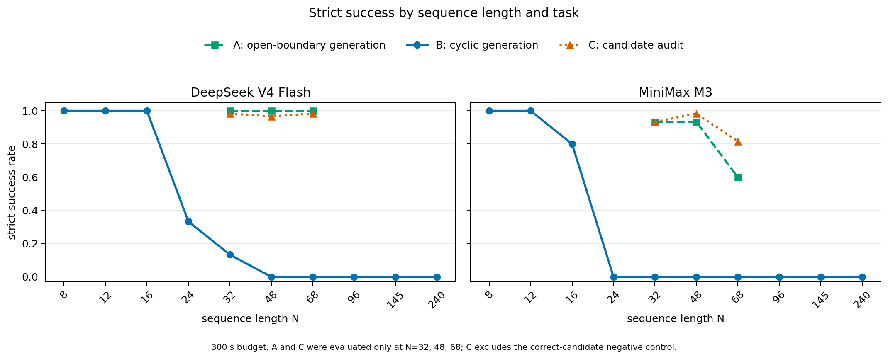

# 聚合失配与生成—验证不对称：一组受控实验给出的证据

**副标题：为什么会执行局部规则，不等于能构造全局一致对象**  
**状态：研究证据说明 v0.1**  
**关联主题：聚合失配、生成—审计差异、候选结构外部化、组合治理**

---

## 技术摘要

这组实验用一个真值唯一、可以严格自动评分的 GF(2) 约束系统，检验同一个问题：

> 当局部规则保持不变时，为什么 LLM 能正确执行局部操作，却经常无法按时生成满足全部约束的完整对象？

实验得到四条主要证据：

1. **边界拓扑会显著改变完整生成结果。** 在相同局部 XOR 规则、匹配实例、相同输出长度和 300 秒预算下，开边界生成成功率很高，周期闭合生成却几乎全部失败。
2. **给定完整候选后，全量审计大幅恢复。** 模型仍要扫描全部约束，但不再需要从零构造全局对象；两个部署配置的严格成功率分别达到 97.8% 和 91.1%。
3. **失败不能简单归因于不会 XOR 或不能输出长序列。** 纯复制和单位置 XOR 检查均为 45/45；周期任务在小规模上也可以稳定完成。
4. **生成—验证差异不是无条件能力排序。** 候选审计同时获得额外结构，并使用不同输出接口，因此证据支持的是“候选条件下的审计相对从零构造具有巨大优势”，而不是“验证在所有任务上普遍比生成容易”。

这使“聚合失配”从一个理论描述变成一个可测现象：**局部能力可以保留，但当求解顺序、输出顺序和未外部化状态发生冲突时，局部能力未必能组合成预算内的全局成功。**

完整实验设计、统计口径与复现资产见 [`llmdealer` 中的研究论文](https://github.com/wxy2ab/llmdealer/blob/main/exp/aggregation_mismatch_experiment/docs/PAPER.md)。

---

## 1. 被检验的核心命题

“聚合失配”并不等于模型完全没有相关能力。它描述的是另一种失败：

```text
局部规则可以执行
  → 局部结果需要被组合
  → 组合过程依赖全局状态或跨位置约束
  → 模型未能在预算内提交全局一致对象
```

本研究把这一命题拆成两个可区分的问题：

- **结构问题：** 当局部规则不变，只改变边界拓扑和自然求解顺序时，完整构造是否会显著恶化？
- **候选问题：** 当完整候选已经外部化，模型只需穷举检查全部局部约束时，成功率是否恢复？

第一个问题对应聚合结构；第二个问题对应生成—审计不对称。

---

## 2. 实验一证明：相同局部规则不保证相同的全局构造能力

实验比较两种完整生成任务：

- **开边界生成 A：** 边界外变量固定，可以沿输出顺序递推。
- **周期生成 B：** 首尾闭合，早期输出依赖尚未解决的边界状态。

两者使用相同的三元 XOR 规则、匹配实例、相同长度、完整序列输出和 300 秒预算。关键差别是：A 存在与输出顺序一致的自然递推，B 必须先处理闭合依赖。

| 条件 | DeepSeek V4 Flash | MiniMax M3 |
|---|---:|---:|
| 开边界完整生成 A | 45/45（100%） | 37/45（82.2%） |
| 周期闭合完整生成 B | 2/45（4.4%） | 0/45（0%） |
| 实例级 A−B | +0.956 | +0.822 |

### 这项实验证明了什么？

**它证明，局部规则的可执行性不足以预测完整对象的可构造性。**

如果失败主要来自 XOR 本身太难，A 与 B 不应出现如此大的差距。真正改变的是局部关系如何被组织成全局对象：开边界允许顺序递推，周期闭合要求模型在提交早期位置前处理尚未外部化的边界状态。

因此，至少在受测系统中，困难更接近：

```text
求解顺序
  × 输出顺序
  × 未外部化边界状态
  → 预算内完整构造失败
```

这就是聚合失配的直接实验证据。

---

## 3. 实验二证明：外部化候选结构会大幅改变任务难度

第二组实验比较：

- **周期生成 B：** 从零生成满足所有周期约束的完整序列。
- **候选审计 C：** 给定完整候选，扫描全部约束并输出所有失败位置。

C 不是单位置判断。模型仍需检查整个候选，只是不再负责从空白状态构造完整对象。

| 同期 300 秒对照 | DeepSeek V4 Flash | MiniMax M3 |
|---|---:|---:|
| 从零周期生成 B | 1/45（2.2%） | 0/45（0%） |
| 无效候选全量审计 C | 176/180（97.8%） | 164/180（91.1%） |
| 实例级 C−B | +0.956 | +0.911 |

### 这项实验证明了什么？

**它证明，从零构造与候选条件下的全量审计之间存在巨大、可重复的预算内完成差异。**

候选把大部分全局结构放进了输入。模型可以沿候选逐项计算 residual，而不必同时搜索边界状态、维护完整解并按指定顺序提交。这说明，模型是否拥有一个可见、可遍历的中间对象，会直接改变其端到端表现。

但这项比较同时改变了两件事：

1. C 获得了完整候选；
2. C 输出失败位置集合，而 B 输出完整序列。

所以更准确的结论是：

> **候选结构外部化与审计接口的组合，显著优于从零周期构造。**

当前证据还不能把收益进一步拆成“候选信息贡献多少、较短输出贡献多少”。

---

## 4. 长度实验说明：聚合困难会随规模快速放大

下图把开边界生成 A、周期生成 B 和候选审计 C 放在同一个长度坐标上。B 覆盖 10 档长度；A 与 C 只在 \(N=32,48,68\) 的匹配实例上运行。



图中最重要的不是某个精确阈值，而是三条曲线之间的结构差异：

- 周期生成 B 在小规模上能够成功，排除了“接口完全不可用”的解释。
- 随长度增加，B 很快进入超时主导区间。
- 同样的中等长度上，A 仍显著高于 B。
- 外部化候选后的 C 也显著高于 B，但在 MiniMax 的较长条件上仍出现下降。

### 这项实验证明了什么？

**它证明聚合失配不是静态的会/不会，而是会随着需要同时维护的全局依赖增多而迅速恶化。**

这也解释了为什么模型在玩具示例、单步检查或短输出上显得可靠，一旦对象变长、闭合依赖增多，端到端完成率却会突然失去工程可用性。

---

## 5. 排除性实验缩小了可能解释

主对照之外的实验没有建立一个单一机制，但排除了几种过于简单的解释。

| 排除性实验 | 结果 | 能排除或限制的解释 |
|---|---|---|
| 纯复制 | 两个配置均为 45/45 | 不是单纯因为无法提交较长序列 |
| 单位置 XOR 检查 | 两个配置均为 45/45 | 不是单纯因为不会执行局部规则 |
| 小规模周期生成 | \(N=8,12\) 均可稳定完成 | 不是周期接口从一开始就不可解 |
| syndrome × patch/full rewrite | 没有稳定主效应 | “只要给错误证据就必然恢复”不成立 |
| 完整 cut-set 锚点 | 两个探索性实例从 0/6 恢复到 6/6 | 与“外部化足够边界状态可恢复顺序执行”一致，但样本仍太小 |

这些结果把最可信的解释收窄到：**局部规则、候选可见性、边界状态、求解顺序、输出接口和预算共同决定端到端完成，而不是某个孤立技能决定一切。**

---

## 6. 生成—验证不对称到底意味着什么？

这组实验观测到的不是抽象意义上的“生成能力”和“验证能力”排名，而是两种计算组织方式的差异。

### 从零生成

模型必须同时完成：

```text
发现全局状态
  → 维持跨位置一致性
  → 解决闭合依赖
  → 按要求的顺序输出完整对象
```

### 候选条件下的审计

候选已经承载了全局结构，模型主要完成：

```text
读取候选
  → 扫描局部约束
  → 计算失败位置
  → 提交结构化诊断
```

因此，生成—审计不对称性的实质可能不是“模型更喜欢验证”，而是：

> **当搜索和全局状态维护被外部候选承担后，模型可以把同一个全局问题重写成一系列可遍历的局部计算。**

这正是聚合失配与生成—验证研究之间的连接点。

---

## 7. 对 Against LLM Mediocrity 框架的含义

这组实验给“局部合理不自动组成全局价值”提供了一个受控版本。

在聚合失配框架中，失败不是：

```text
每个局部部分都很差
```

而是：

```text
局部能力存在
  + 局部规则可执行
  + 单项输出可正确
  ≠ 全局对象可稳定构造
```

实验说明，组合算子不是透明管道。它可能引入新的状态维护、顺序冲突和跨位置一致性负担。模型在局部空间中的能力，只有经过合适的组合结构才能转化为任务价值。

这为“组合治理”提供三条直接依据：

1. **把关键状态外部化。** 不让模型在自由文本推理中隐式维护所有边界变量和跨部件绑定。
2. **把完整构造改写为候选—审计—修订。** 由程序或受治理对象维护候选，让模型定位问题和选择局部操作。
3. **把最终正确性重新交给确定性验证器。** 模型输出不是完成状态，只有通过全局约束检查才可提交。

---

## 8. 当前证据允许与不允许的结论

### 当前证据允许

- 在两个受测部署配置、中文提示和 300 秒预算下，周期闭合完整构造显著难于匹配的开边界生成。
- 给定完整候选后的全量审计显著高于同期从零周期构造。
- 局部规则执行成功不保证全局对象构造成功。
- 聚合困难具有明显的长度依赖。
- 外部化候选或足够边界状态是有前景的系统干预方向。

### 当前证据不允许

- 所有 LLM 都存在同样幅度的差距。
- 验证在所有任务上普遍比生成容易。
- 模型在无限时间或无限 token 下无法求解周期任务。
- C−B 的全部收益都来自候选信息，或全部来自较短输出。
- 两个探索性锚点已经确认了普遍因果机制。
- 合成 GF(2) 结果可以未经验证直接外推到代码、数据库、配置和长文写作。

最稳健的结论是：

> **聚合失配会在局部规则简单但全局闭合、求解顺序和输出顺序冲突时产生强烈的预算内构造差距；候选结构外部化可以大幅缓解该差距，但生成—审计不对称仍具有接口和预算依赖。**

---

## 9. 下一步最有判别力的问题

后续研究不需要简单重复“再测更多同类任务”，而应优先拆解当前仍混在一起的变量：

1. **预算梯度：** 把 B 的独立运行预算从 300 秒扩展到 600、900、1,800 秒，判断差距是预算位移还是在更长预算下仍然稳定。
2. **候选 × 输出接口拆分：** 用 matched factorial 分离候选信息与输出长度/形式。
3. **边界状态机制扩样：** 在更多 host 上检验 cut-set 或最小边界状态能否稳定恢复。
4. **真实任务迁移：** 在代码修复、配置更新、数据库约束和结构化文档修改中比较从零生成与候选—审计—修订流程。

这些实验将决定“聚合失配”最终是一种合成任务现象、一个部署预算现象，还是一种可以跨领域复现的系统结构规律。
