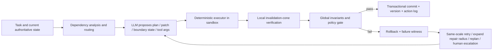

# Aggregation Mismatch: Derivable Claims, Proof Conditions, and Implications for Agent Engineering

**Subtitle: Which conclusions do not need more model experiments, and which still require empirical calibration**  
**Status: Theory-to-engineering bridge report v0.5**<br>
**Empirical data cutoff: July 28, 2026; includes completed artifacts v4–v8**<br>
**Related topics: aggregation mismatch, patch vs. rewrite, generation–verification asymmetry, hard state, deterministic executors, verifier governance**  
**中文：** [聚合失配：可推导命题、证明条件与 Agent 工程含义](./aggregation-mismatch-theoretical-claims-agent-engineering.zh-CN.md)  
**Bilingual synchronization rule:** Keep proposition numbering, formulas, tables, evidence cutoff, and conclusion boundaries aligned across both versions.

---

## Abstract

Some claims about aggregation mismatch follow directly from graph structure, information requirements, program semantics, and invariants. Others may fit the theory extremely well while remaining empirical claims about a particular LLM, prompt, budget, and task distribution.

The central distinction is:

> Theory can prove that an interface reduces the information that must be committed, preserves unchanged regions, narrows the verification surface, or prevents accepted regressions behind a verifier gate. Theory cannot unconditionally prove that a real LLM will infer a better edit plan, nor can it determine a model's success rate, timeout threshold, or cross-domain transfer effect.

Under explicit conditions, the following conclusions are derivable:

1. **For sparse changes, a patch has a smaller commitment surface than a full rewrite and preserves unchanged regions by construction.**
2. **Given a candidate, verification can be rewritten as residual computation; it no longer carries the responsibility of searching for a complete object from scratch.**
3. **Given sufficient boundary state, cyclic dependency can be cut into deterministic expansion; the minimum sufficient boundary depends on the rank or dependency structure of the particular system.**
4. **Executing in dependency-topological order avoids unresolved predecessors; reverse dependency order requires additional intermediate state, delayed commitment, or symbolic solving.**
5. **If a repair loop accepts only strict reductions in a well-founded violation measure, it must terminate and cannot accept a regressive step, although it may stop at a nonzero local minimum.**
6. **If an executor preserves the required semantics, verifier acceptance is sound, and only verified states may commit, every committed state satisfies the protected invariants.**
7. **A local change can invalidate only constraints whose dependency sets intersect the change; on a bounded-degree dependency graph, incremental verification grows with edit size rather than total object length.**
8. **Patches with conflict-free read and write sets commute and may be merged in any order; conflicting patches require serialization, recomputation, or escalation.**
9. **Authoritative state, deterministic transitions, and idempotent commits provide replay, recovery, and deduplication semantics; the model no longer has to infer current state from conversational history.**
10. **Constrained decoding or a schema can guarantee syntactic validity, but not semantic correctness.**

As a corollary of proposition six: **when a correct plan is already bound to the
authoritative state and can be compiled deterministically into native tool
arguments, asking the model to serialize those arguments again adds no task
information and introduces another stochastic failure surface.**

These claims are already strong enough to guide agent architecture. The model should primarily submit plans, patches, boundary states, and tool arguments. The runtime should own the authoritative object. Deterministic executors should expand and write changes. Verifiers should control commits. Dependency graphs should determine execution order, incremental verification scope, and safe parallel boundaries.

They are not strong enough to justify claims such as “patch always beats rewrite,” “verification is universally easier than generation,” or “more reasoning budget necessarily eliminates aggregation mismatch.” Those remain empirical questions.

The completed artifact-v4 illustrates this boundary directly. Enough correct bits
strongly recover cyclic construction, but equal-count random correct bits are not
worse than the structural cut-set. A candidate produces a large gain only when the
operation changes to audit; full rewrite does not improve. An independent
1800-second budget nearly recovers only the shortest length, while the
natural/reverse comparison is ceiling-limited. Theoretical direction and measured
model benefit are not substitutes.

Artifact-v5 tests the patch theorem at a native tool boundary. When the same
authoritative edit plan is supplied, patch beats full rewrite by 41.7 percentage
points. When the model must infer the plan, both arms remain near floor and the
difference is only 2.1 points. This is the expected distinction between
**delivery advantage given a correct plan** and **end-to-end advantage after plan
inference**. The experiment supports the first, not the second.

Artifacts v6 and v7 test the control plane around that conditional theorem. V6
supports a scheduler–ledger–renderer package, plan-error routing, and governed
commit, while not isolating a pure order effect. V7 then finds positive but
non-confirmatory effects for requested topological order and localized receipts,
while its deterministic plan compiler passes 48/48 frozen adoption cases with zero
protected invariant violations. The empirical result supports the compiler
implementation; the theoretical reason to prefer compilation follows from the
absence of information gain in resampling a verified plan.

---

## 1. What Theory Can and Cannot Establish

This document uses three evidence levels.

| Level | Meaning | Example |
|---|---|---|
| **T: conditional theorem** | The result follows from explicit algebraic, graph-theoretic, or program-semantic assumptions | A sparse patch has a shorter description; a verifier gate preserves invariants |
| **S: structural prediction** | The task structure is provably changed, but the magnitude of benefit for a particular LLM is not | Natural dependency order reduces unresolved state; a candidate converts search into checking |
| **E: empirical claim** | The claim depends on model policy, service behavior, prompt, language, or task distribution and must be measured | DeepSeek's gain at 900 seconds; the real edit-density crossover |

This separation prevents two opposite errors:

- treating a provable interface property as an accidental observation about one model;
- treating a model-dependent result as a universal law that needs no experiment.

### 1.1 Conditional Is Not Unconditional

“Patch > rewrite” is the clearest example.

The following implication can be derived:

```text
the correct edit plan is known
+ the change is sparse
+ the patch encoding is shorter than the complete object
+ the executor is correct and deterministic
+ delivery risk increases monotonically with model-authored commitment surface
→ patch delivery is more reliable than full-rewrite delivery
```

Theory alone cannot establish:

```text
starting from the same problem,
the model's probability of inferring the correct patch plan
is necessarily at least as high as its probability of inferring the full target object
```

The first statement concerns interface and execution semantics. The second concerns the model's search and inference policy.

---

## 2. Formal Setup

Let:

- \(x\in\Sigma^N\) be the current authoritative object;
- \(y^\star\in\Sigma^N\) be the target object;
- \(\Delta=\{i:x_i\neq y^\star_i\}\) be the true edit set;
- \(k=|\Delta|\) and \(\rho=k/N\) be the edit density;
- \(p\) be a patch or operation plan submitted by the model;
- \(E(x,p)\) be the object produced by a deterministic executor;
- \(I(y)\) be the global invariants the object must satisfy;
- \(V(y)\in\mathbb N\) be a violation count or another well-founded violation measure;
- \(Hy=c\) be the linear constraint system used in the GF(2) experiment;
- \(G=(U,D)\) be the dependency graph of a general task;
- \(q(m)\) be the probability that the model correctly delivers \(m\) vulnerable commitments once the correct plan has already been fixed.

A vulnerable commitment is not necessarily a token. It is any model-authored field, position, reference, argument, or sequence element whose error causes strict failure.

End-to-end success can be factored as:

\[
P(\text{success})
=P(\text{plan correct})
\cdot P(\text{delivery correct}\mid\text{plan correct})
\cdot P(\text{execution and commit correct}
\mid\text{plan correct, delivery correct}).
\]

Theory most readily constrains the last two factors. The first usually depends on the model, context, task distribution, and search process, so it must be measured.

---

## 3. Proposition One: Sparse Patches Reduce the Commitment Surface

### 3.1 Description Length

If a literal full rewrite requires an average of \(c_r\) encoding units per position, then:

\[
L_{\text{rewrite}}=Nc_r.
\]

If a patch has fixed overhead \(c_0\), and each edit requires an address, operator, and value with average burden \(c_p+\lceil\log_2N\rceil\), then:

\[
L_{\text{patch}}
=c_0+k(c_p+\lceil\log_2N\rceil).
\]

Therefore, the serialized patch is strictly shorter when:

\[
k<
\frac{Nc_r-c_0}
{c_p+\lceil\log_2N\rceil}.
\]

From an information perspective, if the target is known to differ from the current object at exactly \(k\) positions, the number of possible targets is:

\[
\binom Nk(|\Sigma|-1)^k.
\]

Selecting one such target requires at least:

\[
\log_2\binom Nk+k\log_2(|\Sigma|-1)
\]

bits. A literal arbitrary full object requires \(N\log_2|\Sigma|\) bits. The sparse-delta description is substantially smaller when \(k\ll N\). When \(k\) approaches \(N\), address and operation overhead can eliminate the patch advantage.

### 3.2 The Unchanged-Region Invariant

A standard patch executor satisfies:

\[
\forall i\notin\Delta_p,\quad E(x,p)_i=x_i.
\]

As long as the patch's write set is correct, unchanged regions are not regenerated by the model. They therefore cannot be accidentally corrupted by the delivery step. A full rewrite has no equivalent structural guarantee.

### 3.3 When Patch Reliability Dominance Follows

Assume:

1. patch and rewrite use the same correct edit plan;
2. the executor is correct;
3. \(q(m)\) is non-increasing in the number of vulnerable commitments \(m\);
4. \(m_{\text{patch}}<m_{\text{rewrite}}\).

Then:

\[
q(m_{\text{patch}})\ge q(m_{\text{rewrite}}).
\]

If the conditional probability of a correct next commitment after any correct prefix is at most \(1-\epsilon\), exact delivery probability is at most:

\[
(1-\epsilon)^m.
\]

This expression illustrates how even small per-commitment risk can compound with commitment surface. It is not a universal LLM error model and cannot replace empirical success-rate measurement.

### 3.4 Direct Implications for Agents

- Prefer `edit[]`, AST operations, JSON Patch, SQL migrations, or typed tool arguments over resubmitting the whole object.
- Apply operations against an authoritative baseline. A model-authored “repaired full object” should not automatically overwrite authoritative state.
- Route using \(\rho=k/N\), addressing overhead, regional coupling, and plan confidence. Patch must not be an unconditional default.
- At moderate density, rewrite the affected function, subtree, section, or partition. Use a full rewrite when change is dense or target structure changes globally.
- Measure `plan_correct` separately from `delivery_correct_given_plan`, so search failure is not conflated with delivery failure.

### 3.5 Relation to Existing Experiments

The DeepSeek artifact-v3 results align with the conditional derivation:

| Comparison | Patch | Full rewrite | Difference |
|---|---:|---:|---:|
| Model infers edit plan, 300 seconds | 228/480 (47.5%) | 124/480 (25.8%) | +21.7 pp |
| Same authoritative edit plan supplied, 300 seconds | 240/240 (100%) | 142/240 (59.2%) | +40.8 pp |
| Model infers edit plan, preallocated 900-second subset | 83/120 (69.2%) | 52/120 (43.3%) | +25.8 pp |

The second row is closest to the theorem-aligned comparison: the plan is fixed and only the final delivery interface changes. The first row additionally shows that, for this frozen DeepSeek configuration and task distribution, the end-to-end patch benefit was not erased by plan inference.

Artifact-v5 adds a native editing-agent test:

| V5 comparison | Patch | Full rewrite | Difference | Verdict |
|---|---:|---:|---:|---|
| Model infers the shared plan, 300 seconds | 2/96 (2.1%) | 0/96 (0.0%) | +2.1 pp, 95% CI [0.0, 6.3] | End-to-end advantage not established |
| Same authoritative plan supplied, 300 seconds | 46/48 (95.8%) | 26/48 (54.2%) | +41.7 pp, 95% CI [27.1, 56.3] | Delivery advantage established |

The paired oracle comparison has 21 positive instances, one negative instance,
and 26 ties; its exact sign-flip result is \(p=1.10\times10^{-5}\). The inferred
comparison has one positive instance and 47 ties, so its exact sign-flip result is
\(p=1\). V5 therefore identifies a plan-inference bottleneck: a stable patch tool
can reduce delivery failures without making an incorrect inferred plan correct.

The data do not establish patch superiority for every model, task, and edit
density. V5 also does not identify a density crossover: five of six inferred-plan
cells are at a joint zero floor, and actual per-run payload telemetry was not
retained. Sources are the
[artifact-v3 report](https://github.com/wxy2ab/llmdealer/blob/main/exp/aggregation_mismatch_experiment/docs/PATCH_VS_REWRITE_V3_REPORT.md)
and [artifact-v5 report](https://github.com/wxy2ab/llmdealer/blob/main/exp/aggregation_mismatch_experiment/docs/V5_STABLE_EDITING_AGENT_REPORT.md).

---

## 4. Proposition Two: A Complete Candidate Rewrites Construction as Residual Computation

For a linear constraint system:

\[
Hy=c,
\]

once a candidate \(y\) is supplied, verification computes:

\[
r=Hy\oplus c.
\]

Here \(r_i=1\) indicates that constraint \(i\) fails. For sparse \(H\), computing the complete residual costs:

\[
O(\operatorname{nnz}(H)).
\]

Each residual row reads only its constraint neighborhood, so rows can be partitioned or evaluated in parallel.

From-scratch generation must instead find a \(y\) satisfying \(Hy=c\). For linear systems this is still polynomial-time; the experiment must not be overstated as a complexity-class separation. But generation does carry an additional solving and construction responsibility that residual evaluation does not.

### 4.1 What Follows

- Candidate-conditioned audit and from-scratch generation are not the same task under equal information.
- The candidate exposes failure witnesses: a nonzero residual is a localized constraint violation.
- If the verifier is known and executable, deterministic code should perform the check rather than asking an LLM to simulate it.

### 4.2 What Does Not Follow

- Verification is not thereby universally easier than generation.
- An LLM is not guaranteed to scan every constraint correctly.
- The candidate is not guaranteed to be near the target, and local repair is not guaranteed to reach a global solution.
- A short audit output does not identify how much benefit came from candidate information versus the output interface.

### 4.3 Direct Implications for Agents

- Materialize an inspectable candidate early instead of leaving all reasoning in free text.
- Represent residuals, failing positions, counterexamples, and violated invariants as structured objects.
- Give executable constraints to programs. Use LLMs to interpret failures, select repair neighborhoods, and propose candidate operations.
- Track candidate quality. Random, near-correct, and previously validated candidates should not use the same repair policy.

### 4.4 Artifact-v4 Empirical Verdict

Across 18 DeepSeek holdouts, five-bit candidate full rewrite is −0.111
[−0.222, −0.019] relative to no candidate, while the random-candidate rewrite
interval includes zero. Five/random audit minus rewrite is +0.870 / +0.796.
The result is not that “a candidate is inherently useful,” but:

> A candidate's theoretical task simplification becomes an observed model gain
> only when the system connects it to a structurally matched residual/audit
> operation.

Audit versus rewrite still changes both operation and output, so it is not a pure
verification-ability estimate.

---

## 5. Proposition Three: Sufficient Boundary State Can Cut Cyclic Dependency

Partition variables into an externalized boundary set \(C\) and a remaining set \(R\):

\[
H_Cx_C+H_Rx_R=c.
\]

Once \(x_C\) is supplied:

\[
H_Rx_R=c-H_Cx_C.
\]

If \(H_R\) has full column rank and the system is consistent, \(x_R\) is uniquely determined. Boundary values satisfying this rank condition are therefore sufficient state for complete construction.

A recurrence system can also be written as:

\[
x=Fz+g,
\]

where \(z\) is the closure boundary state. Once the correct \(z\) is supplied, the remainder can be expanded deterministically in natural order, with closure checked at the end.

### 5.1 Limits of the Derivation

Theory can determine:

- whether a boundary set uniquely determines the remaining object;
- whether the remainder becomes a DAG or one-way recurrence;
- whether a proposed boundary set is redundant or leaves unresolved degrees of freedom.

General theory alone cannot establish:

- that the first \(b\) positions in a particular experiment form an information-theoretically minimal cut-set;
- that structural anchors help an LLM more than an equal number of random answer bits;
- that an LLM can infer the compact boundary state and fails only at full-object delivery.

Those require paired experiments.

### 5.2 Direct Implications for Agents

- Do not ask the model to maintain cross-module boundaries implicitly. Externalize API contracts, variable bindings, schemas, plan state, and unresolved dependencies.
- Let the model submit compact control state while the runtime performs expansion, compilation, execution, and checking.
- Search for sufficient state using rank, dependency cuts, interface contracts, or data-flow analysis rather than merely adding more prose to the prompt.
- Distinguish “more answer bits” from “structurally appropriate boundary state.” Any additional LLM benefit of the latter must be measured.

### 5.3 Artifact-v4 Empirical Verdict

Full cut-set minus no anchors is +0.741 [0.574, 0.870], but structural cut-set
minus equal-count random correct bits is −0.019 [−0.056, 0.000]. Compact boundary
seed plus executor is +0.148 [0.037, 0.259] relative to no anchors.

Artifact-v4 therefore supports “enough answer information and executable compact
state can help,” not “structural location has already been identified as the
additional mechanism.” Keep the hard-state/executor architecture, but select state
representations with answer-information-matched ablations rather than treating a
cut-set label as a quality guarantee.

---

## 6. Proposition Four: Dependency Order Determines the Live State Needed for Online Construction

Let an edge \(u\rightarrow v\) in dependency graph \(G=(U,D)\) mean that \(u\) is required before \(v\) can be constructed.

If output order \(\pi\) is a topological order, all predecessors are available when each node commits:

\[
\text{read predecessors}\rightarrow\text{compute node}\rightarrow\text{commit node}.
\]

If output order is not topological, the system must use at least one additional mechanism:

- delay commitment;
- retain boundary state that has not yet been externalized;
- emit placeholders and backfill them;
- perform symbolic derivation or global solving;
- separate internal execution order from final serialization.

For any cut in order \(\pi\), define live frontier \(F_t\) as dependencies crossing from the committed prefix to the unresolved suffix, and let:

\[
w(\pi)=\max_t|F_t|.
\]

If that frontier carries \(b\) independent binary states, any exact online process must distinguish \(2^b\) possibilities and therefore requires at least \(b\) bits of internal state. This is an information-distinguishability result, not an LLM-specific claim.

### 6.1 Theory–Evidence Boundary

Theory can establish that one order has a larger dependency frontier and requires more retained state. It cannot by itself determine:

- the success-rate loss for a particular LLM;
- that an LLM's effective state capacity equals a fixed cutwidth;
- that cutwidth is the unique structural predictor of all failures.

### 6.2 Direct Implications for Agents

- Let dependency structure determine internal execution order and let a renderer determine presentation order.
- Have the planner produce a DAG, preconditions, and unresolved variables. Schedule only ready nodes.
- If the user requires reverse-order presentation, construct in topological order in the workspace and serialize deterministically afterward.
- Use `frontier_size`, unresolved bindings, and cross-module interfaces as routing and decomposition signals.

### 6.3 Artifact-v4 Empirical Verdict

Natural order succeeds on 54/54 and reverse order on 53/54, a difference of +0.019
[0.000, 0.056]. Both are near ceiling, so the structural prediction is not tested
informatively. Dependency-aware execution remains supported by program semantics
and state lower bounds, but this experiment does not provide an LLM effect size.
A follow-up must increase dependency frontier or length.

---

## 7. Proposition Five: A Verifier Gate Can Guarantee Monotone Repair

Let \(V(y)\in\mathbb N\) be a violation count. Accept a new state only when:

\[
V(y_{t+1})<V(y_t).
\]

The natural numbers contain no infinite strictly descending chain. The loop can therefore accept at most \(V(y_0)\) repairs before terminating.

More generally, use a finite lexicographic measure or another well-founded order:

\[
V(y)=
(\text{critical violations},
\text{hard violations},
\text{soft loss}).
\]

If acceptance requires strict descent in a well-founded order, the system cannot accept cycles or regressions.

### 7.1 What the Theorem Does Not Guarantee

- It does not guarantee reaching \(V=0\).
- It does not guarantee a global optimum.
- It does not guarantee that the verifier covers true utility.
- It does not guarantee that the model can find a descending patch.
- It does not guarantee that improving one encoded metric preserves value omitted from \(V\).

The repair loop therefore still needs:

- stall detection;
- repair-radius expansion;
- replanning or regional rewrite;
- verifier-coverage audit;
- human escalation or a task termination condition.

### 7.2 Direct Implications for Agents

- A critique controls state transition only after it becomes a machine-comparable verifier delta.
- Apply each proposal in a sandbox. Roll back failures or non-improvements so they never contaminate authoritative state.
- Record `before_hash`, `patch`, `after_hash`, `verifier_delta`, and evidence for every accepted change.
- Expand the repair neighborhood at a local minimum instead of repeating same-scale patches indefinitely.

---

## 8. Proposition Six: Deterministic Execution and Sound Verification Form a Commit Safety Envelope

Assume initial committed state \(s_0\) satisfies invariant \(I(s_0)\), and every transition obeys:

1. the model proposes an action \(a_t\) but cannot directly overwrite authoritative state;
2. a deterministic executor produces candidate \(s'=E(s_t,a_t)\);
3. verifier acceptance is sound:
   \[
   \operatorname{Accept}(s')\Rightarrow I(s');
   \]
4. only `Accept` may set \(s_{t+1}=s'\); otherwise \(s_{t+1}=s_t\).

By induction:

\[
\forall t,\quad I(s_t).
\]

This is a system-level safety result. The model need not be infallible; erroneous proposals only need to be prevented from bypassing the executor and commit gate.

### 8.1 Soundness and Completeness Must Be Separated

- Weak **soundness** breaks safety: an invalid state may be accepted and committed.
- Weak **completeness** primarily harms liveness: a valid state may be rejected and progress slowed.

Perfect verification is often unrealistic. Authority should be stratified by invariant type:

| Invariant | Appropriate authority |
|---|---|
| Schema, types, compilation, deterministic tests in a fixed environment, database constraints | Deterministic tools |
| Safety policy, permissions, budget | Policy engine / hard gate |
| Factual support and citation coverage | Retrieved evidence + structured checks + audit |
| Taste, business value, ethical tradeoffs | Human or explicitly authorized governance process |

### 8.2 Direct Implications for Agents

- The LLM is a proposer, not the authority over final state.
- “The model says it is complete” is not a commit. Completion requires a verifiable state transition.
- Keep hard verifiers separate from learned judges. A learned judgment must not silently override a hard failure.
- Any write path that bypasses the gate invalidates the safety proof and should be treated as an architectural defect.

### 8.3 Corollary: Compile a Verified Plan Instead of Resampling Delivery

Let \(p\) be a plan already verified and bound to authoritative state \(s\), and let
\(C(s,p)\) be a deterministic compiler that preserves the plan semantics. If state
hashes still match, execution is atomic, and the global verifier is sound for the
protected invariants, then the runtime can produce and check the delivery without a
new model sample:

\[
\operatorname{Accept}(E(s,C(s,p)))\Rightarrow I(E(s,C(s,p))).
\]

A new model call does not improve plan information in this setting. It can only be
justified when compilation is unavailable, the plan is incomplete, or a model is
needed to choose among semantically distinct fallback actions.

Artifact-v7 validates one implementation boundary: the frozen compiler passes
48/48 cases with zero invalid arguments, collateral changes, hash violations, or
plan violations. That is an adoption test, not a proof of 100% production
reliability.

Artifact-v8 extends that boundary to semantic addressing. Both index and ID
compilers pass 64/64 frozen cases with zero protected violations. When the model
must deliver the same verified semantic plan, ID Patch succeeds on 63/64 cases
versus 43/64 for physical-index Patch, a +31.25-point base-cluster effect. This
supports runtime-owned physical address resolution in the tested object family. It
does not prove a universal ID advantage or identify relocation as the cause.

---

## 9. Proposition Seven: Local Changes Have a Computable Invalidation Cone

Let constraint \(j\) depend only on variable set \(N(j)\), and let patch write set be \(\Delta_p\). The constraints that may have been affected and therefore require rechecking are:

\[
A(\Delta_p)
=\{j:N(j)\cap\Delta_p\neq\varnothing\}.
\]

If all constraints were valid before the change, any \(j\notin A(\Delta_p)\) reads exactly the same values and remains valid.

If each variable participates in at most \(d\) constraints:

\[
|A(\Delta_p)|\le kd.
\]

This bounds incremental verification. A local patch need not rerun every local check, although global verification is still required when:

- constraint dependencies are unknown or dynamic;
- the patch changes the schema, reference graph, or constraints themselves;
- the system has global aggregation, opaque side effects, or remote state;
- local checks do not cover task-level utility.

### 9.1 Direct Implications for Agents

- Require every patch to declare `read_set`, `write_set`, and `affected_invariants`.
- Use dependency indices to select the smallest relevant regression-test slice.
- Use fast incremental checks in the inner loop and full end-to-end checks before commit or when risk thresholds trigger.
- Write verifier discoveries back into the dependency graph. A newly discovered remote effect should enlarge future invalidation cones.

This claim was not explicit in the original experiment list, but it is a directly derivable and important source of agent cost reduction.

---

## 10. Proposition Eight: Conflict-Free Patches Can Be Parallelized Safely

For patches \(p_i,p_j\), let \(R_i,W_i\) be their read and write sets. Assume these sets fully cover preconditions, address remapping, and side effects. If:

\[
W_i\cap W_j=\varnothing,
\]

\[
W_i\cap R_j=\varnothing,
\]

\[
W_j\cap R_i=\varnothing,
\]

and there are no undeclared side effects, the patches have no read–write conflict and:

\[
E(E(x,p_i),p_j)
=E(E(x,p_j),p_i).
\]

They commute and may be generated in parallel and applied in either order.

When these conditions do not hold, the patches may conflict. Majority voting does not remove the conflict. The system must:

- serialize them;
- recompute one against the latest state;
- merge and reverify them;
- or escalate to a dedicated resolver or human.

### 10.1 Implications for Multi-Agent Systems

The safe parallel boundary is not “different roles.” It is conflict-free dependency and read/write structure.

Build a patch conflict graph:

```text
node = proposed patch
edge = read/write conflict or shared invariant
```

Independent sets may run in parallel. Connected components require serialization or joint solving. Under this discipline, additional agents increase throughput rather than create another aggregation mismatch.

---

## 11. Proposition Nine: Authoritative State, Deterministic Transitions, and Idempotent Commits Guarantee Recoverability

Let:

\[
s_{t+1}=T(s_t,a_t),
\]

where \(T\) is deterministic and each action carries a unique `idempotency_key`.

If:

- authoritative state has a content hash or version;
- the action log is complete;
- repeated actions with the same key take effect only once;
- executor versions are fixed or recorded in the log;

then replaying the same action sequence from the same checkpoint produces the same state. Network retries do not duplicate a committed action, and a failed run can roll back to a checkpoint and replay.

### 11.1 What Is and Is Not Guaranteed

Guaranteed:

- unique state location;
- retry deduplication;
- deterministic replay from the same inputs;
- auditable commit history;
- no need for the model to reconstruct current state from conversational narrative.

Not guaranteed:

- the model chose a valuable action;
- an external nondeterministic service will reproduce exactly;
- unlogged side effects can be recovered;
- the authoritative-state schema captures every relevant real-world variable.

### 11.2 Direct Implications for Agents

- Long-running tasks use the state store and action log as authority, not the final paragraph of a chat summary.
- Each tool action declares `expected_version` so stale plans cannot overwrite newer state.
- Create a checkpoint, preview, or dry run before irreversible actions.
- Recovery begins by rereading authoritative state, not by asking the model to “continue from memory.”

---

## 12. Proposition Ten: Structured Output Guarantees Only the Layer It Constrains

If grammar-constrained decoding, typed tool calls, or a strict schema is implemented correctly, the system can guarantee:

\[
y\in L_{\text{schema}}.
\]

Syntactic validity does not imply:

\[
I(y)=\text{true},
\]

and still less:

\[
U(y)\text{ is high}.
\]

Valid JSON can still contain the wrong file path, an invalid edit location, unsupported facts, or dangerous arguments.

### 12.1 Direct Implications for Agents

Verification should be stratified:

```text
syntax
→ schema/type
→ referential integrity
→ domain invariants
→ end-to-end behavior
→ external utility
```

Tool calling solves interface syntax and parsability, not complete semantic correctness.

---

## 13. Theoretical Classification of the Original P0 / P1 / P2 Claims

| Original claim | Theory level | What follows | What still requires experiments | Immediate agent adjustment |
|---|---|---|---|---|
| P0: externalize boundary state | T + S + E | Under the rank condition, boundary state determines the remainder; enough bits strongly recover v4 | v4 does not support structural locations over equal random bits; minimum sufficient state and cross-configuration replication remain | Explicit interface state; compact-state delivery; programmatic expansion; answer-information ablations |
| P0: candidate-audit advantage | T + S + E | A candidate enables residual computation; v4 audit−rewrite composite differences are large | Separate operation, candidate information, and output effects; cross-configuration replication | Candidate→verifier→failure witness→repair, not candidate→full rewrite |
| P0: recovery with more budget | E | Independent v4 300/900/1800-second success is 0.241/0.370/0.463 | Hosted-service mechanism and more lengths/configurations; these are not a survival curve | Treat budget as a routing variable; do not hard-code “waiting recovers” |
| P0: natural order beats reverse order | T + S; E unresolved | Topological order removes unresolved predecessors; reverse order needs extra state or delayed commitment | v4 is ceiling-limited; test a larger dependency frontier | Dependency-aware scheduler; separate execution from presentation |
| P1: edit-density crossover | T + E | Address/payload overhead creates a conditional patch–rewrite threshold | V5 scanned six \(N,k\) cells but did not identify the threshold because of the inferred-plan floor and missing actual payload telemetry | Three-way patch / region rewrite / full rewrite router |
| P1: verifier–patch loop | T + E | Strict well-founded descent guarantees termination and prevents accepted regressions | Whether it reaches \(V=0\), number of rounds, proxy overfitting | Sandbox, rollback, stall escalation |
| P1: model scale or reasoning budget | E | Interface theory does not determine it | Effects across models, reasoning modes, and budgets | Make routing configurable and measurable |
| P2: transfer to real domains | E | Executor and verifier properties can be proved only within each domain | Transfer from XOR to code, documents, and databases | Start with hard-constraint domains; establish verifier contracts per domain |
| P2: structured output | T + E | A constrained decoder can guarantee syntax/schema | Semantic accuracy, usability, and cost | Typed actions + semantic verifier |
| Patch > rewrite | T + E | Holds under correct plan, sparse change, and monotone delivery risk; V5 oracle arms support the delivery claim | V5 inferred-plan arms do not establish an end-to-end gain; the real crossover remains unknown | Gate on plan confidence, then prefer patch conditionally; route by density, coupling, and confidence |

---

## 14. Additional Claims Worth Adding to the Research List

Beyond the original P0 / P1 / P2 list, the following claims should be tracked explicitly.

### 14.1 Local Invalidation Cones

**Theoretical core:** A change can invalidate only dependency-intersecting constraints; with bounded dependency, incremental verification grows at most with \(kd\).  
**What to measure:** Accuracy and missing-edge rate of dependency extraction in real code, configuration, and document systems.  
**Engineering value:** Substantially lower test and audit cost per patch.

### 14.2 Patch Conflict Graphs and Safe Parallelism

**Theoretical core:** Patches with no read/write conflict or hidden side effects commute.  
**What to measure:** Accuracy of agent-declared read/write sets and hidden-conflict rates under dynamic dependency.  
**Engineering value:** A stronger scheduling basis for multi-agent concurrency than role labels.

### 14.3 The Commit Safety Envelope

**Theoretical core:** Valid initial state, semantic executor, sound verifier, and an unbypassable commit gate imply all committed states are valid.  
**What to measure:** Verifier coverage, false acceptance, bypass paths, and nondeterministic side effects.  
**Engineering value:** Reframes agent safety from “will the model obey?” to “can an erroneous proposal commit?”

### 14.4 Separating Internal Execution Order from External Presentation Order

**Theoretical core:** If rendering preserves semantics, the system may construct in a low-frontier order and present in the user-required order.  
**What to measure:** Effect of order on model planning and delivery success.  
**Engineering value:** Avoids forcing reverse-dependency construction merely to match final document order.

### 14.5 Separating Discovery from Delivery

**Theoretical core:** End-to-end success is a composite event involving plan correctness, delivery fidelity, execution, and commit.  
**What to measure:** Conditional success at each layer instead of final exact match alone. V5 directly demonstrates why: oracle-plan patch gains 41.7 points, while inferred-plan patch gains only 2.1 points.<br>
**Engineering value:** Routes failure to replan, re-emit, executor repair, or verifier repair correctly; a delivery tool must not be mistaken for a planning intervention.

### 14.6 Replay and Idempotence of Canonical State

**Theoretical core:** Deterministic transitions, complete logs, and idempotency keys guarantee repeat-execution semantics.  
**What to measure:** External-tool nondeterminism, omitted side effects, and recovery time.  
**Engineering value:** Reliable recovery for long-running agents without dependence on narrative context continuity.

### 14.7 Verifier Coverage as an Independent Bottleneck

**Theoretical core:** Sound acceptance for encoded invariants does not imply correctness under true task utility.  
**What to measure:** Miss patterns across hard verifiers, learned judges, and human evaluation.  
**Engineering value:** Separates “improve the model” from “improve the oracle” into distinct workstreams.

---

## 15. Agent Architecture Derived from These Claims



### 15.1 Model Responsibilities

- understand the objective;
- propose candidate structures;
- select or infer edit plans;
- interpret residuals;
- make judgments over non-formalizable constraints;
- decide when to expand search or request a human-governed variable.

### 15.2 Runtime Responsibilities

- own canonical state;
- maintain dependency graphs, versions, and hashes;
- apply patches;
- execute schemas, types, tests, constraints, and permission checks;
- control commit, rollback, retry, and idempotency;
- preserve evidence, verifier deltas, and audit history.

### 15.3 Router Responsibilities

Routing should have at least three modification scales, not only patch versus rewrite:

| Condition | Default path |
|---|---|
| Sparse, low coupling, known locations | Patch + incremental verification |
| Moderate density, coupling localized to one region | Function / subtree / section rewrite |
| High density, schema change, or global objective restructuring | Full rewrite + full verification |
| Uncertain plan but strong verifier | Candidate → audit → repair |
| Compact boundary state with executable expansion | Compact state → deterministic expansion |
| Verifier does not cover critical utility | Human governance or oracle expansion; prohibit automatic commit |

Theory should not invent the numeric thresholds. Choose among actions by minimizing:

\[
J(a)=
\lambda_fP(\text{failure}\mid a)
+\lambda_tT(a)
+\lambda_cC(a)
+\lambda_rR(a),
\]

where \(a\) is patch, regional rewrite, full rewrite, or escalation; \(T\) is time, \(C\) is call cost, and \(R\) is regression risk.

---

## 16. Minimum Implementable Revision

Agents can implement the following changes now that artifact-v4 has adjudicated
part of P0 and artifact-v5 has separated planning from native-edit delivery, while
the remaining P0 / P1 / P2 claims still require calibration.

### Phase One: Does Not Depend on New Experiments

1. Establish canonical state, version numbers, and content hashes.
2. Prevent the model from overwriting authoritative objects; require typed operations.
3. Add a deterministic executor, sandbox, commit gate, and rollback.
4. Record read/write sets, preconditions, and affected invariants for every action.
5. Schedule ready nodes by dependency order and render final presentation separately.
6. Separate hard verifiers from learned judges; language judgments cannot override hard failures.
7. Log plan, delivery, execution, verification, and commit failures separately.
8. Run incremental verification for local patches and trigger global verification by risk before commit.
9. Use a conflict graph to decide which multi-agent results may merge in parallel.
10. Add idempotency keys, checkpoints, and action replay.
11. Add a plan-verification gate before any write; low-confidence or invalid plans must replan rather than merely switch delivery interfaces.
12. Persist native tool arguments, event order, payload size, repair calls, and pre/post hashes as first-class evidence.

### Phase Two: Requires Empirical Calibration

1. Learn edit-density routing thresholds for patch, regional rewrite, and full rewrite.
2. Learn frontier-size, length, and timeout risk for each model and budget.
3. Calibrate when candidate quality supports audit–repair and when the system should replan from scratch.
4. Measure the benefit of structural anchors relative to random information.
5. Measure verifier–patch-loop stall distributions and repair-radius expansion policy.
6. Establish transfer evidence separately for code, configuration, databases, and documents.
7. Replicate the frozen V5 design with durable event retention and interventions that raise plan accuracy without changing the delivery interface.

---

## 17. Engineering Measurement Recommendations

Final success alone cannot show whether a theoretical advantage landed in the intended layer. At minimum, record:

| Metric | Question answered |
|---|---|
| `plan_correct` | Did the model find the correct edit set or control state? |
| `delivery_correct_given_plan` | Could it deliver a known correct plan strictly? |
| `commitment_surface` | How many vulnerable commitments did the model author? |
| `edit_density` | Is the patch still in the sparse regime? |
| `dependency_frontier` | How much cross-boundary state does the order require? |
| `affected_constraint_count` | How large is the incremental verification scope? |
| `executor_success` | Did the tool apply the operation correctly? |
| `verifier_accept / false_accept / false_reject` | Is the oracle reliable? |
| `rollback_rate` | How many proposals were blocked by the gate? |
| `stall_depth` | Where does repair reach a local minimum? |
| `conflict_graph_density` | How much true multi-agent parallelism exists? |
| `replay_success` | Can the long-running task recover exactly from a checkpoint? |
| `plan_hash / pre_hash / post_hash` | Was the intended plan applied to the intended authoritative version? |
| `native_tool_args / event_order / payload_size` | Which delivery operations were actually executed, in what order, and with what commitment surface? |
| `repair_call_count` | Did success require repeated repair attempts rather than a clean first delivery? |

These metrics turn theory into a diagnostic instrument rather than a post hoc explanation.

---

## 18. Claims That Must Not Be Over-Derived

The following statements remain unjustified:

- **“Patch always beats full rewrite.”** High edit density, expensive addressing, an incorrect plan, or global structural change can reverse the result.
- **“Verification is universally easier than generation.”** A specific comparison requires an explicit candidate, verifier, and output contract.
- **“A verifier makes the system correct.”** A verifier protects only the properties it encodes soundly.
- **“Local repair necessarily converges to the correct answer.”** Strict descent guarantees termination, not zero violations or high true utility.
- **“More agents reduce aggregation mismatch.”** Without dependency and conflict governance, concurrency can create more integration failures.
- **“More budget necessarily recovers cyclic construction.”** This is an empirical question about model and service behavior.
- **“Structured JSON implies semantic reliability.”** A schema protects only the syntactic layer.
- **“GF(2) results transfer directly to real software engineering.”** Each real domain needs its own executor, verifier, and transfer evidence.
- **“V5 proves a universal end-to-end patch advantage.”** Its inferred-plan comparison is near floor and does not establish that claim.
- **“V5 identifies the patch–rewrite density crossover.”** The scanned cells are floor-limited and actual per-run payload telemetry is unavailable.

---

## 19. Conclusion

The most immediately useful outputs of aggregation-mismatch research are not fixed success rates. They are conditional structural conclusions:

```text
reduce model-authored commitment surface
+ externalize boundary and candidate state
+ construct in dependency order
+ apply operations through deterministic executors
+ control commits through sound verifiers
+ parallelize only conflict-free regions
+ use authoritative state for replay and rollback
→ convert local model capability into more reliable system-level state transitions
```

Patch superiority over rewrite is **partly a theoretical result**. It follows under a correct plan, sparse changes, a reliable executor, and delivery risk that increases with commitment surface. Outside those conditions, routing and experiments must decide.

Artifact-v5 supplies the missing native-agent boundary test: it supports the
conditional delivery theorem under an authoritative plan, while showing that the
same tool change does not by itself repair plan inference. The engineering
consequence is concrete: verify the plan first, then optimize the delivery
interface.

Artifact-v7 further sharpens that consequence: if the verified plan can be compiled,
the preferred path is not model Patch versus model Rewrite. It is deterministic
plan compilation, native execution, global verification, and atomic commit. Its
requested-order and localized-receipt effects remain directional rather than
confirmatory, so they should not be hard-coded as universal routing laws.

Artifact-v8 adds runtime ownership before and during delivery. Its
readiness–ledger–staged-interaction package raises exact success by 59.4 points,
while semantic ID raises delivery success by 31.25 points relative to model-authored
physical indexes. The first result fails a 4× token-cost guardrail, local-verifier
increment is ceiling-limited, and the density crossover fails its gate. The
engineering consequence is therefore conditional: own dependency state and address
resolution in the runtime, but route scaffold intensity by cost and keep
Patch/Rewrite thresholds configurable.

The appropriate engineering strategy is therefore neither to wait for every P0 / P1 / P2 experiment nor to hard-code current empirical effects as universal rules:

> First implement the theoretically supported substrate of structured state, minimal operation submission, deterministic execution, verifier-gated commit, dependency-aware scheduling, and rollback-capable transactions. Then use experiments to calibrate patch thresholds, budgets, candidate quality, model routing, and real-domain boundaries.

---

## Related Documents

- [Aggregation Mismatch Artifact-v8: Runtime Ownership and Semantic Addressing](./aggregation-mismatch-v8-runtime-ownership-routing.md)
- [Aggregation Mismatch Artifact-v7: Mechanism Recovery and Deterministic Delivery](./aggregation-mismatch-v7-mechanism-recovery.md)
- [Patch vs. Full Rewrite: A Controlled Experiment on Sparse Repair Delivery](./patch-vs-full-rewrite-controlled-experiment.md)
- [Aggregation Mismatch Artifact-v5: Stable Editing Agent, Planning Bottleneck, and Conditional Patch Advantage](./aggregation-mismatch-v5-stable-editing-agent.md)
- [Aggregation Mismatch Artifact-v4: Experimental Evidence, Theory Gaps, and Agent Implications](./aggregation-mismatch-v4-claims-theory-gap.md)
- [Controlled evidence for aggregation mismatch and generation–verification asymmetry (Chinese)](./aggregation-mismatch-generation-verification-asymmetry-evidence.zh-CN.md)
- [Aggregation Mismatch and Compositional Governance in LLM Systems](./aggregation-mismatch-compositional-governance-llm-systems.md)
- [State-Governed Agent Regime for Governed LLM Systems](./state-governed-agent-regime-for-governed-llm-systems.md)
- [Governed LLM Object Model and Interface Specification](./governed-llm-object-model-interface-specification.md)
- [Audit Engineering for Governed LLM Systems](./audit-engineering-failure-localization-control-space-writeback.md)
- [Complete experiment paper and artifact](https://github.com/wxy2ab/llmdealer/tree/main/exp/aggregation_mismatch_experiment)
