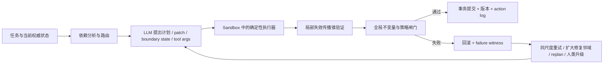

# 聚合失配：可推导命题、证明条件与 Agent 工程含义

**副标题：哪些结论不必等待更多模型实验，哪些只能由实验校准**  
**状态：理论—工程桥接报告 v0.4**<br>
**实验数据截点：2026-07-28；已纳入完成的 artifact-v4–v7**<br>
**关联主题：聚合失配、patch vs. rewrite、生成—验证不对称、硬状态、确定性执行器、验证器治理**  
**English:** [Aggregation Mismatch: Derivable Claims, Proof Conditions, and Implications for Agent Engineering](./aggregation-mismatch-theoretical-claims-agent-engineering.md)  
**双语同步规则：** 两个版本的命题编号、公式、表格、证据截点和结论边界必须同步更新。

---

## 摘要

围绕聚合失配，有些结论可以由图结构、信息量、程序语义和不变量直接推出；另一些结论即使非常符合理论，也仍然是关于具体 LLM、提示、预算和任务分布的经验命题。

最重要的区分是：

> 理论可以证明一种接口减少了必须提交的信息、保存了未修改区域、缩小了验证范围，或在验证器闸门下不产生回退；但理论不能无条件证明某个真实 LLM 一定能更正确地找到修改计划，也不能给出具体模型的成功率、超时阈值和跨领域迁移幅度。

在明确条件下，可以直接推出以下结论：

1. **稀疏修改时，patch 比完整重写需要更小的提交面，并天然保存未修改区域。**
2. **给定正确候选后，验证可改写为 residual 计算；它不再承担从零搜索完整对象的职责。**
3. **给定足够的边界状态后，循环依赖可以被切开为确定性展开；但哪些位置构成最小充分边界，要由具体系统的秩或依赖结构决定。**
4. **按依赖拓扑顺序执行可以避免未决前驱；逆依赖顺序至少需要额外中间状态、延迟承诺或符号求解。**
5. **如果只接受严格减少违例度量的修复，修复循环必然终止且不会接受退化步骤；但它可能停在非零局部最小值。**
6. **如果执行器保持不变量、验证器对接受结论是可靠的，并且只有通过验证的状态才能提交，那么所有已提交状态都满足不变量。**
7. **一次局部修改只会使与其依赖相交的约束失效；在有界依赖图中，增量验证成本随修改规模而不是对象总长度增长。**
8. **读写集合无冲突的 patch 可以并行并以任意顺序合并；有冲突的 patch 必须串行化、重算或升级裁决。**
9. **权威状态、确定性转移和幂等提交可以保证重放、恢复和去重语义；模型不再负责从对话历史猜测当前状态。**
10. **受约束解码或 schema 可以保证语法合法，但不能由此推出语义正确。**

作为命题六的推论：**正确 plan 已经绑定到权威状态，并且可以被确定性编译为原生工具
参数时，再让模型序列化这些参数不会增加任务信息，只会增加一个随机失败面。**

这些命题足以先指导 agent 架构：让模型主要提交计划、patch、边界状态和工具参数；让运行时持有权威对象；让确定性执行器负责展开和写入；让验证器决定是否提交；让依赖图决定执行顺序、增量验证范围和可并行边界。

它们并不足以写出“patch 永远优于 rewrite”“验证普遍比生成容易”或“更多推理预算一定消除聚合失配”。这些仍需实验。

已完成的 artifact-v4 恰好展示了这条边界：足够正确 bits 强烈恢复周期构造，但等量
随机正确 bits 不弱于结构 cut-set；候选只有在任务改写为 audit 时产生巨大收益，
full rewrite 并未改善；独立 1800 秒预算只在较短实例上接近恢复；自然/逆序条件则
因 ceiling 无法裁决。理论方向与模型收益不能互相替代。

Artifact-v5 在原生工具边界上检验了 patch 定理。给定同一权威 edit plan 时，
patch 相对完整重写高 41.7 个百分点；要求模型自行推断 plan 时，两组都接近 floor，
差异只有 2.1 个百分点。这正是**正确计划下的交付优势**与**经过计划推断后的端到端
优势**之间的区别。实验支持前者，不支持后者。

Artifact-v6 与 v7 进一步检验了这条条件性定理周围的控制面。v6 支持
scheduler–ledger–renderer 组合、plan-error 路由与 governed commit，但没有识别纯
order effect。v7 的 requested topological order 与 localized receipt 都有正向但未
确认的效应；deterministic plan compiler 则在 48/48 个冻结采用案例上通过，保护项
违规为 0。经验结果支持当前 compiler 实现；偏好编译的理论理由来自：对 verified plan
再采样没有信息增益。

---

## 1. 理论能证明什么，不能证明什么

本文使用三种证据等级。

| 等级 | 含义 | 例子 |
|---|---|---|
| **T：条件性定理** | 给定明确假设，可以用代数、图结构或程序语义推出 | 稀疏 patch 的描述长度更短；验证闸门保存不变量 |
| **S：结构性预测** | 能证明任务结构发生了变化，但不能证明具体 LLM 的收益幅度 | 自然依赖顺序减少未决状态；候选把搜索改写为检查 |
| **E：经验命题** | 涉及模型策略、服务预算、提示、语言或真实分布，必须测量 | DeepSeek 在 900 秒下提升多少；某个 edit-density 交叉点是多少 |

这一区分避免两种相反错误：

- 把一个本来可以证明的接口性质，误写成只对某个模型成立的偶然观察；
- 把一个依赖模型行为的结果，误写成不需要实验的普遍定律。

### 1.1 条件性结论不是无条件结论

“patch > rewrite”是典型例子。

可以证明：

```text
正确 edit plan 已知
+ 修改稀疏
+ patch 编码短于完整对象
+ executor 正确且确定
+ 交付错误随模型提交面单调增加
→ patch 的交付可靠性高于完整重写
```

不能只靠理论证明：

```text
模型从相同问题出发推断 patch plan 的正确率
一定不低于推断完整目标对象的正确率
```

前者是接口与执行语义结论；后者涉及模型的搜索和推断策略。

---

## 2. 形式化设置

令：

- \(x\in\Sigma^N\) 为当前权威对象；
- \(y^\star\in\Sigma^N\) 为目标对象；
- \(\Delta=\{i:x_i\neq y^\star_i\}\) 为真实修改集合；
- \(k=|\Delta|\)，\(\rho=k/N\) 为 edit density；
- \(p\) 为模型提交的 patch 或操作计划；
- \(E(x,p)\) 为确定性执行器应用 patch 后的对象；
- \(I(y)\) 为对象必须满足的全局不变量；
- \(V(y)\in\mathbb N\) 为违例数量或其他良基排序上的违例度量；
- \(H y=c\) 为 GF(2) 实验中的线性约束系统；
- \(G=(U,D)\) 为一般任务的依赖图；
- \(q(m)\) 为在正确计划已经确定时，模型正确提交 \(m\) 个脆弱承诺的概率。

“脆弱承诺”不一定等于 token。它指模型必须自行决定且一旦错误就会使严格结果失败的字段、位置、引用、参数或序列元素。

端到端成功可以粗略拆成：

\[
P(\text{success})
=P(\text{plan correct})
\cdot P(\text{delivery correct}\mid\text{plan correct})
\cdot P(\text{execution and commit correct}
\mid\text{plan correct, delivery correct}).
\]

理论最容易约束后两项。第一项通常依赖模型、上下文、任务分布和搜索过程，因此必须测量。

---

## 3. 命题一：稀疏 patch 减少提交面

### 3.1 描述长度

如果完整重写每个位置平均需要 \(c_r\) 个编码单位，那么：

\[
L_{\text{rewrite}}=Nc_r.
\]

如果 patch 有固定开销 \(c_0\)，每项需要位置地址、操作符和值，平均负担为
\(c_p+\lceil\log_2 N\rceil\)，那么：

\[
L_{\text{patch}}
=c_0+k(c_p+\lceil\log_2 N\rceil).
\]

因此，当

\[
k<
\frac{Nc_r-c_0}
{c_p+\lceil\log_2 N\rceil}
\]

时，patch 的序列化长度严格小于完整重写。

从信息量看，若目标只允许在距离当前对象恰好 \(k\) 的位置变化，则可能目标数为：

\[
\binom Nk (|\Sigma|-1)^k.
\]

标识其中任一目标至少需要：

\[
\log_2\binom Nk+k\log_2(|\Sigma|-1)
\]

比特。任意完整对象则需要 \(N\log_2|\Sigma|\) 比特。前者在 \(k\ll N\) 时显著更小；当 \(k\) 接近 \(N\) 时，地址和操作开销可能让 patch 失去优势。

### 3.2 未修改区域不变量

标准 patch executor 满足：

\[
\forall i\notin\Delta_p,\quad E(x,p)_i=x_i.
\]

也就是说，只要 patch 的写集合正确，未修改区域不会被模型重新生成，因而不会出现“修一个位置、意外改坏其他位置”的交付回归。完整重写没有这个结构保证。

### 3.3 何时能推出 patch 的可靠性优势

若：

1. patch 与 rewrite 使用同一个正确 edit plan；
2. executor 正确；
3. \(q(m)\) 随脆弱承诺数 \(m\) 单调不增；
4. \(m_{\text{patch}}<m_{\text{rewrite}}\)；

则：

\[
q(m_{\text{patch}})\ge q(m_{\text{rewrite}}).
\]

如果每一步在任意正确前缀下的条件正确率至多为 \(1-\epsilon\)，则完整严格交付概率至多为：

\[
(1-\epsilon)^m.
\]

这个式子说明为什么微小的单步风险会随提交面累积。但它不是所有 LLM 的固定误差模型，也不能替代真实成功率测量。

### 3.4 对 agent 的直接含义

- 模型默认提交 `edit[]`、AST operation、JSON Patch、SQL migration 或工具参数，而不是重新提交整个对象。
- executor 根据权威基线应用操作；模型生成的“修复后全文”不应自动覆盖权威对象。
- 路由器必须看 \(\rho=k/N\)、地址开销、区域耦合和 plan confidence，不能把 patch 写成永远优先。
- 中等密度可重写受影响的函数、子树、段落或表分区；高密度或目标结构整体变化时再完整重写。
- 分别统计 `plan_correct` 与 `delivery_correct_given_plan`，避免把搜索失败和交付失败混成一个指标。

### 3.5 与现有实验的关系

artifact-v3 的 DeepSeek 结果与上述条件性推导一致：

| 对照 | Patch | Full rewrite | 差异 |
|---|---:|---:|---:|
| 模型自行推断 edit plan，300 秒 | 228/480（47.5%） | 124/480（25.8%） | +21.7 pp |
| 给定相同权威 edit plan，300 秒 | 240/240（100%） | 142/240（59.2%） | +40.8 pp |
| 模型自行推断，预分配 900 秒子集 | 83/120（69.2%） | 52/120（43.3%） | +25.8 pp |

第二行最贴近理论：计划被固定，只改变最终交付接口。第一行则额外证明，在该 DeepSeek 配置和冻结任务分布上，patch 的端到端收益没有被 plan inference 抵消。

Artifact-v5 进一步加入了原生编辑 Agent 对照：

| V5 对照 | Patch | Full rewrite | 差异 | 裁决 |
|---|---:|---:|---:|---|
| 模型自行推断共享 plan，300 秒 | 2/96（2.1%） | 0/96（0.0%） | +2.1 pp，95% CI [0.0, 6.3] | 未建立端到端优势 |
| 给定同一权威 plan，300 秒 | 46/48（95.8%） | 26/48（54.2%） | +41.7 pp，95% CI [27.1, 56.3] | 已建立交付优势 |

Oracle 配对比较有 21 个正实例、1 个负实例和 26 个 ties，精确 sign-flip
\(p=1.10\times10^{-5}\)；infer 比较只有 1 个正实例和 47 个 ties，精确
\(p=1\)。V5 因而识别出 plan-inference bottleneck：稳定 patch 工具可以减少
交付错误，却不能把错误的推断计划变正确。

这些数据仍不能把 patch 优势外推为所有模型、所有任务和所有修改密度的普遍定律。
V5 也没有识别 density crossover：6 个 infer cell 中有 5 个共同为零，且未保留
实际逐 run payload telemetry。来源见
[artifact-v3 报告](https://github.com/wxy2ab/llmdealer/blob/main/exp/aggregation_mismatch_experiment/docs/PATCH_VS_REWRITE_V3_REPORT.md)
与 [artifact-v5 报告](https://github.com/wxy2ab/llmdealer/blob/main/exp/aggregation_mismatch_experiment/docs/V5_STABLE_EDITING_AGENT_REPORT.md)。

---

## 4. 命题二：完整候选把构造问题改写为 residual 计算

对线性约束：

\[
Hy=c,
\]

给定候选 \(y\) 后，只需计算：

\[
r=Hy\oplus c.
\]

其中 \(r_i=1\) 表示第 \(i\) 条约束失败。稀疏矩阵下，完整 residual 的计算量为：

\[
O(\operatorname{nnz}(H)).
\]

每条 residual 只读取对应约束邻域，因此可以分块或并行计算。

从零生成则必须找到某个 \(y\) 使 \(Hy=c\)。在线性系统中，这仍然是多项式时间问题，不能把实验夸大成复杂性类别分离；但它确实比“给定 \(y\) 后计算 \(Hy\oplus c\)”多了承担一个求解和构造职责。

### 4.1 可以推出的结论

- candidate-conditioned audit 与 from-scratch generation 不是相同信息条件下的同一任务。
- 候选使失败见证显式化：非零 residual 就是可定位的违例证据。
- 若验证器已知且可执行，验证可以由确定性程序完成，不应浪费 LLM 去模拟。

### 4.2 不能推出的结论

- 不能推出“验证在所有任务上都比生成容易”。
- 不能推出模型一定会正确扫描全部约束。
- 不能推出候选一定靠近正确答案，或局部修复一定能到达全局解。
- 不能从 audit 的短输出直接识别候选信息和输出长度各自贡献。

### 4.3 对 agent 的直接含义

- 尽早形成一个可检查候选，而不是让所有推理长期停留在自由文本中。
- 把验证器的 residual、失败位置、反例和 violated invariant 写成结构化对象。
- 能程序验证的约束交给程序；LLM 负责解释、定位修复邻域或提出候选操作。
- 保留“候选质量”指标。随机候选、近正确候选和历史有效候选不应走同一条修复策略。

### 4.4 Artifact-v4 的经验裁决

在 18 个 DeepSeek holdout 上，five-bit candidate full rewrite 相对无候选为
−0.111 [−0.222, −0.019]，random candidate rewrite 的区间含 0；five/random
audit 相对同候选 rewrite 则为 +0.870 / +0.796。它证明的不是“候选天然有用”，而是：

> 候选只有接入与其结构匹配的 residual/audit 操作时，理论上的任务改写才转化为
> 已观测的模型收益。

Audit 对 rewrite 同时改变操作与输出，仍不能解释为纯 verification ability。

---

## 5. 命题三：充分边界状态可以切开循环依赖

把变量分成已外部化的边界集合 \(C\) 与剩余集合 \(R\)：

\[
H_Cx_C+H_Rx_R=c.
\]

给定 \(x_C\) 后：

\[
H_Rx_R=c-H_Cx_C.
\]

若 \(H_R\) 满列秩且系统一致，则 \(x_R\) 唯一确定。因此，满足该秩条件的边界值是完整构造的充分状态。

对递推系统也可以写成：

\[
x=Fz+g,
\]

其中 \(z\) 是闭环边界状态。给定正确 \(z\) 后，其余对象可按自然顺序确定性展开；闭环条件只需最终检查。

### 5.1 能证明到哪里

可以证明：

- 某个边界集合是否足以唯一确定剩余对象；
- 给定边界状态后，剩余展开是否为 DAG 或单向递推；
- 一个候选边界集合是否冗余，或是否仍留下自由度。

不能仅靠一般理论证明：

- 某个实验中选择的前 \(b\) 位就是信息论最小 cut-set；
- 等数量的结构性 anchor 一定比随机位置答案更能帮助 LLM；
- LLM 能正确求出紧凑边界状态，却只是无法交付完整对象。

后面三项都需要配对实验。

### 5.2 对 agent 的直接含义

- 不要求模型隐式维护跨模块边界；把 API contract、变量绑定、schema、计划状态和未决依赖写入显式状态。
- 让模型提交紧凑控制状态，运行时负责展开、编译、执行和检查。
- 用秩、依赖切分、接口契约或数据流分析寻找“足够状态”，不要只靠 prompt 里增加更多背景文字。
- 区分“给了更多答案 bits”和“给了结构上正确的边界状态”；后者是否额外有用要测量。

### 5.3 Artifact-v4 的经验裁决

完整 cut-set 相对无锚点为 +0.741 [0.574, 0.870]，但结构 cut-set 相对等量随机
正确 bits 为 −0.019 [−0.056, 0.000]。Compact boundary seed + executor
相对无锚点为 +0.148 [0.037, 0.259]。

因此，v4 支持“足够答案信息与可执行紧凑状态可以帮助”，不支持“结构位置本身已经
识别为额外机制”。工程上应保留 hard-state/executor 架构，同时用答案信息量匹配的
ablation 选择状态表示，不能把 cut-set 标签硬编码为质量保证。

---

## 6. 命题四：依赖顺序决定在线构造所需的活跃状态

令依赖图 \(G=(U,D)\) 中的边 \(u\rightarrow v\) 表示生成 \(v\) 前需要 \(u\)。

如果输出顺序 \(\pi\) 是拓扑序，那么每个节点提交时，其全部前驱都已经可用。系统可以在线执行：

\[
\text{read predecessors}\rightarrow\text{compute node}\rightarrow\text{commit node}.
\]

如果输出顺序不是拓扑序，系统至少需要采用一种额外机制：

- 暂缓提交；
- 保存尚未外部化的边界状态；
- 输出占位符并回填；
- 做符号推导或全局求解；
- 重新排序内部执行与最终序列化。

对顺序 \(\pi\) 的任一切口，可定义跨越已输出/未输出部分的活跃依赖前沿 \(F_t\)。令：

\[
w(\pi)=\max_t |F_t|.
\]

若这些前沿携带 \(b\) 个相互独立的二元状态，任何精确在线过程都至少要区分 \(2^b\) 种可能，因此需要至少 \(b\) bit 的内部状态。这个结论来自信息可区分性，不依赖 LLM。

### 6.1 理论与经验的边界

理论可以推出某个顺序的依赖前沿更大、需要保存的状态更多。它不能自动推出：

- 某个 LLM 的成功率会下降多少；
- LLM 的隐式状态容量等于某个固定 cutwidth；
- cutwidth 是所有失败的唯一结构预测量。

### 6.2 对 agent 的直接含义

- 内部执行顺序由依赖图决定，最终展示顺序由 renderer 决定，两者不必相同。
- planner 先产出 DAG、前置条件和未决变量；scheduler 只调度 ready nodes。
- 对必须逆序展示的结果，先在隐藏工作区按拓扑顺序构造，再确定性序列化。
- 把 `frontier_size`、未决绑定数和跨模块接口数作为路由和拆分信号。

### 6.3 Artifact-v4 的经验裁决

自然序为 54/54，逆序为 53/54，差为 +0.019 [0.000, 0.056]。两端接近天花板，
无法检验理论预测。依赖顺序原则仍由程序语义与状态下界支持，但当前实验不能为它提供
LLM 收益幅度；后续需要提高依赖前沿或长度后重测。

---

## 7. 命题五：验证器闸门可以保证单调修复

设 \(V(y)\in\mathbb N\) 是违例数量。修复循环只在下式成立时接受新状态：

\[
V(y_{t+1})<V(y_t).
\]

因为自然数不存在无限严格下降链，所以最多接受 \(V(y_0)\) 次修复后循环必然停止。

更一般地，可以使用有限字典序或其他良基排序：

\[
V(y)=
(\text{critical violations},
\text{hard violations},
\text{soft loss}).
\]

只要接受规则构成严格良基下降，就不会接受循环或回退步骤。

### 7.1 这条定理没有保证什么

- 不保证一定到达 \(V=0\)；
- 不保证到达全局最优；
- 不保证 verifier 覆盖了真实效用；
- 不保证模型总能找到一个下降 patch；
- 不保证单指标下降不会损害未进入 \(V\) 的价值。

因此，修复循环还需要：

- stall detection；
- repair-radius expansion；
- replan 或 region rewrite；
- verifier coverage audit；
- 人类升级或任务终止条件。

### 7.2 对 agent 的直接含义

- critique 只有转化成机器可比较的 verifier delta，才能控制状态转移。
- 每次尝试在 sandbox 中应用；失败或不改进时回滚，不污染权威状态。
- 为每次接受保存 `before_hash`、`patch`、`after_hash`、`verifier_delta` 和证据。
- 达到局部最小值时扩大修复邻域，不能无限重复同尺度 patch。

---

## 8. 命题六：确定性执行器与可靠验证器形成提交安全包络

设初始已提交状态 \(s_0\) 满足不变量 \(I(s_0)\)。每次提交满足：

1. 模型只能提出动作 \(a_t\)，不能直接覆盖权威状态；
2. 确定性执行器产生候选 \(s'=E(s_t,a_t)\)；
3. 验证器具有接受可靠性：
   \[
   \operatorname{Accept}(s')\Rightarrow I(s');
   \]
4. 只有 `Accept` 才能令 \(s_{t+1}=s'\)，否则 \(s_{t+1}=s_t\)。

由数学归纳法可得：

\[
\forall t,\quad I(s_t).
\]

这是一条系统级安全结论。它不要求模型永远正确，只要求错误提案不能绕过 executor 和 commit gate。

### 8.1 Soundness 与 completeness 要分开

- **Soundness 不足**会破坏安全：错误状态可能被接受并提交。
- **Completeness 不足**主要破坏活性：正确状态可能被拒绝，系统进展变慢。

真实系统里“验证器完全可靠”常常过强。因此应按不变量类型分层：

| 不变量 | 合适权威 |
|---|---|
| schema、类型、编译、固定环境下的确定性测试、数据库约束 | 确定性工具 |
| 安全策略、权限、预算 | policy engine / hard gate |
| 事实支持与引用覆盖 | 检索证据 + 结构化检查 + 审计 |
| 品味、商业价值、伦理权衡 | 人类或明确授权的治理流程 |

### 8.2 对 agent 的直接含义

- LLM 是 proposer，不是最终状态权威。
- “模型说已经完成”不构成 commit；必须有可验证状态转移。
- hard verifier 与 learned judge 分层，后者不能无条件覆盖前者。
- 任何绕过 gate 的写路径都会使上述安全证明失效，应列为架构级缺陷。

### 8.3 推论：编译 verified plan，而不是重新采样 delivery

令 \(p\) 为已经验证且绑定到权威状态 \(s\) 的 plan，\(C(s,p)\) 为保持 plan 语义的
确定性 compiler。如果状态 hash 仍匹配、执行是原子的，而且全局 verifier 对保护项
可靠，那么运行时不需要新的模型采样就能生成并检查 delivery：

\[
\operatorname{Accept}(E(s,C(s,p)))\Rightarrow I(E(s,C(s,p))).
\]

在这一条件下，新模型调用不会改善 plan 信息。只有 compiler 不可用、plan 不完整，
或需要模型在语义不同的 fallback 之间选择时，才有必要再次调用模型。

Artifact-v7 验证了一个实现边界：冻结 compiler 在 48/48 案例上通过，invalid
arguments、collateral changes、hash violations 和 plan violations 均为 0。这是
adoption test，不是生产可靠率 100% 的证明。

---

## 9. 命题七：局部修改具有可计算的失效传播锥

设第 \(j\) 条约束只依赖变量集合 \(N(j)\)。patch 修改集合为 \(\Delta_p\)。需要重新检查的、可能受影响的约束集合为：

\[
A(\Delta_p)
=\{j:N(j)\cap\Delta_p\neq\varnothing\}.
\]

如果修改前所有约束有效，则 \(j\notin A(\Delta_p)\) 的约束读取值完全未变，因此仍然有效。

若每个变量最多参与 \(d\) 条约束，则：

\[
|A(\Delta_p)|\le k d.
\]

这给出增量验证的上界。局部 patch 不必每次都重新执行所有局部检查，但在以下情况仍需要全局验证：

- 约束依赖集合未知或动态变化；
- patch 改变 schema、引用图或约束本身；
- 存在全局聚合、不透明副作用或远程状态；
- 局部检查不能覆盖任务级效用。

### 9.1 对 agent 的直接含义

- 每个 patch 声明 `read_set`、`write_set`、`affected_invariants`。
- 运行时根据依赖索引生成最小 regression test slice。
- 快速增量检查用于内循环，完整端到端检查用于提交前或风险阈值触发时。
- verifier 结果应回写依赖图；新发现的远程影响扩大未来失效传播锥。

这是此前实验列表中没有单独提出、但对减少 agent 成本非常关键的一条可推导结论。

---

## 10. 命题八：无冲突 patch 可以安全并行

对 patch \(p_i,p_j\)，令 \(R_i,W_i\) 分别为读集合和写集合，并假定这些集合完整覆盖前置条件、地址重映射与副作用。若：

\[
W_i\cap W_j=\varnothing,
\]

\[
W_i\cap R_j=\varnothing,
\]

\[
W_j\cap R_i=\varnothing,
\]

且没有未声明副作用，则二者无读写冲突，并满足：

\[
E(E(x,p_i),p_j)
=E(E(x,p_j),p_i).
\]

即两个 patch 可交换，可以并行产生并以任意顺序应用。

如果条件不成立，只能说明“可能冲突”，不能通过多数投票消除。系统应：

- 串行化；
- 在最新状态上重算；
- 合并后重新验证；
- 或把冲突升级给专门 resolver / 人类。

### 10.1 对 multi-agent 的含义

多 agent 的安全并行边界不是“角色不同”，而是依赖与读写集合无冲突。

工程上应构造 patch conflict graph：

```text
node = proposed patch
edge = read/write conflict or shared invariant
```

图中无边集合可以并行；相连组件需要串行或联合求解。这样，多 agent 才真正增加吞吐，而不是制造新的聚合失配。

---

## 11. 命题九：权威状态、确定性转移与幂等提交保证可恢复性

令状态转移为：

\[
s_{t+1}=T(s_t,a_t),
\]

其中 \(T\) 确定，且每个动作带唯一 `idempotency_key`。

如果：

- 权威状态有内容哈希或版本号；
- action log 完整；
- 相同 key 的重复动作只生效一次；
- executor 版本固定或随日志记录；

则从同一 checkpoint 重放相同动作序列会得到相同状态。网络重试不会重复提交同一动作，失败后也可以回滚到最近 checkpoint 再重放。

### 11.1 能保证与不能保证

能保证：

- 状态定位唯一；
- 重试去重；
- 相同输入下的确定性回放；
- 提交历史可审计；
- 模型不必从对话叙事重建当前状态。

不能保证：

- 模型选择的动作有价值；
- 外部非确定性服务会完全复现；
- 未记录的副作用可以恢复；
- 权威状态本身的 schema 一定表达了真实世界全部变量。

### 11.2 对 agent 的直接含义

- 长任务以 state store 和 action log 为准，不以聊天最后一段摘要为准。
- 每次 tool action 声明 `expected_version`，避免基于过期状态覆盖新结果。
- 不可逆动作前建立 checkpoint、preview 或 dry-run。
- 失败恢复重新读取权威状态，而不是让模型凭记忆“接着做”。

---

## 12. 命题十：结构化输出只能保证它约束到的层

如果使用 grammar-constrained decoding、类型化 tool call 或严格 schema，并且 decoder/validator 实现正确，则可以保证输出属于语法语言 \(L_{\text{schema}}\)：

\[
y\in L_{\text{schema}}.
\]

但语法合法不蕴含：

\[
I(y)=\text{true},
\]

更不蕴含：

\[
U(y)\text{ is high}.
\]

例如，合法 JSON 仍可能包含错误文件路径、无效修改位置、不支持的事实或危险参数。

### 12.1 对 agent 的直接含义

验证应分层：

```text
syntax
→ schema/type
→ referential integrity
→ domain invariants
→ end-to-end behavior
→ external utility
```

tool calling 解决的是接口语法与可解析性，不是完整语义正确性。

---

## 13. 原 P0 / P1 / P2 claim 的理论裁决

| 原 claim | 理论等级 | 可以推出什么 | 仍需实验什么 | 可立即采用的 agent 调整 |
|---|---|---|---|---|
| P0：边界状态外部化 | T + S + E | 满秩条件下，给定边界状态可唯一确定剩余对象；v4 中足够 bits 强恢复 | v4 不支持结构位置优于等量随机 bits；仍需测最小充分状态与跨配置 | 显式 interface state；compact-state delivery；程序展开；答案信息 ablation |
| P0：候选审计优势 | T + S + E | 给定候选可计算 residual；v4 audit−rewrite 组合差异巨大 | 操作、候选信息和输出各自贡献；跨配置复现 | candidate→verifier→failure witness→repair，而非 candidate→全文重写 |
| P0：预算恢复 | E | v4 的独立 300/900/1800 秒为 0.241/0.370/0.463 | 托管服务机制、更多长度/配置；不是 survival curve | 把预算作为路由变量，不硬编码“多等必恢复” |
| P0：自然顺序优于逆序 | T + S；E 未裁决 | 拓扑序消除未决前驱；逆序需要额外状态或延迟承诺 | v4 受 ceiling 限制；需更高 dependency frontier | dependency-aware scheduler；执行与展示分离 |
| P1：edit-density crossover | T + E | patch 与 rewrite 存在由地址/载荷开销决定的条件阈值 | V5 扫描了 6 个 \(N,k\) cell，但 infer-plan floor 与缺失的实际 payload telemetry 使阈值仍未识别 | patch / region rewrite / full rewrite 三路路由 |
| P1：verifier–patch loop | T + E | 严格良基下降保证终止和不接受回退 | 能否到 \(V=0\)、需要多少轮、是否代理过拟合 | sandbox、rollback、stall escalation |
| P1：模型规模或 reasoning budget | E | 无法从接口理论推出 | 不同模型、推理模式和预算的效应 | 只做可配置路由与测量 |
| P2：真实领域迁移 | E | 只能在每个领域内部证明 executor / verifier 的局部性质 | XOR 结论能否迁移到代码、文档、数据库 | 先用硬约束领域，逐域建立 verifier contract |
| P2：结构化输出 | T + E | 受约束 decoder 可保证语法/schema | 语义正确率、可用性与成本 | typed actions + semantic verifier |
| Patch > rewrite | T + E | 正确计划、稀疏编辑和单调交付风险下成立；V5 oracle arms 支持交付结论 | V5 infer arms 未建立端到端收益；真实交叉点仍未知 | 先对 plan 做 gate，再条件性优先 patch；按密度、耦合和信心路由 |

---

## 14. 新增到研究列表的 claim

除了原 P0 / P1 / P2，建议把以下命题加入正式研究与工程列表。

### 14.1 局部失效传播锥

**理论核：** 修改只会使依赖相交的约束失效；有界依赖下增量验证规模至多随 \(kd\) 增长。  
**要测：** 真实代码、配置和文档依赖图能否被准确抽取；漏边率是多少。  
**工程价值：** 大幅降低每轮 patch 的测试与审计成本。

### 14.2 Patch 冲突图与安全并行

**理论核：** 无读写冲突且无副作用的 patch 可交换。  
**要测：** agent 对 read/write set 的声明准确率；动态依赖造成的隐藏冲突率。  
**工程价值：** 给 multi-agent 并发提供比“角色分工”更可靠的调度依据。

### 14.3 提交安全包络

**理论核：** 初态有效、executor 保持语义、verifier 接受可靠、commit gate 不可绕过，则所有提交态有效。  
**要测：** verifier 覆盖率、误接受率、绕过路径和非确定性副作用。  
**工程价值：** 把 agent 安全从“模型是否听话”改成“错误提案能否提交”。

### 14.4 内部执行顺序与外部呈现顺序分离

**理论核：** 只要 renderer 保持语义，系统可以按低前沿顺序构造，再按用户要求展示。  
**要测：** 不同顺序对模型规划与交付成功率的影响。  
**工程价值：** 避免为了符合最终文档顺序而强迫模型逆依赖构造。

### 14.5 发现与交付的分层测量

**理论核：** 端到端成功是 plan correctness、delivery fidelity、execution 和 commit 的复合事件。  
**要测：** 各层条件成功率，而不只看最终 exact match。V5 直接说明必要性：oracle-plan patch 提高 41.7 个百分点，infer-plan patch 仅提高 2.1 个百分点。<br>
**工程价值：** 失败后能正确决定 replan、re-emit、executor repair 还是 verifier repair；不能把交付工具误当作规划干预。

### 14.6 Canonical state 的可回放与幂等性

**理论核：** 确定性转移、完整日志和幂等 key 保证重复执行语义。  
**要测：** 外部工具的非确定性、遗漏副作用和恢复时间。  
**工程价值：** 长程 agent 可以可靠恢复，不再依赖上下文叙事连续性。

### 14.7 Verifier coverage 是独立瓶颈

**理论核：** 只对已编码不变量的可靠接受，不能推出真实任务效用正确。  
**要测：** hard verifier、learned judge 与人类评价之间的漏检结构。  
**工程价值：** 把“修模型”与“补 oracle”分成两条独立工作流。

---

## 15. 由这些结论推导出的 Agent 架构



### 15.1 模型职责

- 理解目标；
- 提出候选结构；
- 选择或推断 edit plan；
- 解释 residual；
- 在非形式化约束上提出判断；
- 决定何时需要扩大搜索空间或请求人类治理变量。

### 15.2 运行时职责

- 持有 canonical state；
- 维护 dependency graph、version 和 hash；
- 应用 patch；
- 执行 schema、类型、测试、约束与权限检查；
- 控制 commit、rollback、retry 和 idempotency；
- 保存 evidence、verifier delta 与审计轨迹。

### 15.3 路由器职责

路由不应只有 patch / rewrite 二选一，而应至少包括：

| 条件 | 默认路径 |
|---|---|
| 稀疏、低耦合、位置明确 | patch + incremental verify |
| 中等密度、耦合集中在局部区域 | function / subtree / section rewrite |
| 高密度、schema 改变或整体目标重构 | full rewrite + full verify |
| plan 不确定但 verifier 强 | candidate → audit → repair |
| 边界状态紧凑且 executor 可展开 | compact state → deterministic expansion |
| verifier 不覆盖关键效用 | 人类治理或补充 oracle，禁止自动提交 |

具体阈值不应由理论拍脑袋设定。可以最小化：

\[
J(a)=
\lambda_f P(\text{failure}\mid a)
+\lambda_t T(a)
+\lambda_c C(a)
+\lambda_r R(a),
\]

其中 \(a\) 是 patch、局部重写、完整重写或升级；\(T\) 为时间，\(C\) 为调用成本，\(R\) 为回归风险。

---

## 16. 最小可实施修订

在 artifact-v4 已裁决部分 P0、artifact-v5 已分离计划与原生编辑交付，而其余
P0 / P1 / P2 仍需校准时，agent 可以先完成以下改造。

### 第一阶段：不依赖新实验

1. 建立 canonical state、版本号和内容哈希。
2. 禁止模型直接覆盖权威对象，统一通过 typed operation 提交。
3. 增加 deterministic executor、sandbox、commit gate 和 rollback。
4. 每个动作记录 read/write set、precondition 和 affected invariants。
5. 按依赖图调度 ready nodes，最终由 renderer 生成展示顺序。
6. 将 hard verifier 与 learned judge 分层；hard failure 不得被语言判断覆盖。
7. 分开记录 plan、delivery、execution、verification、commit 五层失败。
8. 对局部 patch 运行增量验证，提交前按风险触发全局验证。
9. 用冲突图决定 multi-agent 是否可以并行合并。
10. 增加 idempotency key、checkpoint 和 action replay。
11. 在任何写入前增加 plan-verification gate；低信心或无效 plan 必须 replan，不能只切换交付接口。
12. 把原生工具参数、事件顺序、payload 大小、repair 调用和前后 hash 作为一等证据持久化。

### 第二阶段：需要实验校准

1. 学习 patch / region rewrite / full rewrite 的 edit-density 路由阈值。
2. 学习不同模型和预算下的 frontier-size、长度与 timeout 风险。
3. 校准候选质量何时足以进入 audit–repair，何时应从零 replan。
4. 测量结构 anchor 相对随机信息的真实增益。
5. 测量 verifier–patch loop 的 stall 分布与最佳 repair-radius expansion。
6. 在代码、配置、数据库和文档任务中分别建立迁移证据。
7. 在持久保存完整事件的前提下复现冻结 V5 设计，并加入只提升 plan accuracy、而不改变交付接口的干预。

---

## 17. 工程测量建议

如果系统只记录最终成功率，就无法知道理论上的优势有没有落在正确层。建议至少记录：

| 指标 | 回答的问题 |
|---|---|
| `plan_correct` | 模型是否找到了正确修改集合或控制状态 |
| `delivery_correct_given_plan` | 正确计划能否被严格提交 |
| `commitment_surface` | 模型实际承担了多少脆弱承诺 |
| `edit_density` | patch 是否仍处于稀疏区间 |
| `dependency_frontier` | 当前顺序需要维护多少跨边界状态 |
| `affected_constraint_count` | 增量验证范围有多大 |
| `executor_success` | 工具是否正确应用操作 |
| `verifier_accept / false_accept / false_reject` | oracle 是否可靠 |
| `rollback_rate` | 提案有多少被 gate 阻止 |
| `stall_depth` | 修复循环何时停在局部最小值 |
| `conflict_graph_density` | multi-agent 真实可并行程度 |
| `replay_success` | 长任务能否从 checkpoint 精确恢复 |
| `plan_hash / pre_hash / post_hash` | 预期 plan 是否应用到了预期权威版本 |
| `native_tool_args / event_order / payload_size` | 实际执行了哪些交付操作、顺序如何、提交面多大 |
| `repair_call_count` | 成功是否依赖多轮 repair，而非一次干净交付 |

这些指标让理论成为诊断工具，而不是只在论文里解释结果。

---

## 18. 不应从理论过度推出的说法

以下表述仍然不成立：

- **“patch 永远优于完整重写。”** 高 edit density、复杂地址、错误 plan 或整体结构变化都可能反转结论。
- **“验证普遍比生成容易。”** 只有在候选、验证规则和输出要求明确时，才能分析具体差异。
- **“只要有 verifier，系统就一定正确。”** verifier 只保护它覆盖且可靠编码的性质。
- **“局部修复一定收敛到正确答案。”** 严格下降只保证终止，不保证到达零违例或高真实效用。
- **“更多 agent 会缓解聚合失配。”** 没有依赖和冲突治理时，更多并发可能制造更多合并失败。
- **“更长预算一定恢复周期构造。”** 这是托管模型与运行策略的经验问题。
- **“结构化 JSON 等于语义可靠。”** schema 只解决语法层。
- **“GF(2) 的结论可以直接外推真实软件工程。”** 真实领域必须逐域建立 executor、verifier 与迁移证据。
- **“V5 证明 patch 具有普遍端到端优势。”** infer-plan 比较接近 floor，不能支持该结论。
- **“V5 已识别 patch–rewrite 的密度交叉点。”** 扫描 cell 受 floor 限制，且缺失实际逐 run payload telemetry。

---

## 19. 结论

聚合失配研究中，真正可以先用于 agent 的不是某个固定成功率，而是一组条件性结构结论：

```text
减少模型提交面
+ 外部化边界与候选状态
+ 按依赖顺序构造
+ 用确定性执行器应用操作
+ 用可靠验证器控制提交
+ 只在无冲突区域并行
+ 用权威状态支持回放与回滚
→ 把模型的局部能力转化为更可靠的系统级状态转移
```

其中，patch 相对 rewrite 的优势是**部分理论成立**：在正确计划、稀疏修改、可靠 executor 和交付风险随提交面增加的条件下成立；超出这些条件后，必须由路由器和实验决定。

Artifact-v5 补上了原生 Agent 边界检验：它在权威 plan 条件下支持条件性交付定理，
同时表明相同的工具变化不能自行修复 plan inference。工程结论很直接：先验证计划，
再优化交付接口。

Artifact-v7 又把这条结论收紧：如果 verified plan 能够编译，首选路径就不再是模型
Patch 与模型 Rewrite 二选一，而是确定性 plan compilation、原生执行、全局验证与
原子提交。它的 requested-order 与 localized-receipt 效应仍是方向性而非确认性信号，
不能写死为普遍路由定律。

因此，现阶段最合理的工程策略不是等待所有 P0 / P1 / P2 全部完成，也不是把实验结果写死为规则，而是：

> 先实现“结构化状态 + 最小操作提交 + 确定性执行 + 验证闸门 + 依赖调度 + 可回滚事务”这一可由理论支持的底座；再用实验校准 patch 阈值、预算、候选质量、模型路由和真实领域边界。

---

## 相关文档

- [聚合失配 Artifact-v7：机制恢复与确定性交付](./aggregation-mismatch-v7-mechanism-recovery.zh-CN.md)
- [Patch 与完整重写：稀疏修复交付接口的受控实验](./patch-vs-full-rewrite-controlled-experiment.zh-CN.md)
- [聚合失配 Artifact-v5：稳定编辑 Agent、规划瓶颈与条件性 Patch 优势](./aggregation-mismatch-v5-stable-editing-agent.zh-CN.md)
- [聚合失配 Artifact-v4：实验证据、理论差距与 Agent 工程含义](./aggregation-mismatch-v4-claims-theory-gap.zh-CN.md)
- [聚合失配与生成—验证不对称：受控实验证据](./aggregation-mismatch-generation-verification-asymmetry-evidence.zh-CN.md)
- [LLM 系统中的聚合失配与组合治理](./aggregation-mismatch-compositional-governance-llm-systems.zh-CN.md)
- [面向受治理 LLM 系统的状态治理智能体范式](./state-governed-agent-regime-for-governed-llm-systems.zh-CN.md)
- [受治理 LLM 对象模型与接口规范](./governed-llm-object-model-interface-specification.zh-CN.md)
- [面向受治理 LLM 系统的审计工程](./audit-engineering-failure-localization-control-space-writeback.zh-CN.md)
- [完整实验论文与 artifact](https://github.com/wxy2ab/llmdealer/tree/main/exp/aggregation_mismatch_experiment)
