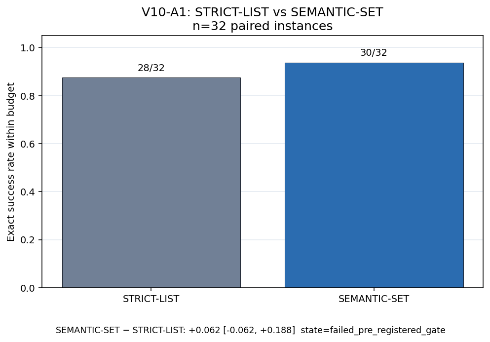
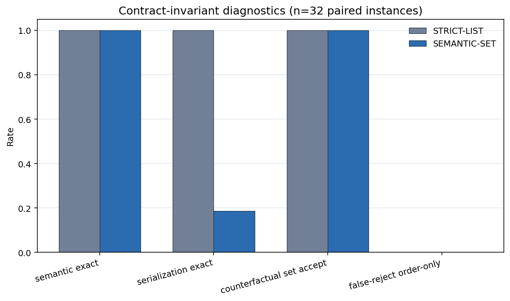
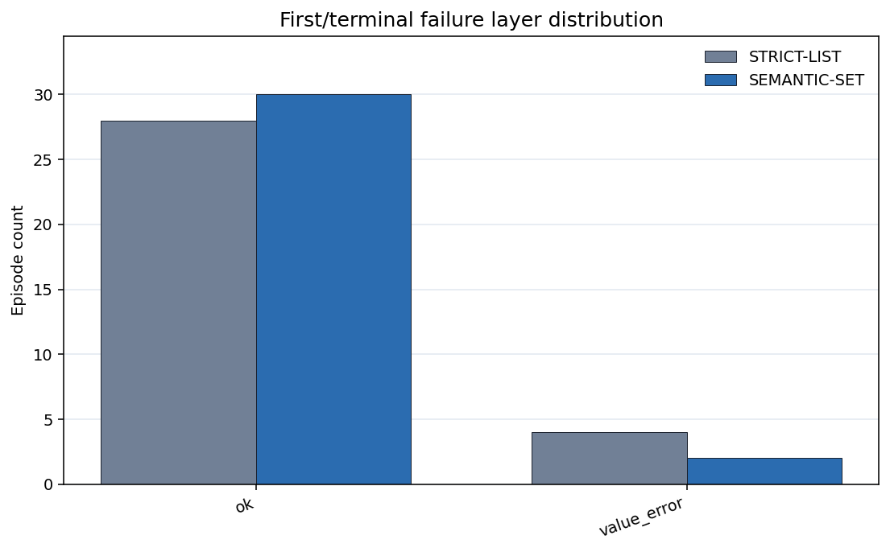
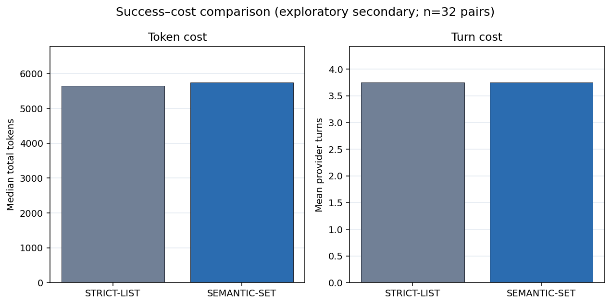

# 聚合失配 Artifact-v10：语义合同与 Runtime Canonicalization

**文档类型：** 理论—实验—数据—工程验证报告<br>
**证据截点：** 2026 年 7 月 28 日<br>
**总体评估：** **实现与数据门通过；预注册大效应 claim 未通过**<br>
**Study family：** `aggregation_mismatch_v10_semantic_contract_canonicalization`<br>
**Schema：** `artifact-v10`<br>
**English:** [Aggregation Mismatch Artifact-v10: Semantic Contracts and Runtime Canonicalization](./aggregation-mismatch-v10-semantic-contract-canonicalization.md)<br>
**双语同步规则：** 两个版本的样本量、估计值、裁决、局限与工程规则必须保持一致。

## 一句话结论

Artifact-v10 验证了 runtime 可以安全接收语义合法、顺序任意的 ID 集合，并将其确定性
规范化；但它**没有确认**“该合同使严格端到端成功率至少提高 20 个百分点”这一预注册
claim：SEMANTIC-SET 为 30/32，STRICT-LIST 为 28/32，配对差 **+6.25 个百分点**，
95% CI 为 **[−6.25, +18.75] 个百分点**，精确 sign-flip \(p=0.625\)。

## 技术摘要

V10 承接 artifact-v9 的一个重要诊断：v9 的 77 个 order failure 中，模型每次都选择了
完全正确的 ready-ID 集合，但严格接口在 value correctness 裁决之前，就因为排列不同而
拒绝提交。

V10 因此拆开：

- **语义正确：** 是否提交了恰好所需的实体及合法 value；
- **序列化正确：** 是否复述了 runtime 持有的唯一列表顺序。

| 项目 | 结果 |
|---|---:|
| 正式 semantic episodes | **64/64 完成** |
| 配对 DAG 实例 | **32**，每个实例运行两种合同 |
| Pilot | **16/16 完成**，不进入确认性推断 |
| Offline canonicalizer cases | **1,024/1,024 通过** |
| 事件重建 | **64/64；0 mismatch** |
| Arm matching | **32/32；0 mismatch** |
| STRICT-LIST success | **28/32 (87.5%)** |
| SEMANTIC-SET success | **30/32 (93.75%)** |
| 配对差 | **+0.0625** |
| 95% cluster-bootstrap CI | **[−0.0625, 0.1875]** |
| 精确 sign-flip \(p\) | **0.625** |
| 预注册最小效应 | **+0.20** |
| Claim state | **`failed_pre_registered_gate`** |

正确读法是：合同机制有效，但本矩阵没有建立大幅性能增益。未通过门不等于证明真实效应
严格为零。

## 1. 理论

### 1.1 表示不变性

设一个 ready layer 内部没有依赖，其任务语义是映射

\[
M=\{node\_id\mapsto value\}.
\]

对任意排列 \(\pi\)，

\[
\operatorname{Semantics}(\pi(M))=\operatorname{Semantics}(M).
\]

如果接口仍只接受一种列表顺序，就引入了比任务语义更严格的表示约束：

\[
\text{semantic validity}
\not\Rightarrow
\text{strict serialization validity}.
\]

可靠 canonicalizer 可以移除这一额外失败面：

\[
\text{验证 ID 集合、唯一性、基数和值域}
\rightarrow
\text{按 runtime 权威顺序排序}
\rightarrow
\text{编译并执行}.
\]

这是关于接口的条件性定理，只在顺序不属于领域语义时成立。

### 1.2 理论不能决定什么

理论不能决定：

- 固定模型多常违反 requested order；
- 端到端成功率能提高多少；
- 合同文字是否改变 value 计算策略；
- 效应能否跨难度、模型、语言或真实编辑任务保持。

这些量需要实验。尤其是，实际收益上限取决于 **order-only false reject** 的基线发生率。

## 2. 实验

### 2.1 三层证据

1. **V9 retrospective audit——只作动机。** 重新计算 77 个历史 order failure 的语义
   内容；它是描述性证据，不进入 V10 的置信区间或 \(p\) 值。
2. **Offline canonicalizer adoption gate。** 用合法与对抗集合检验接受、拒绝、幂等和
   输入不变性。
3. **配对确认实验。** 32 个全新冻结 DAG 实例分别运行两种 acceptance contract，
   形成 64 个 semantic episodes。

### 2.2 配对合同

两臂共享 DeepSeek-V4-Flash 配置、中文 prompt、`thinking=False`、
\(N\in\{16,24\}\)、冻结 DAG、ready set 与 completed ledger 暴露、工具 schema、
输出基数、300 秒预算和 global verifier。唯一变化是 acceptance contract：

- **A-STRICT-LIST：** 提交数组必须连同顺序精确等于 `current_ready_node_ids`；
- **A-SEMANTIC-SET：** ID 集合与 value 必须语义合法，runtime 规范化合法排列。

Primary endpoint 是预算内 strict success。预注册 claim 要求配对提升至少 +0.20、
CI 下界高于 0、精确 sign-flip \(p<0.05\)，并通过数据质量及 floor/ceiling 门。

## 3. 数据与结果

### 3.1 主结果



28 个配对实例同成或同败；3 个仅 SET 成功；1 个仅 STRICT 成功。+6.25 个百分点的
估计为正，但不确定性较大，低于最小工程效应且与 0 相容。因此 V10-A1 未通过预注册门。

### 3.2 诊断分解



- 两臂 semantic node-set correctness 均为 **32/32**；
- STRICT 的 serialization exact 为 **32/32**；
- SET 的 serialization exact 只有 **6/32**；
- **24 个成功的 SET episode** 依赖 runtime 接受并规范化非标准排列；
- 六个终态失败全部是 `value_error`：STRICT 4 个、SET 2 个；两臂均没有终态
  `order` failure。

这是最关键的机制结果：语义正确与序列化正确可以分离，canonicalizer 也被实际使用。
Primary 效应较小，是因为本轮较易矩阵上的 STRICT 已能复述 requested order；残差错误
来自 value，而 canonicalization 无法修复 value。



### 3.3 Offline adoption gate

1,024 个冻结 property cases 包含：

| Case 类型 | 数量 |
|---|---:|
| 合法排列 | 224 |
| 重复 ID | 224 |
| 缺失 ID | 192 |
| 额外 ID | 192 |
| 非法 value | 192 |

1,024 个案例全部通过；false accept 与 false reject 均为 0；canonicalization 幂等且
不修改输入。

### 3.4 成本

| Arm | 中位 tokens | 总 tokens | Provider turns | 中位 wall time |
|---|---:|---:|---:|---:|
| STRICT-LIST | 5,650.5 | 212,769 | 120 | 11.7 s |
| SEMANTIC-SET | 5,744.5 | 221,043 | 120 | 11.8 s |

正式实验合计约 433,812 tokens 与 240 provider turns。V10 没有建立成本下降。



## 4. 结论与 Claim 边界

### 支持

- Semantic-set API 可以安全接受合法排列并确定性 canonicalize，同时拒绝重复、遗漏、
  额外实体和非法 value。
- 在正式 SET 臂中，非标准排列频繁保持语义合法并端到端成功。
- V9 retrospective order 诊断可复算：77/77 失败提交具有精确 ready-ID 集合，
  73/77 的 first-failed-layer value 也全部正确。
- 工程 telemetry 应把 semantic correctness 与 serialization correctness 分开。

### 不支持

- SET 相对 STRICT 在本协议中至少提高 20 个百分点的确认性结论。
- “顺序从不重要”“任意排列总是安全”或“canonicalization 能修复错误 plan/value”。
- 跨模型、跨语言或真实仓库推广。

### 理论—实验差距

理论说明 canonicalization 能移除**可避免的 order-only rejection**；它没有说明该错误在
每种 workload 中都很常见。V9 展示了此类错误高发的困难矩阵；V10 使用较易的
\(N=16/24\) 矩阵，STRICT 臂没有终态 order failure。两项研究互补，并不矛盾：

```text
V9：在严格、困难的合同中，order-only failure 可以主导。
V10：semantic-set 机制有效；但 strict 基线已能跟随 requested order 时，
     它的端到端增益很小。
```

## 5. 工程意义

1. **对语义无序对象使用语义合同。** 接受 stable-ID set/mapping，不把 runtime
   持有的排列写进正确性定义。
2. **权威顺序由 runtime 持有。** 先验证，再 canonicalize 并确定性编译。
3. **不削弱语义验证。** 执行前拒绝重复、缺失、额外、未知实体或非法 value。
4. **把底座采用与性能承诺分开。** 即便没有确认大成功率提升，接口仍可因语义清晰和
   减少误拒而值得采用。
5. **测量目标失败分布。** 在承诺收益之前，把 order-only false reject 与 value error
   分开统计。
6. **按任务语义路由。** 如果顺序具有因果或业务含义，就保留严格顺序合同，并显式暴露
   顺序。

## 6. 可能的应用

| 领域 | 模型输出 | Runtime 责任 | 必需 verifier |
|---|---|---|---|
| 配置更新 | `{entity_id: new_value}` | schema、去重、规范顺序、原子应用 | 业务不变量 |
| 代码编辑 | symbol/AST-ID edit set | 解析当前位置、编辑排序、编译原生 patch | format、type、tests |
| 数据库迁移 | table/column-ID intent | 依赖排序、DDL 编译、事务与回滚 | 锁与数据约束 |
| DAG 工作流 | 当前 ready task-ID set | 调度、ledger、幂等执行 | 全局完成状态 |
| 多 Agent 合并 | artifact/claim-ID changes | 冲突检测、确定性合并、commit gate | 跨任务一致性 |

这些是工程迁移假设，不是 V10 已验证的真实领域。

## 7. 局限与下一步

- 单一 DeepSeek 配置、中文 prompt、合成 GF(2) DAG、32 个配对实例；
- \(N=16/24\) 比 v9 的 \(N=24/48\) 协议更容易；
- 3.125 个百分点的配对分辨率与当前 CI 不支持“零效应”结论；
- 决定性 follow-up 应覆盖 v8/v9 的非 floor 重叠难度区间，预先测量 order-only
  failure 基线，并增加第二模型与真实 unordered code/config task。

## 8. 复现来源

- [冻结设计](https://github.com/wxy2ab/llmdealer/blob/main/exp/aggregation_mismatch_experiment/docs/V10_SEMANTIC_CONTRACT_CANONICALIZATION_DESIGN.md)
- [正式报告](https://github.com/wxy2ab/llmdealer/blob/main/exp/aggregation_mismatch_experiment/docs/V10_SEMANTIC_CONTRACT_CANONICALIZATION_REPORT.md)
- [独立核验](https://github.com/wxy2ab/llmdealer/blob/main/exp/aggregation_mismatch_experiment/docs/V10_SEMANTIC_CONTRACT_CANONICALIZATION_VALIDATION.md)
- [机器汇总](https://github.com/wxy2ab/llmdealer/blob/main/exp/aggregation_mismatch_experiment/results/v10_semantic_contract_canonicalization/confirmatory/analysis/summary.json)
- [Endpoint ledger](https://github.com/wxy2ab/llmdealer/blob/main/exp/aggregation_mismatch_experiment/results/v10_semantic_contract_canonicalization/confirmatory/merged_runs.jsonl)
- [Event ledger](https://github.com/wxy2ab/llmdealer/blob/main/exp/aggregation_mismatch_experiment/results/v10_semantic_contract_canonicalization/confirmatory/events.jsonl)

## 相关文档

- [Aggregation Mismatch Artifact-v10: English](./aggregation-mismatch-v10-semantic-contract-canonicalization.md)
- [聚合失配 Artifact-v9](./aggregation-mismatch-v9-minimal-scaffold-recovery.zh-CN.md)
- [聚合失配：可推导命题与 Agent 工程](./aggregation-mismatch-theoretical-claims-agent-engineering.zh-CN.md)
- [聚合失配与组合治理](./aggregation-mismatch-compositional-governance-llm-systems.zh-CN.md)
- [Patch 与完整重写](./patch-vs-full-rewrite-controlled-experiment.zh-CN.md)
