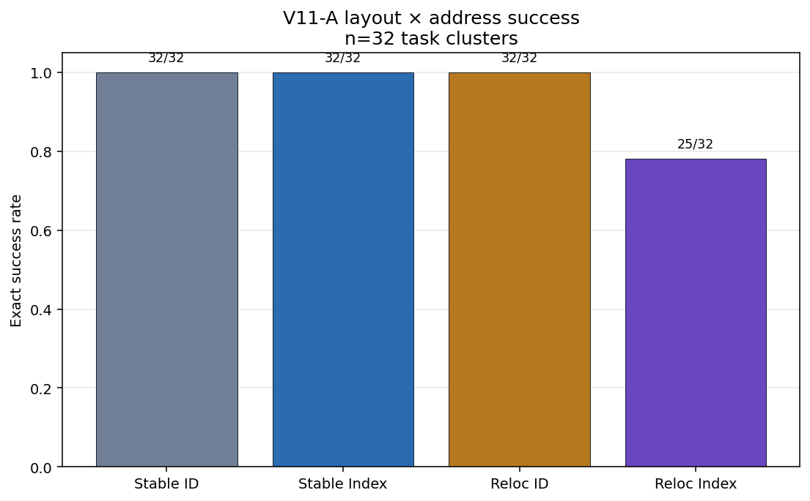
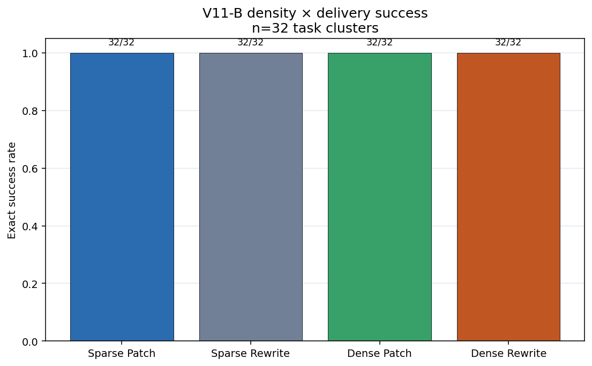
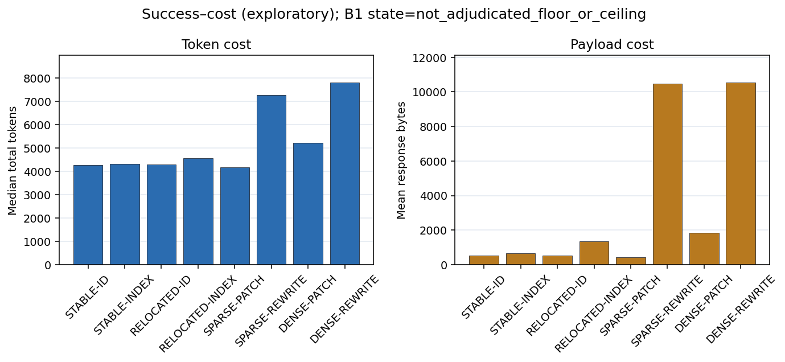

# 聚合失配 Artifact-v11：地址漂移与配置交付

**文档类型：** 理论—实验—数据—工程验证报告

**证据截点：** 2026 年 7 月 29 日

**总体评估：** **预注册地址 interaction 通过；Patch–Rewrite 可靠性 claim 因 ceiling
未裁决**

**Study family：** `aggregation_mismatch_v11_config_delivery_transfer`

**Schema：** `artifact-v11`

**English:** [Aggregation Mismatch Artifact-v11: Address Drift and Configuration Delivery](./aggregation-mismatch-v11-config-delivery-transfer.md)

**双语同步规则：** 两个版本的样本量、估计值、裁决、局限与工程规则必须保持一致。

## 一句话结论

在 production-shaped 合成 JSON 配置中，relocation 使 runtime 解析的 semantic ID
相对模型提交的 physical index 获得 **21.875 个百分点**的严格成功优势。该效应通过
预注册 V11-A1 门，但 7 个差异全部发生在 \(N=48\)；\(N=24\) 的四个单元全部 ceiling。
V11-B 的 Patch 与 Full Rewrite 四个单元又全部成功，因此可靠性未裁决；不过 Patch
在 token、延迟和响应字节上明显更便宜。

## 技术摘要

| 项目 | 结果 |
|---|---:|
| 正式 episodes | **256/256 完成** |
| Pilot | **32/32 完成**，不进入确认性推断 |
| Offline executor cases | **1,024/1,024 符合预期接受/拒绝行为** |
| 正式事件账本 | 2,048 events；每 episode 恰好 8 条 |
| Event reconstruction mismatch | 0 |
| V11 tests | **26/26 通过** |
| Stable-ID / Stable-Index | 32/32 / 32/32 |
| Relocated-ID / Relocated-Index | 32/32 / **25/32** |
| V11-A1 interaction | **+0.21875**，95% CI **[0.09375, 0.375]** |
| V11-A1 exact / Holm \(p\) | 0.015625 / **0.03125** |
| V11-A1 state | **`passed`** |
| Sparse Patch / Rewrite | 32/32 / 32/32 |
| Dense Patch / Rewrite | 32/32 / 32/32 |
| V11-B1 state | **`not_adjudicated_floor_or_ceiling`** |
| 正式 token 用量 | input 1,062,138 + output 279,292 = **1,341,430** |

## 1. 理论

### 1.1 Semantic identity 对 relocation 不变

设 \(C\) 是包含 stable ID 的配置，\(\pi(C)\) 只重排 service 数组、不改变对象语义。
对 service \(s\)：

\[
\operatorname{id}_{\pi(C)}(s)=\operatorname{id}_{C}(s),
\]

而通常：

\[
\operatorname{index}_{\pi(C)}(s)\ne\operatorname{index}_{C}(s).
\]

Semantic-ID 工具合同只要求模型识别目标，再由 runtime 对权威状态解析当前地址。
Physical-index 合同则要求模型多做一次重绑定：

\[
\text{语义目标}
\rightarrow
\text{当前物理 index}
\rightarrow
\text{工具 payload}.
\]

理论保证的是表示不变性和更小的模型责任面。它**不能**决定特定模型的失败频率、
效应如何随规模变化或成功率会提高多少。V11-A 检验的是这一经验转化。

### 1.2 Patch 只有条件性的承诺面优势

对象长度为 \(N\)、改动数为 \(k\) 时，可用一个粗略交付模型表示：

\[
L_{\text{rewrite}}\approx N c_r,
\qquad
L_{\text{patch}}\approx c_0+k(c_p+\log N).
\]

当 plan 正确、\(k\ll N\)、地址稳定且 executor 可靠时，Patch 通常要求模型正确提交
更少内容。但这不是无条件可靠性定理：短 Rewrite 可以进入 ceiling；Patch 自身有地址
和 schema 开销；dense edits 会削弱 \(k\ll N\)；错误 plan 在任何接口下仍然错误。

### 1.3 Governed execution 改变安全后果

两条交付路径都使用：

```text
解析目标
→ 检查 old-value precondition
→ 原子应用
→ 全局验证
→ commit 或 rollback
```

这会把地址错误转化为有类型、可审计的拒绝，而不是静默配置损坏。它是安全机制，
不会把错误模型输出变成语义正确。

## 2. 实验

### 2.1 共同协议

- DeepSeek-V4-Flash，中文 prompt，`thinking=False`；
- 一次 provider turn，无模型 repair，300 秒 episode budget；
- 交付前冻结正确 semantic edit plan；
- 匹配的原生工具 schema、old-value precondition、原子 executor 与 global verifier；
- strict success 要求目标、value、保护字段、覆盖范围和最终配置全部精确正确；
- 按 task cluster 配对推断；
- V11-A1 与 V11-B1 属于同一 Holm family。

V11 隔离的是正确 plan 之后的 delivery，不测 planning、retrieval 或真实生产仓库编辑。

### 2.2 模块 A：Layout × Address

32 个 task 各自进入四个条件：

| Layout | Address contract | 模型负责 | Runtime 负责 |
|---|---|---|---|
| Stable | Semantic ID | ID、old value、new value | ID→current index |
| Stable | Physical index | index、ID、old value、new value | 校验与执行 |
| Relocated | Semantic ID | ID、old value、new value | ID→relocated index |
| Relocated | Physical index | index、ID、old value、new value | 校验与执行 |

Primary interaction：

\[
\Delta_{A1}
=
(ID-INDEX)_{\text{relocated}}
-
(ID-INDEX)_{\text{stable}}.
\]

冻结门要求方向为正、观察效应至少 +0.15、区间与随机化检验支持，并通过数据、事件、
truth isolation 与 offline executor 门。

### 2.3 模块 B：Density × Delivery

另有 32 个 task 各自进入 Sparse-Patch、Sparse-Rewrite、Dense-Patch 和 Dense-Rewrite。
Primary 是 Sparse Patch−Rewrite；dense 对比与 density interaction 属于探索性分析。
冻结决策规则明确规定：双臂 floor 或 ceiling 时必须标记为未裁决。

## 3. 数据与结果

### 3.1 数据完整性

正式矩阵包含 256 个唯一 run key、256 次 provider turn 和 256 次 transport attempt。
每个 episode 恰好一次原生工具提交、8 条事件。事件 index 连续、时间戳单调，256 个
endpoint 全部可重建，mismatch=0。

1,024 个 offline case 覆盖合法输入以及 duplicate target、stale old value、unknown
ID、非法 field/value、stale baseline、out-of-range 或 reordered index、missing/
duplicate service、collateral mutation 和 unapplied edit 等变异。False accept、
false reject 与重建状态 mismatch 全部为 0。

“1,024/1,024 通过”表示观察到的接受或拒绝符合测试 oracle，不表示所有 case 都应被
接受，也不表示生产安全率为 100%。

### 3.2 V11-A1 通过，但存在规模边界



| 规模 | Stable-ID | Stable-Index | Relocated-ID | Relocated-Index |
|---|---:|---:|---:|---:|
| \(N=24\) | 16/16 | 16/16 | 16/16 | 16/16 |
| \(N=48\) | 16/16 | 16/16 | 16/16 | **9/16** |
| Overall | 32/32 | 32/32 | 32/32 | **25/32** |

配对 interaction：

\[
\Delta_{A1}=0.21875,
\qquad
95\%\ CI=[0.09375,0.375].
\]

7 个 task 支持 ID，0 个支持 Index，25 个 tie。原始 exact sign-flip
\(p=0.015625\)，Holm 后 \(p=0.03125\)，因此 V11-A1 通过。

措辞必须精确：观察效应超过预注册 +0.15，且 CI 下界超过 0；但下界 0.09375
**没有**超过 +0.15。因此不能说“以 95% 置信度证明总体效应至少为 15 个百分点”。

7 次失败全部是 \(N=48\) Relocated-Index precondition failure。失败 batch 的 35 个
edit operation 中，24 个 current index 正确，11 个错误；错误不能用“全部复制
relocation 前 index”解释。Precondition 和原子性在 commit 前拒绝每个错误 batch，
没有观察到 partial 或 collateral mutation。

### 3.3 V11-B1 未裁决



Sparse Patch、Sparse Rewrite、Dense Patch、Dense Rewrite 全部为 32/32。
Sparse Patch−Rewrite 的观察差为 0，CI [0,0]，raw/Holm \(p=1\)。按冻结规则，
裁决是 `not_adjudicated_floor_or_ceiling`，不是等价，也不是 Patch 在更难矩阵中没有
可靠性优势的证据。

### 3.4 可靠性 ceiling 下，成本仍有决策价值



| 条件 | Median tokens | Median wall time | Mean response bytes |
|---|---:|---:|---:|
| Sparse-Patch | 4,176.5 | 2.917 s | 435 |
| Sparse-Rewrite | 7,276 | 17.935 s | 10,489 |
| Dense-Patch | 5,233 | 5.569 s | 1,842 |
| Dense-Rewrite | 7,805 | 18.013 s | 10,536 |

相对 Rewrite，Patch：

- sparse tokens 减少 42.6%、wall time 减少 83.7%、response bytes 减少 95.9%；
- dense tokens 减少 33.0%、wall time 减少 69.1%、response bytes 减少 82.5%。

这些是冻结矩阵中的描述性成本结果，不是预注册 V11-B1 可靠性 endpoint。

## 4. 结论与 Claim 边界

### 支持

- 在当前 verified-plan 配置协议中，relocation 会在较大的受测规模选择性暴露
  physical-index 重绑定错误。
- Semantic ID + runtime current-address resolution 避免了 7 次观察到的
  Relocated-Index 失败。
- Old-value precondition、原子执行与 global verification 把本轮地址错误转化为
  安全拒绝。
- Patch 与 Rewrite 都能在本矩阵完美交付正确 plan。
- 在相同观察成功率下，Patch 在本研究中明显更便宜。
- Event ledger 可以重建 address、coverage、precondition、verifier 与 commit。

### 不支持

- Semantic ID 在所有规模、布局、模型或真实领域都更可靠。
- Relocation 独立于规模或上下文负担解释全部效应。
- Patch 在 V11 中比 Rewrite 更可靠。
- Patch 与 Rewrite 等价。
- 已经建立固定的 sparse-to-dense crossover。
- Offline 1,024/1,024 等于生产 100% 安全。
- 结果已经跨模型、语言或真实仓库泛化。

### 理论—实验差距

| 理论 | V11 证据 | 剩余差距 |
|---|---|---|
| ID 对 permutation 不变 | A1 interaction 通过 | 第二模型、连续规模、真实 schema |
| Runtime resolution 移除模型侧重绑定 | 避免 7 次失败 | 分离规模、edit 数量、分散度、relocation distance |
| Patch 减少承诺面 | token/time/bytes 大幅下降 | 非 ceiling 可靠性与 density 曲线 |
| Governed executor 阻止错误 commit | 7 次安全拒绝；offline gate 通过 | 并发、stale read、crash/replay、外部副作用 |

## 5. 工程意义

1. **模型侧合同使用 semantic identity。** 接受 service ID、resource name、symbol ID、
   row key 或 claim ID。
2. **根据当前权威状态解析物理地址。** JSON Pointer、array index、行 span 和 cell
   coordinate 应属于 runtime 或 deterministic compiler。
3. **交付绑定 frozen plan。** 包含 plan hash、state hash、old-value precondition 和
   protected invariants。
4. **保持原子执行。** Batch 中一个错误地址应拒绝或回滚整批，不能留下部分配置。
5. **分开可靠性路由与成本路由。** Ceiling 不能证明等价；当两条路径都安全时，成本仍
   可以支持优先 Patch。
6. **监控 interaction 变量。** 记录对象规模、edit 数、目标分散度、relocation distance、
   address contract 与 failure layer。
7. **保留受控 Full Rewrite fallback。** 用于 patch 语义不支持或整体结构变化，不应把
   每次 Patch 失败都自动升级成 Rewrite。

## 6. 可能的应用

| 领域 | Stable identity | Runtime 责任 |
|---|---|---|
| Kubernetes / IaC | resource UID 或 kind/name | 解析当前文档 path 并原子应用 |
| JSON/YAML 配置 | entity ID + field name | 编译当前 JSON Pointer 或 index |
| 代码编辑 | symbol 或 AST node ID | 解析当前 span 并编译原生 edit |
| 数据库迁移 | table/column/constraint ID | 编译 DDL 与事务顺序 |
| 表格 Agent | row key + semantic column | 排序/筛选后解析当前 cell |
| 工作流系统 | task ID | 持有依赖位置与 completed ledger |
| 文档编辑 | section 或 claim ID | 章节重排后解析当前文本范围 |

这些是工程迁移假设，不是 V11 已验证的真实领域。

## 7. 局限与下一步

- 单 DeepSeek 配置、中文 prompt、合成 JSON、正确 verified plan、每模块 32 个 task
  cluster，且只有 \(N=24/48\)。
- A 效应存在异质性，全部集中于 \(N=48\)。
- B 矩阵过易，不能估计可靠性差或 density crossover。
- Offline mutation coverage 受已编码不变量限制。

决定性的 follow-up 应在第二模型复现 A1，增加规模档和受控 permutation distance，
让 B 离开 ceiling，并在真实配置或代码仓库上加入 stale-state、并发、crash/replay
与幂等 mutation。

## 8. 复现来源

- [冻结设计](https://github.com/wxy2ab/llmdealer/blob/main/exp/aggregation_mismatch_experiment/docs/V11_CONFIG_DELIVERY_TRANSFER_DESIGN.md)
- [正式报告](https://github.com/wxy2ab/llmdealer/blob/main/exp/aggregation_mismatch_experiment/docs/V11_CONFIG_DELIVERY_TRANSFER_REPORT.md)
- [独立验证](https://github.com/wxy2ab/llmdealer/blob/main/exp/aggregation_mismatch_experiment/docs/V11_CONFIG_DELIVERY_TRANSFER_VALIDATION.md)
- [机器汇总](https://github.com/wxy2ab/llmdealer/blob/main/exp/aggregation_mismatch_experiment/results/v11_config_delivery_transfer/confirmatory/analysis/summary.json)
- [Endpoint ledger](https://github.com/wxy2ab/llmdealer/blob/main/exp/aggregation_mismatch_experiment/results/v11_config_delivery_transfer/confirmatory/merged_runs.jsonl)
- [Event ledger](https://github.com/wxy2ab/llmdealer/blob/main/exp/aggregation_mismatch_experiment/results/v11_config_delivery_transfer/confirmatory/events.jsonl)

## 相关文档

- [Aggregation Mismatch Artifact-v11: English](./aggregation-mismatch-v11-config-delivery-transfer.md)
- [聚合失配 Artifact-v10](./aggregation-mismatch-v10-semantic-contract-canonicalization.zh-CN.md)
- [Patch 与完整重写](./patch-vs-full-rewrite-controlled-experiment.zh-CN.md)
- [聚合失配：可推导命题与 Agent 工程](./aggregation-mismatch-theoretical-claims-agent-engineering.zh-CN.md)
- [聚合失配与组合治理](./aggregation-mismatch-compositional-governance-llm-systems.zh-CN.md)
