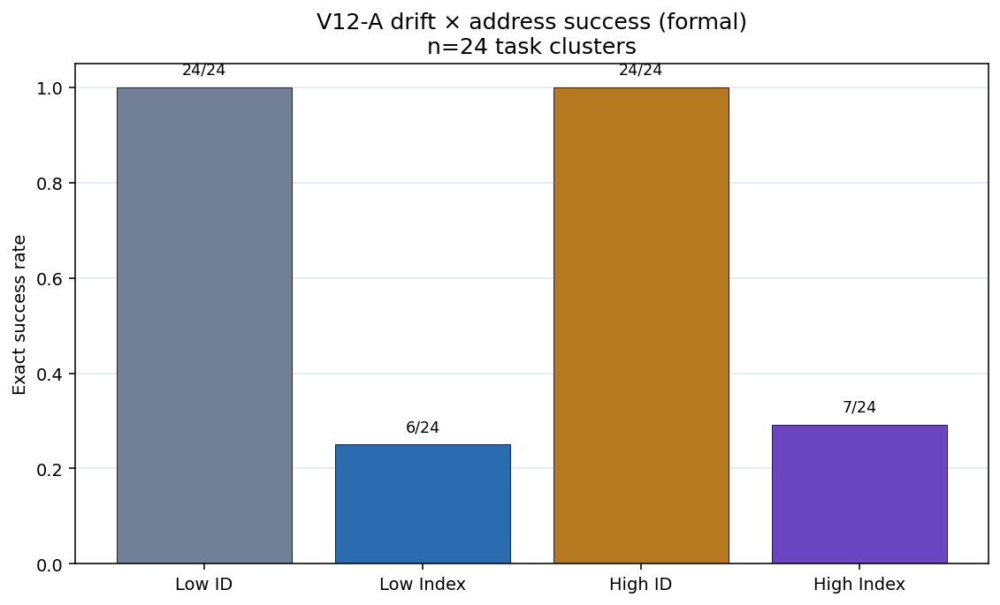
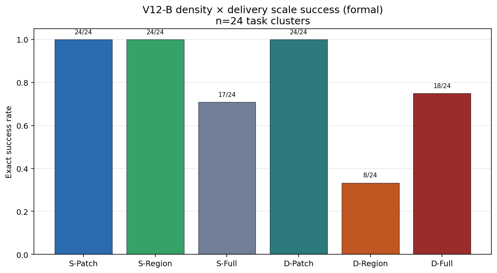
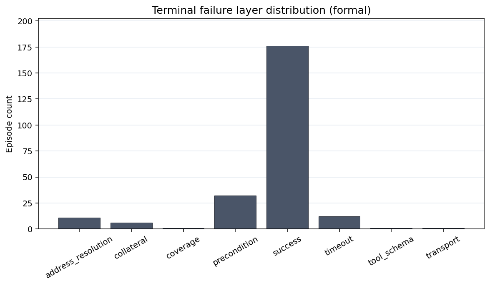

# 聚合失配 Artifact-v12：漂移剂量与交付尺度路由

**文档类型：** 理论—实验—数据—工程验证报告

**证据截止：** 2026-07-29

**总体判断：** **预注册的漂移剂量交互未通过；稀疏 Patch−Full Rewrite endpoint 通过**

**研究族：** `aggregation_mismatch_v12_scale_routing_transfer`

**Schema：** `artifact-v12`

**English:** [Aggregation Mismatch Artifact-v12: Drift Dose and Delivery-Scale Routing](./aggregation-mismatch-v12-scale-routing-transfer.md)

**双语同步规则：** 两个版本的样本量、估计值、裁决、局限与工程规则必须保持一致。

## 一句话结论

在更大的 production-shaped 合成 JSON 配置上，semantic ID 在低漂移与高漂移下都相对
model-authored index 保持大的简单优势，但高漂移没有进一步扩大该优势：
\((ID-Index)_{high}-(ID-Index)_{low}=-0.0417\)，因此 V12-A1 未通过。稀疏
verified-plan 交付中，semantic Patch 为 24/24，Full Rewrite 为 17/24，预算内严格
成功率优势为 **+0.2917**，V12-B1 通过。

## 技术摘要

| 项目 | 结果 |
|---|---:|
| Formal / pilot / offline | **240/240** / **24/24** / **768/768** |
| Formal tasks | 48 |
| Provider turns / transport attempts | 240 / 245 |
| Formal event ledger | 2,138 events |
| Endpoint reconstruction mismatch | 0 |
| Offline false accept / reject / mismatch | 0 / 0 / 0 |
| V12 tests | **24/24 passed** |
| Low-drift ID / Index | 24/24 / **6/24** |
| High-drift ID / Index | 24/24 / **7/24** |
| V12-A1 interaction | **−0.0417**，95% CI **[−0.25, 0.1667]** |
| V12-A1 raw / Holm \(p\) | 1 / 1 |
| V12-A1 state | **`failed_pre_registered_gate`** |
| Sparse Patch / Region / Full | 24/24 / 24/24 / **17/24** |
| V12-B1 Patch−Full | **+0.2917**，95% CI **[0.125, 0.4583]** |
| V12-B1 raw / Holm \(p\) | 0.015625 / **0.03125** |
| V12-B1 state | **`passed`** |
| Dense Patch / Region / Full | 24/24 / **8/24** / 18/24 |
| Formal token usage | **4,915,111** |

## 1. 理论

### 1.1 语义身份不变性与漂移剂量是两个不同主张

对配置 \(C\) 及其排列 \(\pi(C)\)，稳定实体 ID 保持不变：

\[
id_{\pi(C)}(s)=id_C(s).
\]

物理数组下标通常不保持不变：

\[
index_{\pi(C)}(s)\ne index_C(s).
\]

这给出了一个结构性理由：让模型提交语义目标，由 runtime 解析当前地址。但它不推出
一个单调性能定律，即每次 layout drift 增大都必然带来更大的 ID 观测优势。

因此 V12-A1 检验的是更强的经验主张：

\[
\Delta_{A1}
=
(ID-Index)_{high}
-
(ID-Index)_{low}
\ge 0.15.
\]

ID 的简单效应可以在两个漂移档都很大，而交互仍为零或负。把简单效应当作漂移剂量
的证明，会回答错误的 estimand。

### 1.2 交付尺度改变模型拥有的承诺面

给定一个正确计划，其中对象规模为 \(N\)、编辑数为 \(k\)：

- **Patch** 要求模型只提交最小语义变更集；
- **Regional Rewrite** 要求模型重写一个受影响区域；
- **Full Rewrite** 要求模型重新生成完整配置。

当 \(k\ll N\) 时，Patch 的模型生成内容与时延暴露通常更小。这是条件性优势，而非
普遍定理：密集编辑、Patch 语义不足、错误计划或不可靠 executor 都可能抹去收益。

### 1.3 Endpoint 是预算内交付

Primary outcome 是在 300 秒内完成精确、经验证的 commit：

\[
strict\_success
=
semantic\ correctness
\land invariant\ preservation
\land commit
\land wall\_time\le300s.
\]

V12-B1 可以识别该 endpoint 下的交付优势，不能证明在无限时间下 Full Rewrite 的
语义正确率仍然更低。

## 2. 实验

### 2.1 共享协议

- DeepSeek-V4-Flash，中文提示，`thinking=False`，temperature 0；
- 最大 32k tokens，单 provider turn，无模型 repair；
- 300 秒 semantic-episode budget；
- 交付前冻结正确 semantic plan；
- 原生工具、old-value precondition、atomic executor 与 global verifier；
- 按 task cluster 做配对推断；
- V12-A1 与 V12-B1 构成同一个 Holm family。

V12 隔离的是正确计划之后的寻址与交付，不检验计划推断、检索或自主生产仓库编辑。

### 2.2 Module A：漂移 × 寻址

24 个 task cluster 分别进入四个条件：

| 漂移 | 寻址合同 | 模型负责 | Runtime 负责 |
|---|---|---|---|
| Low | Semantic ID | ID 与值变化 | 当前 ID→index 解析 |
| Low | Physical Index | 当前 index 与值变化 | 校验 |
| High | Semantic ID | ID 与值变化 | 当前 ID→index 解析 |
| High | Physical Index | 当前 index 与值变化 | 校验 |

24 个任务覆盖 \(N\in\{48,72,96\}\)。Low drift 只做最小目标移动；High drift 冻结为
Kendall inversion [0.40, 0.60]，目标 displacement 至少 \(N/4\)。计划不暴露
`baseline_index`。

### 2.3 Module B：密度 × 交付尺度

另有 24 个 cluster 分别进入六个条件：

| 密度 | Patch | Regional Rewrite | Full Rewrite |
|---|---:|---:|---:|
| Sparse，\(k/N=1/24\) | primary | exploratory | primary |
| Dense，\(k/N=1/3\) | exploratory | exploratory | exploratory |

任务覆盖 \(N\in\{96,144\}\)。预注册的 B1 对比为 Sparse Patch−Full。Regional
Rewrite 与所有 dense 对比均为 secondary。

## 3. 数据完整性

正式矩阵包含 240 个唯一 run key 和 48 个正式任务，十个条件均为 24 个 episode。
Pilot 包含 24 个唯一 key，不进入确认性推断；pilot、formal 与既往 artifact 没有 key
重叠。

正式 ledger 包含 2,138 个 event、240 个 provider turn 和 245 个 transport attempt。
Endpoint reconstruction mismatch 为 0。768 个 offline executor case 的 false
accept、false reject、mutation mismatch 与 reconstructed-state mismatch 均为 0。
Freeze、executor-contract 与 agent-suite 测试合计 24/24 通过。

## 4. 结果

### 4.1 V12-A1 未通过

| 条件 | 严格成功 |
|---|---:|
| Low-drift ID | 24/24 |
| Low-drift Index | 6/24 |
| High-drift ID | 24/24 |
| High-drift Index | 7/24 |

两个 exploratory simple effect 分别为 +0.75 与 +0.7083。预注册交互为：

\[
\Delta_{A1}=0.7083-0.75=-0.0417,
\qquad
95\%\ CI=[-0.25,0.1667].
\]

raw 与 Holm-adjusted \(p\) 均为 1。V12-A1 为
`failed_pre_registered_gate`。

正确解释必须保持收窄：该协议没有表明高漂移会进一步放大 ID 优势。它不抹去观测到
的巨大 ID−Index 简单效应，但简单效应不是 primary drift-dose claim。

### 4.2 V12-B1 通过

Sparse Patch 与 Region 都是 24/24，Sparse Full 为 17/24：

\[
\Delta_{B1}=1.0-0.7083=+0.2917,
\qquad
95\%\ CI=[0.125,0.4583].
\]

raw exact sign-flip \(p=0.015625\)，Holm-adjusted \(p=0.03125\)，效应超过预注册
+0.15 门槛。七个配对差异全部是 Patch 成功、Full 在 300 秒 endpoint 内超时。

证据支持预算内严格交付，不支持无限预算下的语义优越性。失败请求或其 transport
retry 可能在 300 秒后才结束，但 over-budget episode 不会被计为成功。

### 4.3 Regional Rewrite 不是普遍成立的中间方案

Dense Patch、Region 与 Full 分别为 24/24、8/24、18/24。exploratory effect 为
Patch−Region +0.6667、Patch−Full +0.25、Region−Full −0.4167。Regional Rewrite
在 sparse 达到 ceiling，在 dense 却表现最差。因为这些是 secondary contrast，V12
没有建立一般 density crossover 或通用路由阈值。

### 4.4 失败层与成本

| 终态层 | 数量 |
|---|---:|
| Success | 176 |
| Precondition | 32 |
| Timeout | 12 |
| Address resolution | 11 |
| Collateral | 6 |
| Tool schema / coverage / transport | 1 / 1 / 1 |

Index 失败集中于 address 与 precondition。Full Rewrite 失败集中于 timeout 与输出负担。
Dense Regional 的失败包括 collateral、coverage、address 和 schema。

| 条件 | Median tokens | Median wall time |
|---|---:|---:|
| Sparse Patch | 18,663 | 4.2 s |
| Sparse Region | 19,114 | 7.1 s |
| Sparse Full | 36,077 | 138.2 s |
| Dense Patch | 20,751 | 9.8 s |
| Dense Region | 29,848 | 39.7 s |
| Dense Full | 30,344 | 144.4 s |

13 个 episode 的观测总 wall time 超过 300 秒：12 个终态为 timeout，1 个为 transport
failure；over-budget success 为 0。总时长可能包含失败等待，以及同一 semantic
episode 内的一次 transport retry；它不是独立随机化的长预算实验臂。

## 5. 结论与 claim 边界

### 支持

- 在冻结 V12 verified-plan 协议中，Sparse semantic Patch + deterministic execution
  相对模型 Full Rewrite 提高 300 秒预算内严格成功率。
- 作为观测到的简单效应，semantic ID 在两个漂移档都显著优于 physical Index。
- Runtime 地址解析、precondition、atomic apply 与 global verification 将观测错误
  转换为类型化拒绝，而非静默部分提交。
- Endpoint 与 event ledger 均可无误重建。

### 不支持

- 更高漂移会单调或因果地扩大 ID 优势。
- Patch 总是优于 Full 或 Regional Rewrite。
- Regional Rewrite 通常是最佳折中。
- 已建立一个硬性的 sparse-to-dense crossover。
- 无限时间下 Full Rewrite 仍然更差。

### 未裁决或未测量

- 跨模型复现、真实仓库、计划推断、模型 repair、并发与生产副作用。
- 没有 primary 落入冻结的 floor/ceiling“未裁决”状态；V12-A1 是直接未通过门槛。

## 6. 理论—实验差距

| 理论 | V12 证据 | 剩余缺口 |
|---|---|---|
| Semantic ID 对排列不变 | 大的 ID 简单效应 | 第二模型与真实 schema |
| 漂移剂量应增加重绑定负担 | interaction −0.0417；未通过 | 避免 ID ceiling / Index floor 的可测剂量窗 |
| Sparse Patch 缩小承诺面 | B1 +0.2917；通过 | 无限预算语义与真实任务 |
| Regional 输出可能权衡局部性和上下文 | 异质 exploratory 结果 | 预注册 Regional 协议 |
| Governed executor 拒绝不安全交付 | 768/768 offline 与类型化失败 | stale read、crash/replay、并发、副作用 |

## 7. 工程意义

1. **向模型暴露稳定 semantic ID。** 不应先估计漂移强度，才采用一个本身具有不变性的接口。
2. **在执行时解析物理位置。** Array index、JSON Pointer、line span 与 cell coordinate
   属于 authoritative runtime state。
3. **稀疏 verified plan 优先 Patch。** V12 最强证据对应 300 秒交付 endpoint，不是
   端到端计划推断。
4. **不要假设 Regional Rewrite 天然安全。** 为它单独设置 coverage、collateral、
   schema 与 latency gate。
5. **按类型化失败层路由。** Address failure 重新解析，stale precondition 拒绝，
   coverage failure 重规划，只对交付时限压力升级预算。
6. **保留 Full Rewrite 作为 governed fallback。** 用于广泛结构变更或 Patch 语义
   不支持，并要求明确预算与验证。
7. **同时跟踪多个目标。** Reliability、tail latency、tokens、commit risk 与 verifier
   coverage 不能压缩成一个 Patch/Rewrite 布尔开关。

## 8. 可能应用

| 领域 | 模型面对的对象 | Runtime 与 verifier 责任 |
|---|---|---|
| Kubernetes / IaC | resource ID + 字段意图 | 解析当前路径、原子应用、策略校验 |
| JSON/YAML 配置 | entity ID + old/new value | 解析当前 index、schema 与不变量 |
| 代码编辑 | symbol/AST ID + edit plan | 解析当前 span、格式化、类型检查、测试 |
| 数据库迁移 | table/column/constraint ID | 编译 DDL、依赖排序、事务 |
| 表格 Agent | row key + semantic column | 排序/筛选后解析 cell、检查公式 |
| 文档编辑 | claim/section ID + change set | 解析当前范围、引用与交叉引用 |
| 工作流系统 | task ID + transition | 管理 readiness ledger、幂等与 commit |

这些是从合成协议推导出的迁移假设，不是 V12 已验证的领域。

## 9. 推荐的下一步实验

1. 在第二个模型配置上复现 V12-B1。
2. 在真实配置 pull request 上比较 verified-plan Patch 与 Full Rewrite。
3. 若继续检验漂移剂量，重新设计难度窗，避免 ID ceiling 与两个漂移档的 Index 均已很低。
4. 为 Regional Rewrite 做独立预注册研究，再将其提升为生产路由条件。
5. 加入 stale-state、concurrent-write、crash/replay 与 idempotency mutation。

## 10. 复现来源

- [冻结设计](https://github.com/wxy2ab/llmdealer/blob/main/exp/aggregation_mismatch_experiment/docs/V12_SCALE_ROUTING_TRANSFER_DESIGN.md)
- [正式报告](https://github.com/wxy2ab/llmdealer/blob/main/exp/aggregation_mismatch_experiment/docs/V12_SCALE_ROUTING_TRANSFER_REPORT.md)
- [独立核验](https://github.com/wxy2ab/llmdealer/blob/main/exp/aggregation_mismatch_experiment/docs/V12_SCALE_ROUTING_TRANSFER_VALIDATION.md)
- [机器汇总](https://github.com/wxy2ab/llmdealer/blob/main/exp/aggregation_mismatch_experiment/results/v12_scale_routing_transfer/confirmatory/analysis/summary.json)
- [Endpoint ledger](https://github.com/wxy2ab/llmdealer/blob/main/exp/aggregation_mismatch_experiment/results/v12_scale_routing_transfer/confirmatory/merged_runs.jsonl)
- [Event ledger](https://github.com/wxy2ab/llmdealer/blob/main/exp/aggregation_mismatch_experiment/results/v12_scale_routing_transfer/confirmatory/events.jsonl)

## 相关文档

- [Aggregation Mismatch Artifact-v12: English](./aggregation-mismatch-v12-scale-routing-transfer.md)
- [聚合失配 Artifact-v11](./aggregation-mismatch-v11-config-delivery-transfer.zh-CN.md)
- [Patch 与完整重写](./patch-vs-full-rewrite-controlled-experiment.zh-CN.md)
- [聚合失配：理论主张与 Agent 工程](./aggregation-mismatch-theoretical-claims-agent-engineering.zh-CN.md)
- [聚合失配与组合治理](./aggregation-mismatch-compositional-governance-llm-systems.zh-CN.md)
