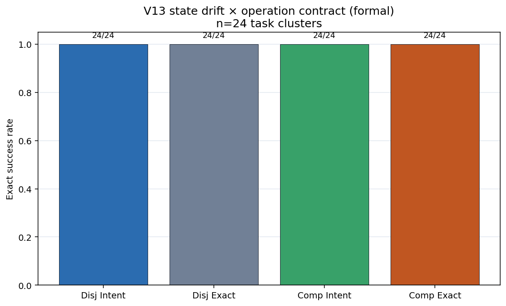

# Aggregation Mismatch Artifact-v13: State Drift and Intent Rebase

**Document type:** Theory–experiment–data–engineering validation report

**Evidence cutoff:** July 29, 2026

**Overall assessment:** **Archived method-development artifact; Primary V13-A1
is not adjudicated due to four-arm ceiling**

**Synthesis status:** Excluded from the V1–V12 + V14 evidence synthesis. V14
replaces the timing design, not the historical record.

**Study family:** `aggregation_mismatch_v13_state_drift_intent_rebase`

**Schema:** `artifact-v13`

**中文：** [聚合失配 Artifact-v13：状态漂移与 Intent Rebase](./aggregation-mismatch-v13-state-drift-intent-rebase.zh-CN.md)

**Bilingual synchronization rule:** sample sizes, estimates, verdicts,
limitations, and engineering rules must remain aligned across both versions.

## One-sentence conclusion

Under the frozen DeepSeek repository-shaped protocol, all four
Disjoint/Compatible × Intent/Exact arms succeed on **24/24** episodes. The
preregistered interaction
\((INTENT-EXACT)_{\mathrm{compatible}}-(INTENT-EXACT)_{\mathrm{disjoint}}\) is
**0.0**, but because every arm sits at ceiling (≥0.90), V13-A1 is
**`not_adjudicated_floor_or_ceiling`**. Ceiling is not equivalence and does not
falsify the Intent-rebase direction.

## Technical summary

| Item | Result |
|---|---:|
| Formal / pilot / offline | **96/96** / **12/12** / **768/768** |
| Formal tasks | 24 |
| Provider turns / transport attempts | 96 / 96 |
| Endpoint reconstruction mismatch | 0 |
| Offline false accept / reject / mismatch | 0 / 0 / 0 |
| V13 tests | **21/21 passed** |
| Four-arm success | **24/24** each |
| V13-A1 interaction | **0.0**, 95% CI **[0.0, 0.0]** |
| V13-A1 sign-flip \(p\) | 1.0 (`no_nonzero_pairs`) |
| V13-A1 state | **`not_adjudicated_floor_or_ceiling`** |
| Formal token usage | **967,252** |
| Over-budget success | **0** |

## 1. Theory

After a plan is frozen, authoritative state may drift. Runtime-interpreted Intent
(`at_least` / `at_most`) should be more tolerant of **compatible** goal-field
changes than model-compiled Exact Patch (`old_value` → `new_value`), while
**disjoint** edits should leave the two contracts closer.

\[
\Delta_{A1}
=
(P_{\text{INTENT}}-P_{\text{EXACT}})_{\text{compatible}}
-
(P_{\text{INTENT}}-P_{\text{EXACT}})_{\text{disjoint}}
\]

Pass gates: \(\Delta\ge +0.15\); task-cluster bootstrap 95% CI lower bound \(>0\);
exact two-sided sign-flip \(p<0.05\); four arms not jointly at floor ≤0.10 or
ceiling ≥0.90; data/event/offline gates pass. Single primary; no Holm.

## 2. Experiment

- Model: `SimpleDeepSeekClientChat` / `deepseek-v4-flash`; thinking=False; T=0;
  top_p=1; max_tokens=32000; zh; 300s/episode; one provider turn; no repair;
  one native tool call
- 24 clusters; \(N\in\{72,96,144\}\) × 8; \(k=N/12\)
- Tools: Intent → `apply_intent_operations`; Exact → `apply_exact_patch`
- Bootstrap seed=20260813; 10,000 resamples

## 3. Data integrity

Frozen SHA/preflight `errors=[]`; prior repository overlap=0; offline FA/FR=0;
pilot mechanical audit OK; formal missing/extra/dup=0; endpoint↔event rebuild OK;
arm matching OK; 21 V13 tests passed.

## 4. Primary

\[
\Delta_{A1}=(1.0-1.0)_{\text{compatible}}-(1.0-1.0)_{\text{disjoint}}=0.0
\]

State: `not_adjudicated_floor_or_ceiling` (reason=`ceiling`).

If A1 had passed, the only allowed claim would be: under the frozen DeepSeek
repository-shaped protocol, when goal fields undergo compatible state change,
runtime-interpreted Intent’s budgeted strict-success advantage over Exact Patch
is larger than under disjoint-only change. That wording is **not** licensed here.

## 5. Secondary / failure / cost

Secondary Intent−Exact simple effects are 0 under both drift types (exploratory).
All 96 formal terminals are `success`. Offline 768 still rejects stale Exact,
locked targets, wrong thresholds, and malformed goals. Median wall ≈4.3–6.0s;
Exact arms use slightly more tokens/wall than Intent (exploratory).

## 6. Claim audit

- **Supported:** freeze integrity; event reconstructability; offline executor
  safety contract; pilot mechanical audit.
- **Not supported:** V13-A1 pass; “Intent always beats Exact.”
- **Not adjudicated:** V13-A1 (four-arm ceiling).
- **Not generalizable:** single DeepSeek; synthetic repos; exogenous verified
  plan; offline 768 ≠ production 100%; may not delete precondition/lock/verifier;
  does not disprove Full Rewrite; not real production validation.

## 7. Engineering implication

Implement runtime Intent interpretation and Exact stale/lock checks, but do
**not** treat this ceiling matrix as router evidence for always preferring Intent.
Next study needs a difficulty ladder that leaves ceiling without post-hoc
threshold editing.

## Sources

- [Artifact-v14 post-compile drift and Exact recovery](./aggregation-mismatch-v14-post-compile-drift-recovery.md)
- [V1–V12 + V14 experiment summary](./aggregation-mismatch-v1-v12-v14-experiment-summary.md)
- [Frozen design](https://github.com/wxy2ab/llmdealer/blob/main/exp/aggregation_mismatch_experiment/docs/V13_STATE_DRIFT_INTENT_REBASE_DESIGN.md)
- [Report](https://github.com/wxy2ab/llmdealer/blob/main/exp/aggregation_mismatch_experiment/docs/V13_STATE_DRIFT_INTENT_REBASE_REPORT.md)
- [Validation](https://github.com/wxy2ab/llmdealer/blob/main/exp/aggregation_mismatch_experiment/docs/V13_STATE_DRIFT_INTENT_REBASE_VALIDATION.md)
