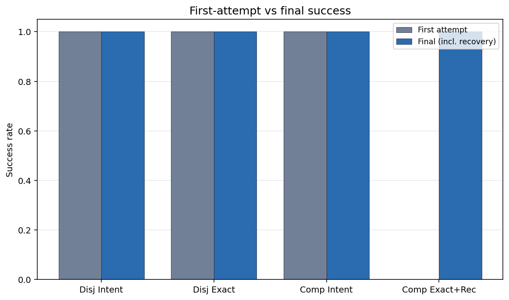
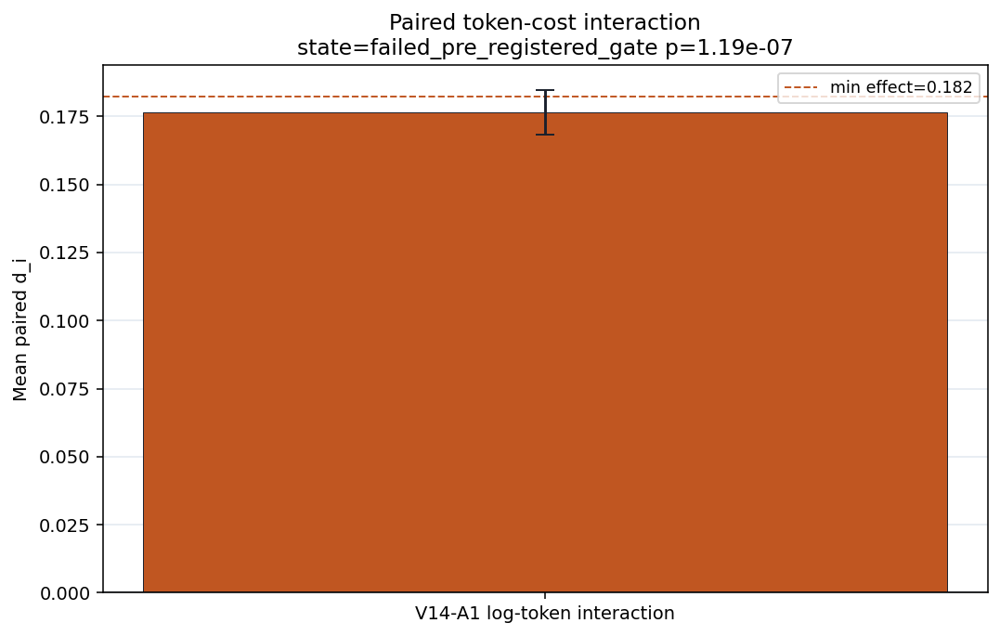
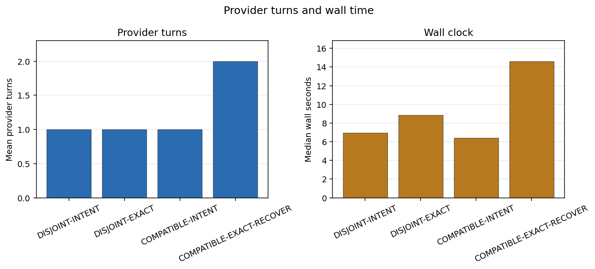

# Aggregation Mismatch Artifact-v14: Post-Compile Drift and Exact Recovery

**Document type:** Theory–experiment–data–engineering validation report

**Evidence cutoff:** July 29, 2026

**Overall assessment:** **The safety mechanism holds; the preregistered +20%
token-cost interaction does not pass**

**Study family:** `aggregation_mismatch_v14_post_compile_drift_recovery`

**Schema:** `artifact-v14`

**中文：** [聚合失配 Artifact-v14：Post-Compile Drift 与 Exact Recovery](./aggregation-mismatch-v14-post-compile-drift-recovery.zh-CN.md)

**Bilingual synchronization rule:** sample sizes, estimates, verdicts,
limitations, and engineering rules must remain aligned across both versions.

## One-sentence conclusion

Under a strict TOCTOU sequence in which the provider generates and seals a tool
payload from the old state before compatible authoritative-state drift occurs,
all 24 Exact payloads are safely rejected as stale and then recover within the
same budget through one located repair; all 24 Intent runs commit on their first
attempt. The paired log-token interaction for Exact recovery is 0.1765
(geometric cost ratio about 1.193), directionally stable but just below the
preregistered \(\log(1.20)=0.1823\) threshold. V14-A1 is therefore
`failed_pre_registered_gate`.

## Technical summary

| Item | Result |
|---|---:|
| Formal / pilot / offline | **96/96** / **12/12** / **768/768** |
| Formal tasks / conditions | 24 / 4 |
| Formal raw events | **1,416** |
| Provider turns / transport attempts | **120 / 120** |
| Endpoint reconstruction mismatch | 0 |
| Offline false accept / reject / mutation | 0 / 0 / 0 |
| Initial post-state leak | 0 |
| Seal before drift | 96/96 |
| Compatible Exact first attempt | 0/24 commit; 24/24 `STALE_OLD_VALUE` |
| Compatible Exact final success | 24/24 |
| Compatible Intent first-attempt commit | 24/24 |
| Final success in all four arms | 24/24 each |
| V14-A1 | **0.176459**; 95% CI **[0.168331, 0.184575]** |
| Exact sign-flip | \(2/2^{24}=1.1921\times10^{-7}\) |
| Minimum effect | \(\log(1.20)=0.182322\) |
| Claim state | **`failed_pre_registered_gate`** |
| Formal tokens | **1,571,142** |
| Unsafe / over-budget success | 0 / 0 |
| V14 tests | **24 passed** |

## 1. Theory

### 1.1 V14 tests genuine post-compile drift

The frozen sequence is:

\[
S_0
\rightarrow Q_0
\rightarrow Seal(Q_0)
\rightarrow D
\rightarrow S_1
\rightarrow Execute(Q_0,S_1).
\]

The initial provider turn can see only \(S_0\). The harness injects drift only
after tool arguments \(Q_0\) have been captured, validated, and sealed. If the
model first sees \(S_1\), the experiment measures regeneration against the new
state rather than staleness of an already compiled payload.

### 1.2 Intent and Exact have different temporal semantics

- An **Exact** payload commits to an old value or precondition. Once compatible
  drift changes the target field, a safe executor must reject that payload.
- **Intent** describes a target predicate interpreted by the runtime against
  current authoritative state. It can remain executable after drift when its
  semantics are still compatible.

This does not imply that Intent is always superior. Exact contracts provide
narrower write authority, stronger auditability, and explicit conflict
semantics; Intent requires a trustworthy interpreter and acceptance boundary.

### 1.3 The primary endpoint is a cost interaction, not a success-rate gap

The four arms are:

- DI: Disjoint Intent;
- DE: Disjoint Exact;
- CI: Compatible Intent;
- CE: Compatible Exact plus located recovery.

The paired task statistic is:

\[
d_i=
[\log T_{CE,i}-\log T_{CI,i}]
-
[\log T_{DE,i}-\log T_{DI,i}],
\qquad
\Delta_{A1}=\frac{1}{24}\sum_i d_i.
\]

Passing requires more than \(\Delta>0\):

\[
\Delta\ge\log(1.20),
\]

with a bootstrap lower confidence bound above zero, exact two-sided sign-flip
\(p<0.05\), final success of at least 0.75 in every arm, and all safety and
data-quality gates passing. The minimum-effect threshold is an engineering
commitment and cannot be lowered after observing the result.

## 2. Experiment

- DeepSeek-V4-Flash; Chinese prompts; `thinking=False`; temperature 0; top_p 1;
- maximum 32k tokens and a shared 300-second semantic-episode budget;
- 24 formal tasks, with eight each at \(N\in\{96,144,216\}\);
- every task enters DI, DE, CI, and CE;
- the initial provider output is sealed before compatible or disjoint drift;
- only CE may use one `RECOVER-EXACT-LOCATED` after a typed stale receipt;
- old-value preconditions, locks, atomic apply, global verification, and
  commit/rollback;
- bootstrap seed 20260814 with 10,000 resamples; one primary and no Holm family.

V14 isolates payload temporal semantics and recovery cost after a verified goal
and plan. It does not test autonomous plan inference, retrieval, real
multi-contributor repository merges, or open-ended code correctness.

## 3. Data integrity and analysis audit

The formal matrix has 96 unique run keys and 1,416 append-only events, with no
missing, extra, or duplicate keys. Event indices are continuous within every
run, terminals are unique, all 96 runs seal the initial payload before drift,
and endpoints reconstruct from events with zero mismatches.

The 768 offline executor cases cover valid and mutated payloads; false accepts,
false rejects, input mutations, and payload mutations are all zero. For all 96
formal endpoints, `input_tokens + output_tokens = total_tokens`.

The initial analyzer mistakenly used one million Monte Carlo sign flips at
\(n=24\), although the frozen design required an exact test. Because all 24
paired differences have the same sign, the exact two-sided value is available
in closed form as \(2/2^{24}=1.1921\times10^{-7}\). The implementation and
derived artifacts are corrected. The effect, confidence interval,
minimum-effect verdict, and final claim state are unchanged.

## 4. Data and results

### 4.1 Mechanism results

| Condition | First-attempt commit | Final success | Recovery |
|---|---:|---:|---:|
| Disjoint Intent | 24/24 | 24/24 | 0 |
| Disjoint Exact | 24/24 | 24/24 | 0 |
| Compatible Intent | 24/24 | 24/24 | 0 |
| Compatible Exact + recovery | **0/24** | **24/24** | **24/24** |

All 24 CE first attempts return `STALE_OLD_VALUE`; none partially modifies
authoritative state. All 24 tasks then complete a located recovery within the
same run key and shared budget. Expected stale is a correct safety rejection,
not a terminal failure.

### 4.2 V14-A1 fails the preregistered minimum-effect gate

\[
\Delta_{A1}=0.176459,
\qquad
\exp(\Delta)=1.19299,
\qquad
95\%\ CI=[0.168331,0.184575].
\]

All 24 task interactions are positive and the exact
\(p=1.1921\times10^{-7}\). However:

\[
0.176459 < \log(1.20)=0.182322.
\]

The confirmatory verdict is therefore `failed_pre_registered_gate`. It is
accurate to report a stable positive cost interaction with a point estimate of
about +19.3% under this protocol. It is not accurate to say that the result
passes the at-least-20% cost gate, nor to rewrite a failed gate as a zero or
negative effect.

The exploratory geometric cost ratios by \(N\) are 1.210, 1.186, and 1.183
(eight tasks each). This stratification was not preregistered as a primary
claim and does not establish a monotone scaling law.

### 4.3 Cost

| Condition | Median tokens | P90 tokens | Median wall | Provider turns |
|---|---:|---:|---:|---:|
| Disjoint Intent | 14,606.5 | 21,526.3 | 6.96 s | 24 |
| Disjoint Exact | 15,187.5 | 22,300.3 | 8.84 s | 24 |
| Compatible Intent | 14,606.5 | 21,526.3 | 6.41 s | 24 |
| Compatible Exact + recovery | 18,112.5 | 26,551.1 | 14.62 s | 48 |

DI and CI have identical initial prompts, tool arguments, and token use in all
24 paired tasks. This is the expected consequence of seal-before-drift; CE's
second provider turn creates the recovery increment.

## 5. Conclusions and claim boundaries

### Supported

- The strict post-seal drift sequence is implemented and event-auditable.
- Sealed Exact payloads are safely detected as stale in 24/24 compatible-drift
  tasks.
- Typed located recovery completes 24/24 under the frozen shared-budget
  protocol.
- The runtime interprets the tested monotone Intent predicates against current
  state and commits them on the first attempt.
- The offline executor and formal commit path show no unsafe commit or state
  mutation.
- The relative token-cost interaction for Exact recovery is consistently
  positive, with a confidence interval above zero.

### Not supported

- V14-A1 reaches the preregistered at-least-20% token interaction.
- Intent is always cheaper, more reliable, or safer than Exact.
- Exact preconditions, locks, or verifiers can be removed.
- Arbitrary natural-language Intent can be merged safely.
- The observed cost ratio transfers directly across models, object types, and
  production concurrency.

### Unmeasured or non-generalizable

- one model, Chinese prompts, and synthetic repository-shaped state;
- an externally verified goal and plan with monotone replicas/timeout fields;
- no real Git merge, non-monotone semantics, multi-writer concurrency, network
  side effects, or long transactions;
- 768/768 offline is implementation-adoption evidence, not a 100% production
  reliability guarantee.

## 6. Theory–experiment gap

| Theory or design claim | V14 evidence | Remaining gap |
|---|---|---|
| Exact preconditions should block stale writes | 24/24 stale; unsafe=0 | Real files, databases, and multiple writers |
| Intent can be reinterpreted against current state | Compatible Intent 24/24 | Conflict, ambiguity, and non-monotone Intent |
| Recovery increases model-owned delivery burden | +19.3%; CI lower bound >0 | Frozen +20% gate not met; second model |
| Typed receipt enables local recovery | Located recovery 24/24 | Randomized generic/causal receipt comparison |
| Event ledger reconstructs a semantic episode | 96/96; mismatch=0 | Crash/replay and distributed transactions |

## 7. Engineering meaning

1. **Make payload seal a formal state transition.** Record payload hash, plan
   hash, pre-state hash, and a seal event. “The model answered” is not an
   adequate definition of a compiled operation.
2. **Revalidate authoritative state at execution.** Check old value, version,
   lock, and target identity immediately before atomic apply.
3. **Represent stale as a typed receipt.** Return failed target, observed value,
   current version, and permitted recovery actions instead of generic retry.
4. **Keep recovery inside the original semantic episode.** Share run key,
   budget, and event ledger; do not turn a second provider call into an
   independent success sample.
5. **Route Intent and Exact conditionally.** Use Exact for narrow authority or
   high conflict risk; consider Intent for verifiable, monotone, interpretable
   goals. Both require verifier and commit gates.
6. **Separate scientific gates from product policy.** A failed V14-A1 gate
   neither requires deleting recovery nor licenses a fixed cost claim; calibrate
   routing with shadow and canary telemetry.

## 8. Potential applications

- **Code agents:** reject old hunks when a file changes after patch generation,
  reread the symbol or region, locally rebase, then run format, type, test, and
  global diff audits.
- **Configuration systems:** use stable entity IDs, old-value/version
  preconditions, and atomic batches; let the runtime interpret monotone Intents
  such as “maintain at least \(k\) replicas.”
- **Database migration:** revalidate schema version and locks between seal and
  execution; recompile the migration on conflict.
- **Spreadsheets and financial models:** resolve current coordinates from row
  keys and semantic columns; reject writes bound to stale cells.
- **Multi-agent merge:** require each subtask to submit a sealed plan and base
  hash; route conflicts to typed rebase instead of last-writer-wins overwrite.
- **Long-running tools:** establish explicit prepare/seal/validate/commit
  boundaries between provider response and external side effects.

## 9. Next steps

1. Replicate the frozen cost interaction on a second model without changing the
   +20% gate.
2. Transfer the protocol to real repository conflicts, JSON schema migration,
   and database DDL.
3. Add non-monotone or mutually exclusive Intents and measure interpreter false
   accept/reject.
4. Compare located, causal, and full-replan recovery on a
   success–token–latency–risk frontier.
5. Inject crash/replay, multiple writers, and long transactions to validate
   idempotency, rollback, and ledger integrity.

## Related documents

- [V1–V12 and V14 experiment summary](./aggregation-mismatch-v1-v12-v14-experiment-summary.md)
- [V1–V12 and V14: agent engineering lessons](./aggregation-mismatch-agent-engineering-lessons-v1-v12-v14.md)
- [Aggregation mismatch: theoretical claims and agent engineering](./aggregation-mismatch-theoretical-claims-agent-engineering.md)
- [Aggregation mismatch and compositional governance in LLM systems](./aggregation-mismatch-compositional-governance-llm-systems.md)
- [Artifact-v12: Drift Dose and Delivery-Scale Routing](./aggregation-mismatch-v12-scale-routing-transfer.md)

## Source artifact

- [Frozen design](https://github.com/wxy2ab/llmdealer/blob/main/exp/aggregation_mismatch_experiment/docs/V14_POST_COMPILE_DRIFT_RECOVERY_DESIGN.md)
- [Formal report](https://github.com/wxy2ab/llmdealer/blob/main/exp/aggregation_mismatch_experiment/docs/V14_POST_COMPILE_DRIFT_RECOVERY_REPORT.md)
- [Independent validation](https://github.com/wxy2ab/llmdealer/blob/main/exp/aggregation_mismatch_experiment/docs/V14_POST_COMPILE_DRIFT_RECOVERY_VALIDATION.md)
- [Machine summary](https://github.com/wxy2ab/llmdealer/blob/main/exp/aggregation_mismatch_experiment/results/v14_post_compile_drift_recovery/confirmatory/analysis/summary.json)
