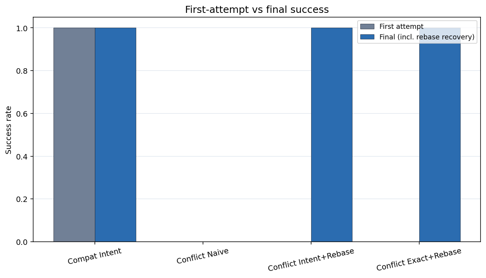
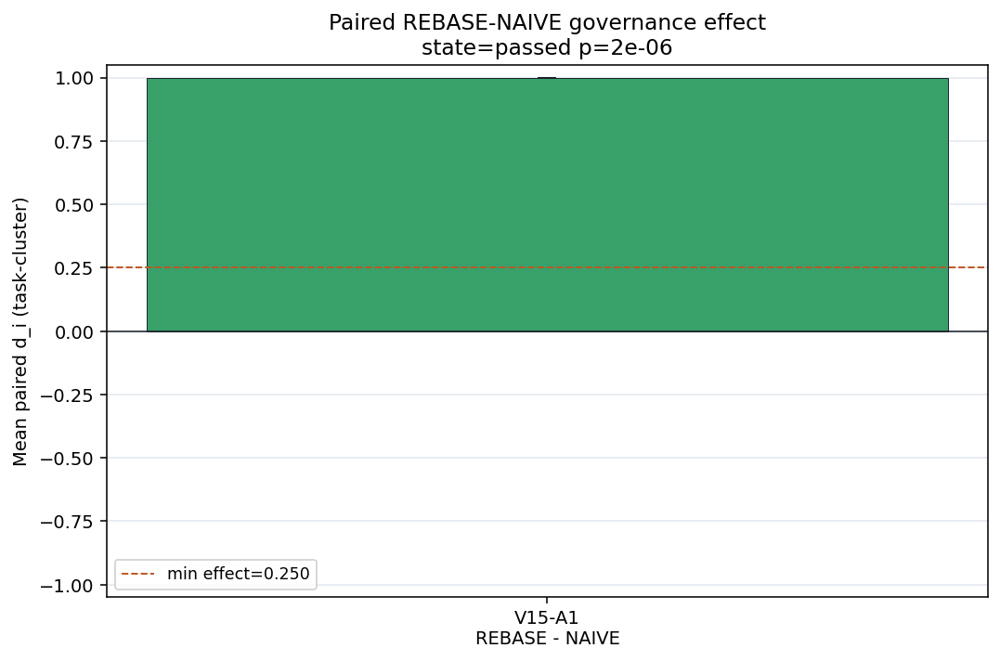
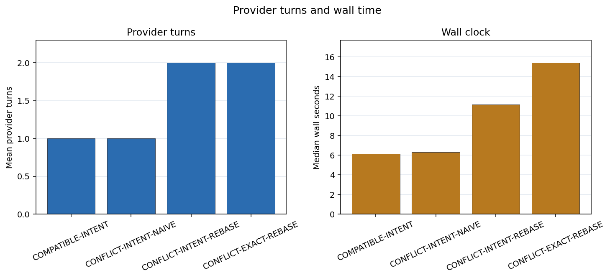

# 聚合失配 Artifact-v15：Intent 冲突治理

**文档类型：** 理论—实验—数据—工程验证报告

**证据截止：** 2026-07-30

**总体裁决：** **机器主检验通过；整套 artifact 需带协议限制分享**

**研究族：** `aggregation_mismatch_v15_intent_conflict_governance`

**Schema：** `artifact-v15`

**English:** [Aggregation Mismatch Artifact-v15: Intent Conflict Governance](./aggregation-mismatch-v15-intent-conflict-governance.md)

**双语同步规则：** 两个版本的样本量、估计、裁决、限制和工程规则必须一致。

## 一句话结论

在这个单模型合成协议中，三个冲突臂的 72 次首提交全部被安全拒绝；冲突后立即终止
的策略最终为 0/24，而允许 runtime 执行一次受治理 rebase 的 Intent 与 Exact 策略
都达到 24/24。Intent-Rebase−Intent-Naive 为 +1.0，但该对比主要识别恢复权限，
不是模型的通用冲突能力；冻结 Pilot Gate 文字还与实际执行门不一致。

## 技术摘要

| 项目 | 结果 |
|---|---:|
| Formal / pilot / offline | **96/96** / **12/12** / **768/768** |
| Formal tasks / conditions | 24 / 4 |
| Formal raw events | **1,594** |
| Provider turns / transport attempts | **144 / 144** |
| Endpoint reconstruction mismatch | 0 |
| Seal before drift | 96/96 |
| 冲突臂首提交 commit | **0/72** |
| Compatible Intent | 最终 **24/24**；首提交 **24/24** |
| Conflict Intent Naive | 最终 **0/24**；禁止 recovery |
| Conflict Intent Rebase | 最终 **24/24**；recovery **24/24** |
| Conflict Exact Rebase | 最终 **24/24**；recovery **24/24** |
| V15-A1 | **+1.0**；95% CI **[1.0, 1.0]** |
| Exact sign-flip | \(2/2^{24}=1.1921\times10^{-7}\) |
| 机器 claim state | **`passed`** |
| 证据分享状态 | **`share_with_caveats`** |
| Formal tokens | **1,633,317** |
| Unsafe / leak / over-budget success | 0 / 0 / 0 |
| V15 tests | **27 passed** |

## 1. 理论

### 1.1 冲突安全与冲突恢复是两个决策

对 sealed operation \(Q_0\)、当前权威状态 \(S_1\)、锁集合 \(L\) 和不变量 \(I\)，
安全提交要求：

\[
\operatorname{pre}(Q_0,S_1)
\land \operatorname{lock\_ok}(Q_0,L)
\land \operatorname{verify}(\operatorname{apply}(Q_0,S_1),I).
\]

`lock_ok` 为假时，拒绝是正确行为；但它并不决定整个 episode 必须终止。独立
governor 应在以下动作中选择：

```text
wait
→ 重新读取并 rebase 一次
→ full replan
→ 人工升级
→ terminal reject
```

安全底座可由程序语义推导：被拒绝的写入不能改变状态，恢复权限必须显式授予。某种
策略是否具有成功优势，则仍是依赖工作负载的经验问题。

### 1.2 Intent 与 Exact 使用不同恢复编译器

- **Intent-Rebase** 在新状态上重新解释受约束目标；
- **Exact-Rebase** 使用冲突 receipt 重建 located old/new precondition；
- **Intent-Naive** 收到相同冲突，但没有恢复权限。

所以 V15 主对比首先是恢复治理差异，而不只是 payload 表示差异；它不能单独证明
Intent 优于 Exact。

## 2. 实验

- DeepSeek-V4-Flash；中文 prompt；temperature 0；`thinking=False`；
- 最大 32k tokens；一个共享 300 秒 semantic-episode 预算；
- 24 个正式任务，\(N\in\{96,144,216\}\) 各 8 个；
- 每任务四条件：Compatible Intent、Conflict Intent Naive、Conflict Intent
  Rebase、Conflict Exact Rebase；
- payload seal 后注入 drift；lock-aware atomic apply、global verification、
  commit/rollback 与 append-only events；
- 两个 Rebase 臂最多允许一次受治理 recovery；
- 10,000 次 task-cluster bootstrap 与 exact two-sided sign-flip。

本实验隔离的是正确 goal/plan 之后的受控冲突—恢复策略，不测自主 planning、真实
Git merge 或任意多 writer 语义。

## 3. 数据完整性

96 个 formal run key 完整且唯一。1,594 条 formal event 在每个 run 内连续，并具有
唯一 terminal；endpoint 从事件重建零错配。独立复算得到 1,633,317 formal tokens、
144 provider turns 和 144 transport attempts。

768 个 offline case 的 false accept、false reject、input mutation、payload mutation
均为 0。所有 formal run 都在 drift 前完成 seal；unsafe commit、泄漏和超预算成功
均为 0。验证脚本通过，V15 专项测试 27 项通过。

## 4. 数据与结果

### 4.1 首提交与最终成功



| 条件 | 首提交 commit | Recovery success | Final success |
|---|---:|---:|---:|
| Compatible Intent | 24/24 | — | 24/24 |
| Conflict Intent Naive | 0/24 | 0/24，禁止 | 0/24 |
| Conflict Intent Rebase | 0/24 | 24/24 | 24/24 |
| Conflict Exact Rebase | 0/24 | 24/24 | 24/24 |

72 次冲突首提交全部被拒绝，没有局部写入。Intent-Rebase−Intent-Naive 为：

\[
\Delta_{A1}=1.0,\qquad 95\%\ CI=[1.0,1.0],\qquad
p_{\mathrm{exact}}=1.1921\times10^{-7}.
\]



机器主检验通过最小效应与安全门。

### 4.2 受治理恢复的成本



| 条件 | Median tokens | P90 tokens | Provider turns |
|---|---:|---:|---:|
| Compatible Intent | 14,623 | 21,549.3 | 24 |
| Conflict Intent Naive | 14,623 | 21,549.3 | 24 |
| Conflict Intent Rebase | 17,467 | 25,399.5 | 48 |
| Conflict Exact Rebase | 18,115.5 | 26,228.6 | 48 |

Recovery 增加第二个 provider turn。Exact 与 Intent Rebase 都是 24/24，因此本实验
不能建立两者的可靠性排名。

## 5. 结论与 Claim 边界

### 已支持

- 受测锁冲突在 72/72 次首提交中都于 mutation 前被检出；
- typed conflict receipt + runtime 授权的一次 rebase 在 48/48 个 Rebase episode
  中完成；
- 对其余条件匹配的 Intent 冲突任务，terminal-on-conflict 与 rebase-once 策略
  具有显著不同的最终端点；
- event ledger、安全门和 offline executor 可机械审计。

### 未支持

- 模型自身获得了通用冲突解决能力；
- Intent 比 Exact 更可靠；
- 所有冲突都应自动 rebase；
- 效应可跨模型、语言、生产仓库或多 writer 系统推广；
- rebase 对含糊、非单调或互斥目标仍然安全。

### 协议限制

冻结设计文字要求每个 Pilot 条件的 final success 至少 2/3；这与 Naive 臂的定义
冲突，因为该臂禁止 recovery，并预期以 locked conflict 终止。实现把 2/3 门只用于
非 Naive 臂，对 Naive 使用独立数据质量检查；Pilot 中三个非 Naive 臂均为 3/3，
Naive 为 0/3。正式实验遵循的是实现门，而不是冻结文字的字面要求。

冻结 turn 数还估计为 formal 120、pilot 15；四臂协议中两个 recovery 臂需要第二 turn，
正确值应为 144 与 18。formal artifact 实际记录 144 turns。

这些偏差不改变正式效应的复算结果，但不允许声称完全遵循预注册。合理分享裁决是
`share_with_caveats`。

## 6. 理论—实验差距

| 理论或设计主张 | V15 证据 | 剩余缺口 |
|---|---|---|
| Locked write 必须在 mutation 前拒绝 | 72/72 reject；unsafe=0 | 真实 side effect 与分布式锁 |
| Recovery 权限属于 runtime policy | Rebase 48/48 vs Naive 0/24 | matched active-control factorial |
| Typed receipt 可支持局部恢复 | Intent/Exact 均 24/24 | generic/located/causal 随机对比 |
| 一次 rebase 可保留 episode identity | 96 run key 下 144 turns | crash/replay 与重复冲突 |
| Intent 可在当前状态重编译 | recovery 24/24 | 含糊与非单调目标 |

## 7. 工程意义

1. **分离拒绝与恢复策略。** Executor 检出冲突；governor 决定 wait、rebase、replan、
   escalation 或 stop。
2. **返回 typed conflict receipt。** 至少包括 target ID、base/current version、
   observed value、lock owner 或 conflict class，以及允许动作。
3. **限制恢复次数。** 在原 run key、共享预算和 idempotency key 下只允许固定次数。
4. **重读权威状态。** 禁止从对话记忆做 rebase。
5. **提交前再次验证。** 重编译 payload 必须再次经过 precondition、lock、invariant、
   atomicity 和 global verifier。
6. **不要把预期失败写成成功门。** 协议 validator 必须理解 negative control 的语义；
   冻结文字与可执行门应由同一 machine specification 生成。

## 8. 可能的应用

- **代码 Agent：** stale/locked patch 被拒后，重读 symbol，局部 rebase 一次并重新
  测试；语义冲突则升级；
- **配置 Agent：** 用 stable ID 解析当前状态，在 version conflict 后重新编译受约束
  Intent；
- **数据库迁移：** 把 lock/schema-version conflict 作为 typed state，禁止 generic
  retry；
- **多 Agent 工作流：** 冲突 subplan 由 central governor 决定 wait/rebase，禁止
  last-writer-wins；
- **长时工具：** 在 prepare、seal、reject、recover、commit 之间保持 episode identity
  与幂等性。

## 9. 下一步

1. 用第二模型与英文 prompt 复现。
2. 用 matched active controls 替代结构性禁用的 Naive：generic retry、reread-only、
   full replan 和 human escalation。
3. 迁移到真实 Git conflict、JSON 配置 merge 和数据库 migration。
4. 加入重复冲突、crash/replay、多 writer 与非单调 Intent。
5. 由同一 machine specification 生成冻结文字门和可执行 validator。

## 相关文档

- [V1–V12、V14 与 V15 实验总览](./aggregation-mismatch-v1-v12-v14-v15-experiment-summary.zh-CN.md)
- [V1–V12、V14 与 V15：Agent 工程经验](./aggregation-mismatch-agent-engineering-lessons-v1-v12-v14-v15.zh-CN.md)
- [Artifact-v14：Post-Compile Drift 与 Exact Recovery](./aggregation-mismatch-v14-post-compile-drift-recovery.zh-CN.md)
- [聚合失配：可推导命题与 Agent 工程](./aggregation-mismatch-theoretical-claims-agent-engineering.zh-CN.md)
- [聚合失配与 LLM 系统的组合治理](./aggregation-mismatch-compositional-governance-llm-systems.zh-CN.md)

## 原始 Artifact

- [冻结设计](https://github.com/wxy2ab/llmdealer/blob/main/exp/aggregation_mismatch_experiment/docs/V15_INTENT_CONFLICT_GOVERNANCE_DESIGN.md)
- [正式报告](https://github.com/wxy2ab/llmdealer/blob/main/exp/aggregation_mismatch_experiment/docs/V15_INTENT_CONFLICT_GOVERNANCE_REPORT.md)
- [独立核验](https://github.com/wxy2ab/llmdealer/blob/main/exp/aggregation_mismatch_experiment/docs/V15_INTENT_CONFLICT_GOVERNANCE_VALIDATION.md)
- [机器汇总](https://github.com/wxy2ab/llmdealer/blob/main/exp/aggregation_mismatch_experiment/results/v15_intent_conflict_governance/confirmatory/analysis/summary.json)
