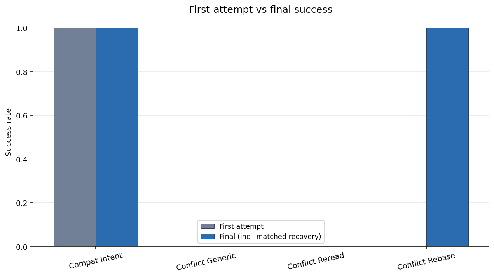
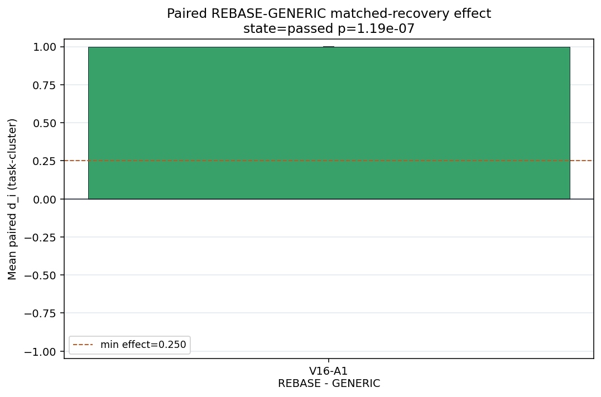

# 聚合失配 Artifact-v16：匹配冲突恢复

**文档类型：** 理论—实验—数据—工程验证报告

**证据截止：** 2026-07-30

**整体裁决：** **机器主检验通过；带协议元数据与因果范围限制分享**

**Study：** `aggregation_mismatch_v16_matched_conflict_recovery` / `artifact-v16`

**English:** [Aggregation Mismatch Artifact-v16: Matched Conflict Recovery](./aggregation-mismatch-v16-matched-conflict-recovery.md)

## 一句话结论

在 provider turn 数匹配后，Generic Retry 与 Reread Only 仍处于锁定态并均为
0/24，runtime Unlock + Rebase 为 24/24。因此 V16 支持“没有权威状态迁移的重试
不是恢复”，但没有分别识别 recovery authority、执行态、目标态信息和模型重新规划。

## 技术摘要

| 项 | 结果 |
|---|---:|
| Formal / pilot / offline | **96/96** / **12/12** / **768/768** |
| Formal tasks / conditions | 24 / 4 |
| Formal events | **1,752** |
| Provider turns / transport attempts | **168 / 168** |
| Compatible Intent 终态成功 | **24/24** |
| Conflict Generic Retry 终态成功 | **0/24** |
| Conflict Reread Only 终态成功 | **0/24** |
| Conflict Rebase Once 终态成功 | **24/24** |
| 冲突臂首次 commit | **0/72** |
| V16-A1 Rebase−Generic | **+1.0**；95% CI **[1.0, 1.0]** |
| Exact sign-flip | \(2/2^{24}=1.1921\times10^{-7}\) |
| 最小效应门 | +0.25；**通过** |
| 机器 claim state | **`passed`** |
| 证据分享状态 | **`share_with_caveats`** |
| Formal tokens | **1,983,686** |
| Unsafe / over-budget success | 0 / 0 |
| V16 tests | **29 passed** |

## 1. 理论

冲突回执只证明封存操作不能针对当前权威状态提交，它本身不是状态迁移。

对状态 \(S\)、锁集合 \(L\)、操作 \(Q\) 和不变量集合 \(I\)：

\[
\operatorname{commit}(Q,S)
\Rightarrow
\operatorname{pre}(Q,S)
\land \operatorname{lock\_ok}(Q,L)
\land \operatorname{verify}(\operatorname{apply}(Q,S),I).
\]

如果 `lock_ok` 仍为假，更大的 prompt 或额外一次 provider turn 不能让 commit
变得有效。只有 runtime 改变权威状态或权限，并重新验证 precondition 后，恢复尝试
才有意义：

```text
请求重试
+ 权威状态/权限未改变
→ 拒绝、等待或升级

请求重试
+ 权威状态迁移完成
+ precondition 重新验证
→ 允许一次有界恢复
```

这条安全规则不意味着信息永远无用。解锁后，模型仍可能需要当前 target slice 或
结构化 rebase plan。

## 2. 实验

- DeepSeek-V4-Flash；中文；temperature 0；`thinking=False`；
- 单一共享 300 秒 semantic-episode 预算；max tokens 32k；
- 24 个任务：\(N\in\{96,144,216\}\) 各 8 个；
- 每个任务四条件：
  - **Compatible Intent：** 首次提交；
  - **Generic Retry：** 锁拒绝后，在锁定 \(S_1\) 上只给 receipt + goal plan；
  - **Reread Only：** 锁拒绝后，在锁定 \(S_1\) 上给 receipt + 完整旧仓库；
  - **Rebase Once：** 锁拒绝后，runtime 解锁至 \(S_2\)，给 receipt + target slice；
- 三个 conflict 臂都恰好获得一个第二 provider turn；
- 原子 apply/rollback、global verification、append-only events 与 task-paired 统计。

实验匹配了调用机会，但没有匹配恢复权限与执行态：只有 Rebase 得到程序化 unlock。

## 3. 数据完整性

96 个 formal run key 完整且唯一；1,752 条事件的 `(run_key,event_index)` 唯一，
96 个 endpoint 可零错配重建。72 个冲突首次尝试全部拒绝且未 commit；
Generic/Reread 终态 commit 为 0；unsafe commit、输入/载荷突变与 prompt leak 均为
0。Offline executor 768/768 通过，29 项 V16 测试通过。

### 协议元数据偏差

设计 Markdown 与可执行 Pilot gate 一致：Compatible/Rebase 须达到 2/3，
Generic/Reread 不得 3/3 全成功。但冻结 `design_manifest.json` 的
`pilot_gate.stop_if` 残留“任何条件低于 2/3 即停止”，与同一 manifest 的负对照语义
矛盾。

Pilot 实测 3/3、0/3、0/3、3/3，Formal 按可执行 gate 继续。重新计算的正式效应
不变，但不能声称完全符合所有冻结预注册文字。

## 4. 数据与结果



| 条件 | 首次 commit | 第二 turn | 终态成功 |
|---|---:|---:|---:|
| Compatible Intent | 24/24 | — | 24/24 |
| Conflict Generic Retry | 0/24 | 24/24，仍锁定 | 0/24 |
| Conflict Reread Only | 0/24 | 24/24，仍锁定 | 0/24 |
| Conflict Rebase Once | 0/24 | 24/24，已解锁 | 24/24 |

\[
\Delta_{A1}
= P(\text{Rebase success})-P(\text{Generic success})
=1.0.
\]

95% bootstrap CI 为 [1.0, 1.0]，exact two-sided sign-flip
\(p=1.1921\times10^{-7}\)。预注册机器主检验通过。



Reread 消耗更多上下文，但没有改变锁定状态：

| 条件 | 中位 tokens | P90 tokens | 中位 wall time |
|---|---:|---:|---:|
| Compatible Intent | 14,608.5 | 21,545.0 | 5.98 s |
| Generic Retry | 16,938.0 | 24,672.0 | 10.17 s |
| Reread Only | 29,589.0 | 43,589.4 | 10.57 s |
| Rebase Once | 17,439.0 | 25,400.2 | 9.99 s |

在锁定态对比内，增加旧状态上下文提高了成本但没有提高成功率。这不证明有效状态迁移
之后的信息在一般情况下无关。

## 5. 结论与理论—实验差距

### 支持

- Same-state Generic Retry 与完整旧状态 Reread 不足以覆盖有效 lock；
- runtime Unlock + Rebase + target-state slice 在冻结合成协议中足以恢复；
- 匹配第二次模型调用不等于匹配 recovery authority；
- typed rejection、无突变安全、有界恢复、事件重建与原子提交在本 harness 中成立。

### 不支持

- 纯信息效应、纯状态效应或纯模型推理效应；
- 上下文在任何恢复任务中都无用；
- 每个冲突都应自动 rebase；
- 跨模型、语言、真实 Git、数据库或分布式多 writer 泛化；
- 模糊、非单调或重复冲突下仍然安全。

### 尚未拆开的因果差距

Rebase 同时改变 authority、可执行状态和 target-state 信息。下一组关键因子实验应让
所有臂拥有相同 unlock、相同 \(S_2\)，再随机 receipt-only、旧状态、target slice 与
结构化 rebase plan。

## 6. 工程意义

1. **Retry 必须有状态迁移前置条件。** 再调用模型前检查 lock、version、lease 和
   authoritative hash 是否真正变化。
2. **不要用上下文膨胀代替治理。** 重读锁定旧状态可能增加 tokens，却不产生提交权限。
3. **把拒绝与恢复分开。** Executor 拒绝；conflict governor 选择等待、解锁/rebase、
   replan、人工升级或终止。
4. **同一 episode 内限制恢复。** 保留 run key、idempotency key、共享预算与事件链。
5. **状态迁移后最小披露。** semantic ID + target slice 足够时，不默认暴露整库。
6. **记录两个裁决。** 机器 claim state 与协议一致性/证据分享状态分开。

## 7. 可能的应用

- **代码 Agent：** 等待分支/文件锁释放，在新 base 上 rebase，只重生成受影响 patch；
- **配置 Agent：** 针对解锁的当前版本解析 semantic ID，再做一次有界重试；
- **数据库迁移：** 把 schema lock 当治理状态，不当 generic tool error；
- **多 Agent 系统：** 中央化锁所有权与恢复权限，不让后到 worker 覆盖当前 owner；
- **长流程工具：** 从权威 checkpoint 恢复，而不是从对话记忆恢复。

## 8. 下一组实验

使用新冻结 schema，让所有臂具有相同 unlock 权限、相同 \(S_2\)、相同 provider turn
数和预算，只随机 recovery information package；再用第二模型和至少一个真实
Git/配置流程复现。

## 相关文档

- [V1–V12、V14–V17 实验总览](./aggregation-mismatch-v1-v12-v14-v17-experiment-summary.zh-CN.md)
- [V1–V12、V14–V17 Agent 工程经验](./aggregation-mismatch-agent-engineering-lessons-v1-v12-v14-v17.zh-CN.md)
- [Artifact-v15：Intent 冲突治理](./aggregation-mismatch-v15-intent-conflict-governance.zh-CN.md)
- [聚合失配与组合治理](./aggregation-mismatch-compositional-governance-llm-systems.zh-CN.md)

## 源 Artifact

- [冻结设计](https://github.com/wxy2ab/llmdealer/blob/main/exp/aggregation_mismatch_experiment/docs/V16_MATCHED_CONFLICT_RECOVERY_DESIGN.md)
- [正式报告](https://github.com/wxy2ab/llmdealer/blob/main/exp/aggregation_mismatch_experiment/docs/V16_MATCHED_CONFLICT_RECOVERY_REPORT.md)
- [独立核验](https://github.com/wxy2ab/llmdealer/blob/main/exp/aggregation_mismatch_experiment/docs/V16_MATCHED_CONFLICT_RECOVERY_VALIDATION.md)
- [机器汇总](https://github.com/wxy2ab/llmdealer/blob/main/exp/aggregation_mismatch_experiment/results/v16_matched_conflict_recovery/confirmatory/analysis/summary.json)
