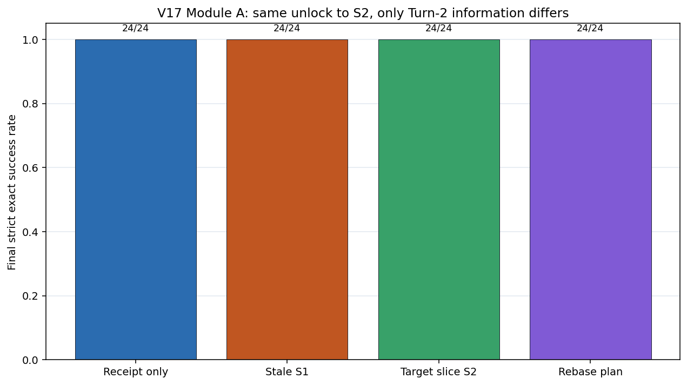
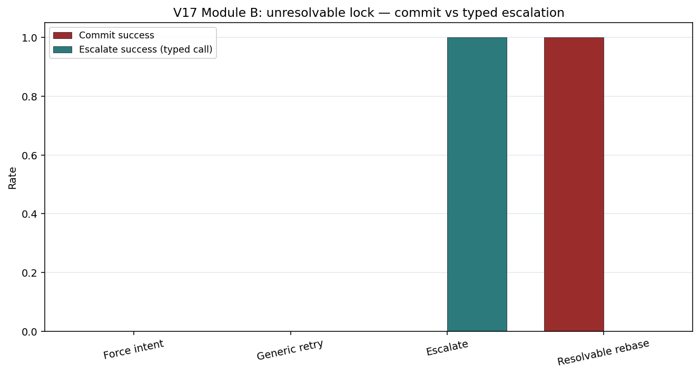

# Aggregation Mismatch Artifact-v17: Unlock Information and Escalation

**Date:** 2026-07-30<br>
**Document type:** Public evidence report covering theory, experiment, data,
conclusions, agent-engineering implications, and applications<br>
**Status:** DeepSeek confirmatory 192/192 complete; V17-A1
`failed_pre_registered_gate` because all four arms were at ceiling; V17-B1
`passed`; overall evidence grade `share_with_caveats`

**Study:** `aggregation_mismatch_v17_unlock_info_and_escalate` / `artifact-v17`

**中文：** [聚合失配 Artifact-v17：Unlock 信息因子与不可解除冲突升级](./aggregation-mismatch-v17-unlock-info-escalate.zh-CN.md)

**Evidence cutoff:** the frozen artifact-v17 design, 192 formal episodes, 24
LLM pilot episodes, 1,536 offline executor cases, 3,840 formal events, and an
independent recomputation. Raw records, frozen manifests, analysis code, and
the event ledger remain in the experiment repository; this document publishes
the auditable result summary and claim boundaries.

V13 remains an archived method-development artifact and is excluded from the
evidence synthesis. V17 follows V15–V16. V15 established a system path from a
typed lock rejection to governed rebase. V16 matched the second provider turn
and showed that same-state retry or reread does not cross a live lock, but its
Rebase arm bundled execution state, authority, and information. V17 separates
two narrower questions: how much information is useful after the same unlock,
and what constitutes a valid terminal outcome when the conflict cannot be
resolved.

## Technical summary

The most defensible result is not “recovery information never matters.”

1. **For the tested absolute, idempotent semantic goal plan, a receipt plus the
   complete goal plan was sufficient after the runtime moved every Module A arm
   to the same unlocked \(S_2\).** All four information arms achieved 24/24.
   TARGET-SLICE minus RECEIPT was zero and missed the preregistered +0.25
   superiority gate. This ceiling does not prove equivalence and does not
   generalize to relative, non-monotone, CAS, or cross-object operations that
   require current \(S_2\).
2. **A live hard lock is not repaired by repeating a write.** Force Intent and
   Generic Retry produced 0/24 commits each, while the resolvable unlocked
   positive control produced 24/24 commits.
3. **An unresolvable conflict needs a valid non-commit terminal state.** Typed
   Escalate produced 24/24 valid escalations and 0/24 commits. V17-B1 passed,
   but it compares `escalate_success` with `final_success`: two different
   endpoints. It validates the governance route, not “escalation is better than
   task completion.”
4. **Sending the complete old state increased cost without changing the output
   in this task.** Median total tokens were 29,689 for OLDSTATE and 16,979 for
   RECEIPT, a 74.9% increase. Event reconstruction found identical recovery
   operations across all four Module A arms for 24/24 tasks.

The direct engineering contribution is therefore: **let the runtime establish
feasibility and authoritative state transition first; then give the model the
minimum sufficient context. If a hard conflict cannot be resolved, return a
typed escalation instead of enlarging the prompt or continuing to write.**

## 1. Theory

### 1.1 A hard feasibility boundary precedes language reasoning

Let committing action \(a\) require a lock predicate \(U(S)=1\), where one
means the target is writable in authoritative state \(S\). If the runtime
remains at \(S_1\) and \(U(S_1)=0\), then:

\[
\operatorname{Commit}(a,S_1)=0.
\]

More tokens, a reread of the old state, or a restatement of intent cannot alter
that runtime predicate. Recovery requires at least one of:

- an authoritative transition to a writable \(S_2\);
- a higher-level conflict decision;
- a valid wait, reject, or escalate terminal outcome instead of commit.

This is a system-state feasibility constraint, not a claim about one model's
intelligence.

### 1.2 Information need depends on operation semantics

The verified goal plan contains stable `service_id` values, fields, predicates,
and absolute thresholds. For this idempotent operation with a predetermined
target value, a candidate minimum recovery input is:

\[
I_{\min}=\{\text{typed receipt},\ \text{unlock declaration},\
\text{verified goal plan}\}.
\]

The full old \(S_1\), a target-state slice, or a rebase plan with observed
values can be redundant here. The minimum changes for relative updates,
non-monotone transformations, compare-and-swap, cross-object constraints, or
target selection that must be recomputed from \(S_2\). V17 tests only the first
operation class.

### 1.3 Success needs multiple valid terminal states

Commit is not the only correct result under an unresolvable conflict. A governed
system should distinguish at least:

\[
\texttt{committed},\quad \texttt{rejected},\quad \texttt{waiting},\quad
\texttt{escalated},\quad \texttt{rolled\_back}.
\]

Module B's `escalate_success` is therefore a safe-terminal-compliance metric,
not a synonym for task completion.

## 2. Experiment

### 2.1 Common protocol

| Item | Setting |
|---|---|
| Model | DeepSeek-v4-flash |
| Language / temperature | Chinese / 0 |
| Budget | 300 seconds per episode; at most 32k tokens per turn |
| Formal clusters | 24 shared tasks; \(N\in\{96,144,216\}\), eight per size |
| Conditions | 2 modules × 4 arms = 8 |
| Scale | 192 formal; 24 pilot; 1,536 offline mutations |
| Calls | Every formal episode has two provider turns |
| Statistics | task-cluster paired bootstrap, exact two-sided sign-flip, Holm over two primaries |
| Safety gates | locked first commit=0, unsafe=0, event reconstruction, offline FA/FR=0 |

The initial turn receives only \(S_0\) and a verified goal plan. The runtime
seals the payload and then injects `LOCKED_CONFLICT`; the first commit must be
rejected in every arm. The second turn receives its assigned recovery policy.

### 2.2 Module A: same unlock, different second-turn information

The runtime moves all four arms to the same unlocked \(S_2\). Tools, turn
count, goal plan, executor, and acceptance rule are held constant.

| Condition | Additional second-turn content |
|---|---|
| `A-UNLOCK-RECEIPT` | typed receipt |
| `A-UNLOCK-OLDSTATE` | receipt + full old \(S_1\) |
| `A-UNLOCK-TARGET-SLICE` | receipt + target slice from \(S_2\) |
| `A-UNLOCK-REBASE-PLAN` | receipt + structured rebase plan with observed value |

Primary V17-A1 is

\[
\Delta_{A1}=P(\text{TARGET-SLICE final success})-
P(\text{RECEIPT final success}),
\]

with a preregistered gate of \(\Delta\ge0.25\), bootstrap lower bound \(>0\),
and Holm-adjusted \(p<0.05\).

### 2.3 Module B: the lock remains, but the valid handling path changes

`B-FORCE-INTENT`, `B-GENERIC-RETRY`, and `B-ESCALATE` remain in locked
\(S_1\). `B-RESOLVABLE-REBASE` is an unlocked positive control.

| Condition | Valid terminal outcome |
|---|---|
| `B-FORCE-INTENT` | write is rejected |
| `B-GENERIC-RETRY` | write is rejected |
| `B-ESCALATE` | typed escalation with no commit |
| `B-RESOLVABLE-REBASE` | commit after unlock |

Primary V17-B1 is

\[
\Delta_{B1}=P(\text{ESCALATE escalate\_success})-
P(\text{FORCE final\_success}).
\]

This is a preregistered **governance-terminal contrast with different
endpoints**.

## 3. Data and results

### 3.1 Completeness and reconstruction

| Check | Observed |
|---|---:|
| Formal / Pilot / Offline | 192/192 / 24/24 / 1,536/1,536 |
| Formal events | 3,840; exactly 20 per episode |
| Provider turns / transport attempts | 384 / 384 |
| Missing / extra / duplicate formal keys | 0 / 0 / 0 |
| Initial post-state leak | 0 |
| Event-to-endpoint reconstruction mismatch | 0 |
| Offline false accept / false reject / mutation | 0 / 0 / 0 |
| Unsafe / over-budget success | 0 / 0 |
| Formal total tokens | 3,779,289 |

### 3.2 Module A: all four arms reached ceiling



| Condition | Final commit success | Median total tokens |
|---|---:|---:|
| A-UNLOCK-RECEIPT | 24/24 | 16,979 |
| A-UNLOCK-OLDSTATE | 24/24 | 29,689 |
| A-UNLOCK-TARGET-SLICE | 24/24 | 17,495.5 |
| A-UNLOCK-REBASE-PLAN | 24/24 | 17,668.5 |

V17-A1 was **0.0**, paired bootstrap CI **[0.0, 0.0]**, sign-flip and
Holm-adjusted \(p=1.0\), so it was `failed_pre_registered_gate`.

The interval must be interpreted correctly. It is an empirical bootstrap over
24 all-zero paired differences, not a population equivalence bound. No
non-inferiority or equivalence margin was preregistered.

Event-level diagnostics found:

- identical second-turn tool arguments across the four A arms in 24/24 tasks;
- recovery arguments identical to initial arguments within every A arm in
  24/24 tasks;
- OLDSTATE/RECEIPT paired median token ratio **1.749×**, with OLDSTATE larger
  in 24/24 tasks.

The model reused the supplied absolute goal plan. Additional state changed
neither the delivered object nor success, while increasing input cost. This is
a post hoc mechanism audit, not another preregistered primary.

### 3.3 Module B: commit and escalate are different terminal states



| Condition | Commit | Typed escalate | Accepted terminal outcome |
|---|---:|---:|---:|
| B-FORCE-INTENT | 0/24 | 0/24 | 0/24 |
| B-GENERIC-RETRY | 0/24 | 0/24 | 0/24 |
| B-ESCALATE | 0/24 | 24/24 | 24/24 |
| B-RESOLVABLE-REBASE | 24/24 | 0/24 | 24/24 |

V17-B1 was **+1.0**, paired bootstrap CI **[1.0, 1.0]**, exact two-sided
sign-flip \(p=1.192\times10^{-7}\), Holm-adjusted
\(p=2.384\times10^{-7}\), and `passed`. The resolvable positive control also
reached 24/24.

The result confirms that the typed escalation tool, its schema, locked-state
non-commit, and routing contract work together in this system. It is not a
shared-endpoint “success-rate improvement”: Force targets a commit, while
Escalate targets a valid escalation.

## 4. Conclusions

### 4.1 Directly supported

- In the frozen absolute semantic-plan task, receipt plus goal plan reached
  24/24 after the same unlock; extra \(S_1\), \(S_2\) slice, or rebase-plan
  information produced no observed success gain.
- Force and Generic Retry cannot commit through a live hard lock; another call
  does not change the feasibility set.
- Typed escalation can be a safe terminal outcome for an unresolvable
  conflict while preserving commit=0.
- Complete old state can materially increase tokens without increasing useful
  decision information.
- The runtime can govern commit authority, unlock, rebase, escalation, and
  final acceptance separately.

### 4.2 Not established

- population equivalence among the four recovery inputs;
- that target-state information is generally useless or every recovery needs
  only a receipt;
- that escalation improves task-completion rate or dominates waiting, queuing,
  or human review;
- autonomous discovery of production conflicts—the lock is explicit and the
  Escalate arm exposes only the typed escalation tool;
- transfer to real Git, databases, network partitions, multiple writers, or
  other models;
- a pure model-capability effect in V17-B1—the runtime lock and endpoint/tool
  contract structurally determine much of the contrast.

## 5. Gap between theory and evidence

| Theoretical claim | V17 evidence | Remaining gap |
|---|---|---|
| Retry cannot cross an unchanged hard constraint | Force/Generic: 0/48 commits | Real locks, leases, processes |
| An absolute idempotent plan can use less state after unlock | Four arms 24/24; identical arguments | Non-ceiling tasks that require \(S_2\) |
| Minimal sufficient context can beat state dumping | OLDSTATE tokens +74.9%; same success | Preregistered cost gate, latency/quality Pareto, second model |
| Escalate instead of forcing an infeasible write | Escalate 24/24; commit 0 | Free multi-tool choice and downstream resolution |
| Success needs a multi-terminal state machine | commit/escalate recorded separately | wait, queue, rollback, human-resolution evaluation |

## 6. Agent-engineering implications

### 6.1 Check feasibility before asking the model to recover

```text
LOCKED_CONFLICT
├─ runtime can establish an authoritative unlocked S2
│  └─ rebind/reseal → one bounded recovery → verify → commit
└─ runtime cannot establish S2
   └─ wait / typed escalate / reject
```

A second model call is not recovery authority. A retry gate should require at
least `authoritative_state_changed && precondition_revalidated`.

### 6.2 Send minimum sufficient recovery context

For a verified absolute plan, start with a typed receipt, authoritative-state
hash, recovery permission, and a verified-plan reference. Add a target slice
only when the compiler or verifier says the operation depends on the current
value. A full repository should be the last escalation level, not the default
retry payload.

### 6.3 Make escalation a first-class terminal outcome

Agent APIs should distinguish `COMMITTED`, `REJECTED_STALE`,
`REJECTED_LOCKED`, `WAITING_ON_OWNER`, `ESCALATED_FOR_POLICY`, and
`ROLLED_BACK`. Each needs its own SLO, audit fields, and downstream owner.
`ESCALATED` must not be counted as commit success.

### 6.4 Keep conflict authority in the runtime

The model may propose reasons and candidate actions. The runtime decides
whether a lock is released, how many recovery attempts are allowed, whether
human review is needed, which tools are available, and when a commit is legal.
A prompt cannot grant itself write authority.

## 7. Possible applications

- **Coding agents:** do not repeat an apply while a file or symbol is owned by
  another writer; reseal once against the new hash after release, or escalate.
- **Configuration deployment:** retain verified plans by stable service ID;
  rebind absolute updates from a receipt, but read a target slice for relative
  updates.
- **Database migration:** wait or escalate while the schema lock remains;
  never “reason around” the lock by rewriting SQL.
- **Multi-agent systems:** let the coordinator own resource leases and conflict
  resolution; workers receive typed receipts and authorized next actions.
- **Spreadsheets and financial models:** do not overwrite owned named ranges;
  escalate to a human or policy layer.
- **Documents and specifications:** preserve a plan while a section is locked,
  then locally rebase on a new version; send the slice only for edits that
  depend on current wording.

## 8. Next experiments

1. Re-run Module A on operations that **must inspect \(S_2\)**: relative
   increments, non-monotone updates, CAS, and cross-object invariants, while
   calibrating the baseline below ceiling.
2. Preregister equivalence/non-inferiority or a joint cost–success gate instead
   of treating failed superiority as equivalence.
3. Expose commit, wait, rebase, and escalate together so one agent must identify
   and route the conflict.
4. Measure downstream resolution rate, human effort, and wait time after
   escalation, separating safe exit from problem resolution.
5. Replicate with another model, English prompts, real Git/database locks, and
   multiple writers.

## 9. Audit verdict and claim boundary

Formal 192, pilot 24, offline 1,536, both primary analyses, all safety
invariants, and the event sequence were independently recomputed. V17-A1 missed
its superiority gate at ceiling. V17-B1 passed its preregistered gate but uses
different endpoints, and runtime/tool contracts structurally impose much of
the route. The overall grade is therefore **`share_with_caveats`**.

**Allowed:** under this absolute semantic-plan task and DeepSeek-v4-flash,
receipt-only reached the same observed success as target-slice after the same
unlock; old state raised tokens; typed escalation correctly avoided commit
under an unresolvable lock; state/authority gates should precede retry and
context should expand on demand.

**Not allowed:** A1 proves population equivalence; information is generally
useless; escalation is “more successful” than completion; the model
autonomously solved production concurrency; prompts can bypass runtime
authority; or one Chinese synthetic study establishes a cross-model production
law.

## Related documents

- [V1–V12 and V14–V17 experiment summary](./aggregation-mismatch-v1-v12-v14-v17-experiment-summary.md)
- [V1–V12 and V14–V17 agent engineering lessons](./aggregation-mismatch-agent-engineering-lessons-v1-v12-v14-v17.md)
- [V16 Matched Conflict Recovery](./aggregation-mismatch-v16-matched-conflict-recovery.md)
- [Aggregation mismatch: theoretical claims and agent engineering](./aggregation-mismatch-theoretical-claims-agent-engineering.md)
