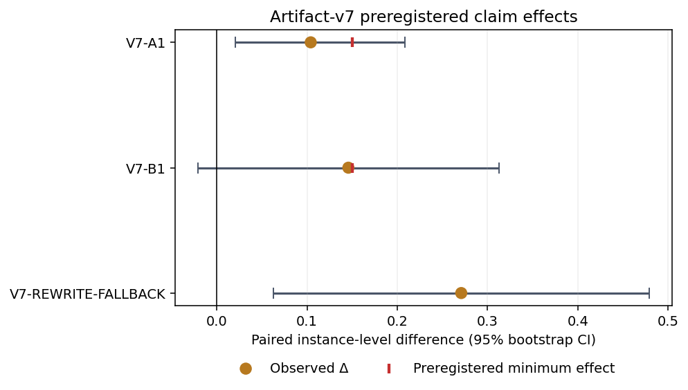

# Aggregation Mismatch Artifact-v7: Mechanism Recovery, Deterministic Delivery, and Agent Engineering

**Document type:** theory–experiment–engineering validation report<br>
**Evidence cutoff:** July 28, 2026<br>
**Overall assessment:** **ready to share with the stated claim boundaries**<br>
**Study family:** `aggregation_mismatch_v7_mechanism_recovery`<br>
**Schema:** `artifact-v7`<br>
**中文：** [聚合失配 Artifact-v7：机制恢复、确定性交付与 Agent 工程](./aggregation-mismatch-v7-mechanism-recovery.zh-CN.md)<br>
**Theory framework:** [Aggregation Mismatch and Compositional Governance](./aggregation-mismatch-compositional-governance-llm-systems.md) · [Derivable Claims and Agent Engineering](./aggregation-mismatch-theoretical-claims-agent-engineering.md)

---

## Technical Summary

Artifact-v7 narrows two unresolved questions from artifact-v6. It uses 240 formal
DeepSeek-V4-Flash model calls and 48 offline deterministic-compiler cases to ask:

1. When information, schema, parser, and renderer are fixed, does changing only the
   **requested assignment order** from reverse-topological presentation order to
   topological order produce a confirmatory gain?
2. Once a correct plan is known and delivery has failed, does a
   **field-localized receipt** improve one patch re-emission, and when should the
   system stop asking the model to serialize tool arguments again?

| Comparison | Strict success | Paired difference and 95% CI | Verdict |
|---|---:|---:|---|
| TOPO vs PRESENT | 20/48 vs 15/48 | +10.4 pp [2.1, 20.8] | **Failed gate:** below +15 pp; Holm \(p=0.125\) |
| LOCATED vs MASKED | 13/48 vs 6/48 | +14.6 pp [−2.1, 31.2] | **Failed gate:** CI crosses zero; Holm \(p=0.143\) |
| Deterministic compiler | 48/48 | exact rate = 1.0; zero invariant violations | **Passed adoption gate** |
| Rewrite vs LOCATED | 26/48 vs 13/48 | +27.1 pp [6.2, 47.9] | **Reported contrast:** no directional pass gate |

The strongest actionable result is not that topological prompting or more detailed
error text has been proven as a general mechanism. It is:

> **Once a plan has been verified, the runtime should preferentially compile that
> plan into tool arguments deterministically, then perform global verification and
> an atomic commit. It should not default to resampling the same structured
> delivery from the model.**

TOPO and LOCATED both have positive point estimates but fail their preregistered
confirmatory gates. Rewrite fallback outperforms one located patch re-emission in
this protocol, but that comparison had no directional pass gate and covers one
configuration with a balanced synthetic error distribution. It is not a general
`Rewrite > Patch` law.



The red markers show the preregistered +0.15 minimum effect for A1 and B1 only.
Rewrite−Located had no preregistered directional threshold. Error bars are
instance-bootstrap 95% intervals over 48 paired instances.

## 1. Theory: What Artifact-v7 Tests

### 1.1 Aggregation mismatch can occur in delivery

An agent episode can be separated into three failure layers:

\[
P(\text{system success})
=
P(\text{plan correct})
\times
P(\text{delivery correct}\mid\text{plan correct})
\times
P(\text{commit safe}\mid\text{plan correct},\text{delivery correct}).
\]

This factorization is a diagnostic decomposition, not an independence assumption.
Artifact-v5 showed that a Patch tool does not repair an incorrect plan. Artifact-v6
showed that stage-aware routing helped plan errors, while two model re-emission
policies recovered 0/24 delivery errors. Artifact-v7 therefore fixes the plan as
correct and studies delivery and commit behavior.

### 1.2 Topological order is a structural prediction, not a model-performance theorem

For a DAG node \(v\), an explicit executor can compute

\[
x_v=f_v(x_{\mathrm{pa}(v)})
\]

once every predecessor is available. A topological scheduler never needs to read an
unresolved predecessor. Reverse-topological presentation requires delayed
commitment, extra state, or prior off-path solving.

That proves a property of explicit execution. Artifact-v7 changes
`requested_output_order`, not the model's private reasoning order. A model may solve
in one order and serialize in another. Theory therefore predicts a possible
direction of benefit, not a guaranteed gain of at least 15 percentage points for a
particular deployment.

### 1.3 More localized evidence does not guarantee that a fixed model will use it

A LOCATED receipt contains all usable information in a MASKED receipt plus field
paths, addresses, and current hashes. For an optimal policy that can ignore extra
fields:

\[
V^*(I_{\text{located}})\ge V^*(I_{\text{masked}}).
\]

This information-monotonicity result does not imply that every fixed prompted policy
\(P_\theta\) must perform better. A deployed model may ignore, misread, or be
distracted by additional detail. B1's failed gate is therefore not a contradiction
of information theory; it says the deployment benefit was not confirmed.

### 1.4 A verified plan makes deterministic compilation the natural boundary

Let:

- \(s\) be authoritative state with a version/hash;
- \(p\) be a verified plan bound to \(s\);
- \(C(s,p)\) compile the plan into native tool arguments;
- \(E\) be a deterministic executor;
- \(V\) be a global verifier.

If the compiler implements the plan semantics correctly, state still matches,
execution is atomic, and the verifier is sound for the protected invariants, then:

\[
V(E(s,C(s,p)))=1.
\]

Under these conditions, another model call adds no task information. It adds a
stochastic serialization and tool-contract failure surface. V7-B2 validates the
current compiler implementation on 48 frozen cases; it is not a proof about every
compiler and not an improvement in model capability.

### 1.5 Patch and Rewrite have no unconditional ranking

Patch reduces model-authored commitment surface and preserves untouched regions, but
it depends on stable addresses, old strings, version hashes, and a strict tool
schema. Rewrite avoids some patch-argument failures but increases output and
collateral-change risk.

The correct engineering object is therefore a conditional router:

\[
\text{route}
=g(\text{plan confidence},\text{edit density},\text{address stability},
\text{compiler availability},\text{verifier coverage}).
\]

V7's Rewrite−Located result says that Rewrite was the better model fallback under
this one-shot recovery contract. It does not overturn the conditional Patch
advantages established by artifacts v3 and v5.

## 2. Frozen Experimental Design

### 2.1 Configuration and inference

| Item | Frozen value |
|---|---|
| Model | `SimpleDeepSeekClientChat / deepseek-v4-flash` |
| Thinking | `False` |
| Temperature / top_p | `0 / 1` |
| Max tokens | 64,000 |
| Prompt language | Chinese |
| Per-call wall budget | 300 seconds |
| Primary unit | Instance |
| Bootstrap | 10,000 instance resamples; seed `20260729` |
| Paired test | Exact two-sided sign-flip |
| Multiplicity | Holm correction across A1 and B1 |

There is one formal run per instance-condition. Temperature zero reduces but does
not eliminate hosted-service variance, so v7 does not estimate repeat stability or
day-level drift.

### 2.2 V7-A: requested-order ablation

The 48 new DAG instances span:

- \(N\in\{8,16\}\);
- frontier \(\in\{2,8\}\);
- four cells with 12 instances each.

Both conditions share graph, truth, information, indexed JSON schema, parser, and
renderer:

| Condition | Required assignment order |
|---|---|
| `A-TOPO-INDEXED` | Topological order |
| `A-PRESENT-INDEXED` | Reverse-topological presentation order |

The primary endpoint, `ordered_assignment_exact`, requires valid schema, exact node
coverage, exact requested order, exact node values, exact rendered object, and
completion within budget.

### 2.3 V7-B: delivery-recovery ladder

The 48 new sparse-repair instances span:

- \(N\in\{96,384\}\);
- \(k\in\{1,10,20\}\);
- six cells with eight instances each;
- four injected delivery failures with 12 instances each.

Every arm shares candidate, truth, verified oracle plan, plan hash, failed tool
arguments, and the initial failure event.

| Condition | Failure evidence | Allowed action |
|---|---|---|
| `B-MASKED-REEMIT` | Error code; address/hash fields masked | One `file_edit_batch` |
| `B-LOCATED-REEMIT` | Exact JSON path, address, and current hash | One `file_edit_batch` |
| `B-REWRITE-FALLBACK` | Located receipt | One `file_write` |
| `B-DETERMINISTIC-COMPILE` | Correct plan plus authoritative state | No model call; runtime compilation |

`recovery_exact` requires the allowed native tool, preserved plan hash, successful
execution, global verifier success, exact final object, no collateral change, and
completion within budget.

## 3. Data and Quality Audit

Independent recomputation produced:

| Check | Result | Interpretation |
|---|---:|---|
| Formal rows | 240/240 | No missing run keys |
| Unique run keys | 240/240 | Zero duplicates |
| Provider attempts | 240 | Exactly one attempt per run key; no best-attempt selection |
| Condition coverage | 48 per condition | Balanced paired comparisons |
| Failure subtype coverage | 12 per type | Balanced injected errors |
| Timeout / over budget | 0/240 | Results are not timeout-driven |
| Event rows | 1,104 | All 240 run keys represented |
| Duplicate event keys | 0 | `(run_key,event_index)` is unique |
| Discontinuous event streams | 0 | Every run starts at zero and remains contiguous |
| Endpoint reconstruction | A 96/96; B 144/144 | Zero mismatches |
| Offline compiler | 48/48 exact | 48 unique cases; zero protected violations |

Formal model calls take 2.35–28.81 seconds; the median is about 3.56 seconds and the
95th percentile about 15.64 seconds. The failures are value, tool-argument, or
global-verification failures rather than truncation at 300 seconds.

One schema field is module-specific: `schema_valid` is meaningful for V7-A's
assignment output, while V7-B uses native tool/executor fields. It must not be
aggregated across all 240 rows. There is intentionally no opaque "overall v7 success
rate."

Paired recomputation also matches the machine summary:

- A1: 5 positive, 0 negative, 43 ties; raw \(p=0.0625\), Holm \(p=0.125\);
- B1: 12 positive, 5 negative, 31 ties; raw/Holm \(p=0.143463\);
- Rewrite−Located: 22 positive, 9 negative, 17 ties; raw \(p=0.029449\), outside
  the confirmatory A1/B1 directional gate;
- all intervals use 10,000 paired instance bootstraps.

The frozen-data verifier, analysis, plot generation, and ten v7 tests all pass.

## 4. Results

### 4.1 Requested topological order shows a small positive effect, not a confirmed mechanism

| Condition | Ordered exact | Order exact | Value-set exact |
|---|---:|---:|---:|
| TOPO | 20/48 | 48/48 | 20/48 |
| PRESENT | 15/48 | 48/48 | 15/48 |

Both arms obey the requested order on every instance. TOPO's five net wins are value
accuracy wins, not fewer ordering violations. The result is compatible with prompt
order affecting computation, but it does not reveal private reasoning order and does
not decompose all of artifact-v6 B's +43.8-point package.

### 4.2 Located receipts are diagnostically richer but not a confirmed recovery law

MASKED succeeds on 6/48 and LOCATED on 13/48. The point estimate almost reaches the
+15-point gate, but its interval crosses zero and the paired test fails. Located
receipts remain useful for diagnosis and routing; one located re-emission should not
be treated as a generally reliable recovery policy.

### 4.3 The deterministic compiler passes the frozen adoption gate

All 48 cases recover exactly, with:

- zero invalid tool arguments;
- zero collateral changes;
- zero hash-invariant violations;
- zero plan-invariant violations;
- zero failures to preserve pre-state during rollback.

This is an implementation acceptance test. It does not establish a production
population reliability of 100%, compiler correctness for every input, verifier
completeness, or concurrency safety.

### 4.4 Rewrite is stronger overall in this protocol, but the error subtypes differ

| Failure subtype | MASKED | LOCATED | REWRITE |
|---|---:|---:|---:|
| Stale hash | 0/12 | 5/12 | 3/12 |
| Old string not found | 2/12 | 1/12 | 7/12 |
| Duplicate edit | 0/12 | 3/12 | 8/12 |
| Wrong new value | 4/12 | 4/12 | 8/12 |

Rewrite succeeds on 26/48 overall, compared with 13/48 for LOCATED, but LOCATED is
higher in the stale-hash subgroup. These subgroup counts are descriptive, not
confirmatory. They suggest that production routing should distinguish refresh/rebase
failures from representation and verifier failures.

## 5. Conclusions by Evidence Level

### Confirmed

- Formal endpoints and events are complete and reconstructable.
- The current deterministic plan compiler passes its frozen 48-case adoption gate.
- The results are not driven by timeout or missing data.

### Directional but not confirmatory

- Requested topological order is +10.4 points over presentation order.
- Located receipt is +14.6 points over masked receipt.

Neither result is zero by declaration, and neither is proven. Both remain candidates
for replication or a higher-power design.

### Protocol-level engineering default, not a universal law

- If a delivery error has occurred and deterministic compilation is unavailable,
  this protocol favors Rewrite over one located patch re-emission.
- The choice must remain conditional on failure type, edit density, object length,
  address stability, and verifier coverage.

### Not supported

- Requested output order independently explains artifact-v6 B.
- Localized receipts universally improve model recovery.
- Rewrite universally beats Patch.
- Deterministic compilation improves model capability.
- 48/48 is a proof of 100% production reliability.
- One DeepSeek configuration and synthetic GF(2)/DAG tasks generalize directly to
  other models or real repositories.

## 6. Where Theory and Experiment Differ

| Structural or theoretical claim | V7 observation | Verdict |
|---|---|---|
| Topological execution reads no unresolved predecessors | TOPO +10.4 pp; both orders 48/48 compliant | Structural property holds; LLM gain not confirmed |
| Located evidence expands the information available to an optimal policy | LOCATED +14.6 pp; CI crosses zero | Information relation holds; deployment use not confirmed |
| A correct plan can be compiled deterministically | 48/48, zero protected violations | Current implementation passes the sampled adoption gate |
| Patch usually has a smaller commitment surface | Rewrite is higher in this recovery protocol | No contradiction: Patch is exposed to strict argument and one-shot re-emission failures |
| A verifier gate protects encoded invariants | Zero protected violations on 48 cases | Supports implementation; does not prove verifier completeness |

The central lesson is:

> **A structurally better order or a more informative receipt does not
> automatically become a confirmatory gain for a fixed LLM. A delivery operation
> that can be compiled from a verified plan should leave the stochastic generation
> loop.**

## 7. Engineering Implications for Agents

### Recommended control flow

```text
model proposes plan
→ plan verifier and plan hash
→ deterministic plan compiler
→ native tool executor
→ global verifier
→ atomic commit or rollback
→ model fallback only when the deterministic path is unavailable
```

### Concrete changes

1. **Store plan and delivery separately.** A governed plan should carry target
   identity, pre-state hash, edit set, dependencies, and plan hash.
2. **Implement compilers for frequent tools.** Generate strict API/tool arguments
   from a verified plan instead of asking the model to copy addresses, old strings,
   hashes, or complete objects again.
3. **Keep located receipts, but route with them.** Use the receipt to trigger
   refresh, rebase, recompile, regional rewrite, or escalation—not merely to append
   more error prose to the next prompt.
4. **Keep artifact-v6's scheduler, ledger, and renderer.** Artifact-v7 does not show
   that requested order alone explains the package benefit.
5. **Route by failure layer.** Plan errors return to planning; delivery-schema
   errors go to the compiler; stale state triggers refresh/rebase; verifier failure
   can trigger rewrite or replan.
6. **Make verification and commit non-bypassable.** Executor success is not task
   completion. Global verification and hash agreement must gate atomic commit.
7. **Retain reconstructable events.** Record plan hash, pre/post hash, native tool
   arguments and result, verifier receipt, and commit or rollback receipt.

### Designs to avoid

- ask the model to "emit the same JSON again" for every delivery error;
- treat more detailed error text as the only recovery mechanism;
- remove dependency scheduling because A1 failed;
- disable Patch globally because Rewrite−Located is positive;
- hide planning, delivery, verification, and commit failures behind one final rate.

## 8. Potential Applications

| Domain | Verified plan | Deterministic compiler | Verification and commit |
|---|---|---|---|
| Code editing | File, symbol, old/new value, dependency tests | Batch edit or AST edit | Parser, tests, diff scope, atomic commit |
| JSON/YAML configuration | Path, old value, new value, version | JSON Patch or typed mutation | Schema, business invariants, hash gate |
| Database migration | Schema delta, backfill plan, preconditions | SQL/DDL transaction | Dry run, constraints, transactional commit |
| Structured documents | Section/anchor, replacement, references | Document operations | Structure, links, formatting, export validation |
| Multi-agent DAGs | Task dependencies, ready set, artifact contracts | Scheduling and merge operations | Ledger, integration tests, release gate |
| API/tool workflows | Validated intent, resource id, parameter constraints | Native API arguments | Idempotency, response invariants, rollback |

Every application requires a domain-specific executor and verifier. Open-ended
creation, unresolved goals, and tasks without an executable plan do not inherit the
deterministic-compiler conclusion automatically.

## 9. Limitations and Next Tests

1. **Single configuration:** DeepSeek-V4-Flash, Chinese prompts, thinking disabled.
   A cost-controlled second configuration is needed for cross-configuration claims.
2. **Single formal run:** repeat or blocked-day designs are needed to estimate
   hosted-service variance.
3. **Synthetic tasks:** GF(2), DAGs, and structured strings provide exact truth, not
   real-code semantics.
4. **Balanced injected errors:** 12 cases per type do not represent production base
   rates; production lift must be reweighted to natural failures.
5. **B2 is an adoption gate:** property-based, mutation, concurrency, and
   real-repository holdout tests are still required.
6. **A1 does not force internal order:** a stronger test would expose a step ledger
   or enforce readiness through the runtime.
7. **Fallback remains conditional:** scan edit density, object length, address
   stability, and regional rewrite to learn a Patch/region/Rewrite router.

## 10. Reproducibility and Sources

Canonical source artifacts:

- [Frozen design](https://github.com/wxy2ab/llmdealer/blob/main/exp/aggregation_mismatch_experiment/docs/V7_AGENT_MECHANISM_RECOVERY_DESIGN.md)
- [Raw verdict report](https://github.com/wxy2ab/llmdealer/blob/main/exp/aggregation_mismatch_experiment/docs/V7_AGENT_MECHANISM_RECOVERY_REPORT.md)
- [Theory–experiment validation](https://github.com/wxy2ab/llmdealer/blob/main/exp/aggregation_mismatch_experiment/docs/V7_AGENT_MECHANISM_RECOVERY_VALIDATION.md)
- [Machine-readable summary](https://github.com/wxy2ab/llmdealer/blob/main/exp/aggregation_mismatch_experiment/results/v7_agent_mechanism_recovery/confirmatory/analysis/summary.json)
- [Coverage audit](https://github.com/wxy2ab/llmdealer/blob/main/exp/aggregation_mismatch_experiment/results/v7_agent_mechanism_recovery/confirmatory/analysis/coverage.json)
- [Complete experiment repository](https://github.com/wxy2ab/llmdealer/tree/main/exp/aggregation_mismatch_experiment)

Reproduction:

```bash
conda activate env
cd exp/aggregation_mismatch_experiment
python scripts/verify_v7_agent_data.py
python scripts/analyze_v7_agent.py --require-complete
python scripts/plot_v7_agent.py
python -m pytest -q tests/test_v7_*.py
```

## 11. One-Sentence Conclusion

> **Artifact-v7 does not confirm requested topological order or field-localized
> receipts as standalone universal recovery mechanisms. It confirms a more useful
> engineering boundary: when a correct plan can be compiled reliably, structured
> delivery should move from model sampling to a deterministic compiler, global
> verifier, and atomic commit.**

## Related Documents

- [聚合失配 Artifact-v7：中文](./aggregation-mismatch-v7-mechanism-recovery.zh-CN.md)
- [Aggregation Mismatch and Compositional Governance](./aggregation-mismatch-compositional-governance-llm-systems.md)
- [Aggregation Mismatch: Derivable Claims and Agent Engineering](./aggregation-mismatch-theoretical-claims-agent-engineering.md)
- [Patch vs. Full Rewrite Controlled Experiment](./patch-vs-full-rewrite-controlled-experiment.md)
- [Artifact-v5 Stable Editing Agent](./aggregation-mismatch-v5-stable-editing-agent.md)
