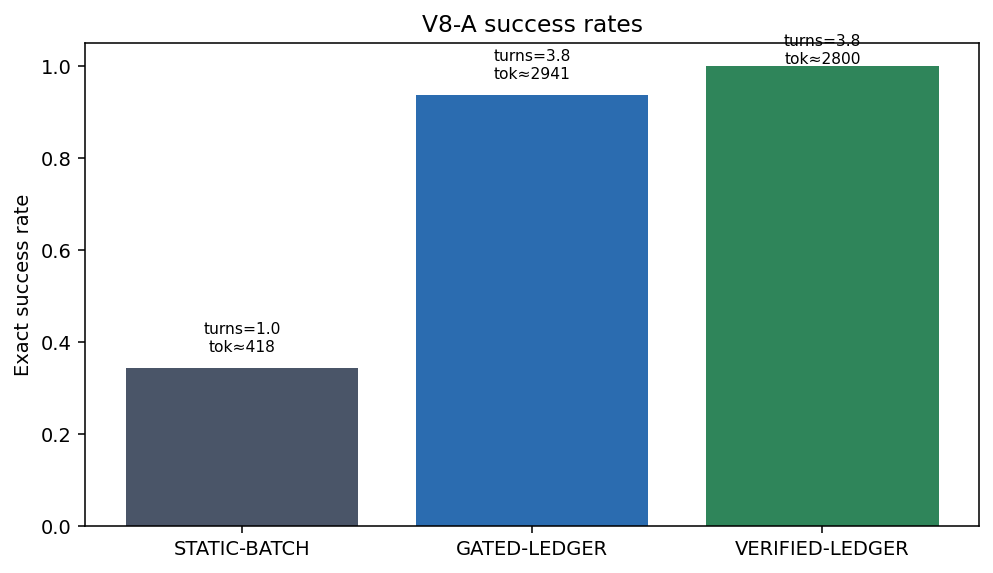
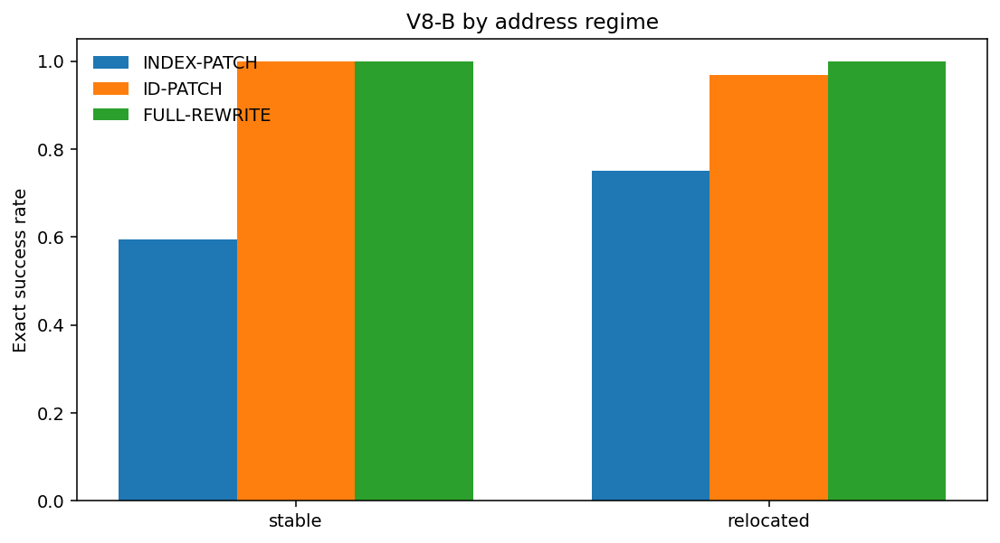
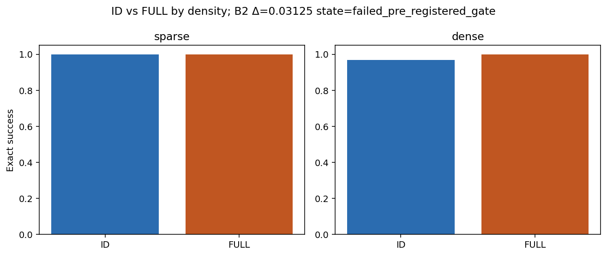

# Aggregation Mismatch Artifact-v8: Runtime Ownership, Semantic Addressing, and Governed Delivery

**Document type:** theory–experiment–engineering validation report<br>
**Evidence cutoff:** July 28, 2026<br>
**Overall assessment:** **ready to share within the stated single-configuration and synthetic-task boundaries**<br>
**Study family:** `aggregation_mismatch_v8_runtime_ownership_routing`<br>
**Schema:** `artifact-v8`<br>
**中文：** [聚合失配 Artifact-v8：运行时所有权、语义寻址与受治理交付](./aggregation-mismatch-v8-runtime-ownership-routing.zh-CN.md)<br>
**Bilingual synchronization rule:** Keep condition names, sample sizes, estimates, verdicts, limitations, and engineering rules aligned across both versions.

---

## Technical Summary

Artifact-v8 tests two agent-engineering questions with **288 DeepSeek-V4-Flash
semantic episodes** and **64 offline deterministic-compiler cases**:

1. Does a runtime-owned readiness gate, staged interaction, and external ledger
   recover exact dependency construction relative to one-shot static output?
2. Once a correct semantic plan is fixed, should the model submit physical indexes,
   stable semantic IDs, or a complete rewritten object—and does the relative value
   of Patch and Rewrite change with edit density?

| Claim | Main estimate | 95% CI | Holm/raw p | Verdict |
|---|---:|---|---:|---|
| **V8-A1** GATED−STATIC | +59.4 pp | [40.6, 75.0] pp | Holm \(1.53\times10^{-5}\) | **Passed**; cost guardrail failed |
| **V8-A2** VERIFIED−GATED | +6.25 pp | [0, 15.6] pp | Holm 1.0 | **Not adjudicated: ceiling** |
| **V8-B1** ID−INDEX | +31.25 pp | [20.3, 42.2] pp | Holm \(4.58\times10^{-5}\) | **Passed** |
| **V8-B2** density interaction | +3.125 pp | [0, 9.375] pp | Holm 1.0 | **Failed preregistered gate** |
| **V8-B3** deterministic compile | 64/64 exact on both paths | — | — | **Passed adoption gate** |

The strongest supported conclusion is:

> **In this single DeepSeek configuration and synthetic object family, moving
> dependency state and physical address resolution into the runtime substantially
> improves exact system success. The ledger scaffold, however, costs about seven
> times the median tokens of the static baseline, and the experiment does not
> establish a hard sparse-ID-Patch/dense-Full-Rewrite crossover.**

## 1. Theory

### 1.1 Aggregation mismatch is also a runtime-ownership problem

Agent success can be diagnostically separated into:

\[
P(S)
=
P(P)
\times P(D\mid P)
\times P(C\mid P,D),
\]

where \(P\) is plan or intermediate-construction correctness, \(D\) is delivery
correctness, and \(C\) is safe commitment. This is not an independence assumption.
It separates failure responsibilities:

- planning can fail because dependencies and completed state are not maintained;
- delivery can fail because paths, indexes, hashes, or tool schemas are wrong;
- commit can accept an invalid state or duplicate a side effect.

Artifact-v8A intervenes on runtime support for the first layer. Artifact-v8B fixes a
correct semantic plan and intervenes on the delivery interface. B3 asks whether
delivery can leave model sampling entirely.

### 1.2 A readiness ledger changes the computation

For a DAG node \(v\), local execution is directly valid only when all parents are
resolved:

\[
x_v=f_v(x_{\mathrm{pa}(v)}).
\]

A one-shot response makes the model maintain dependency order, completed values,
coverage, arithmetic, and final serialization at once. A runtime-owned ledger
turns that into governed transitions:

\[
(L_t,R_t)\rightarrow\Delta_t\rightarrow L_{t+1},
\]

where \(L_t\) is completed hard state and \(R_t\) is the ready set. A correct gate
can prevent not-ready submissions by construction. Theory predicts reduced model
responsibility; it does not predict a particular model's +59.4-point gain. That is
the empirical A1 result.

### 1.3 A local verifier has a safety property, not a guaranteed model lift

If a local verifier is sound for the protected rule, it can prevent a known local
violation from entering the ledger. It does not guarantee that:

- errors occur in a repairable region;
- the model uses the receipt correctly;
- a ledger baseline leaves enough headroom to identify incremental value;
- verification is free of false acceptance, false rejection, or cost.

Both A2 arms exceed 0.90, and none of the 32 VERIFIED episodes triggers a repair.
The result is therefore ceiling-limited. It is not evidence that local verification
is useless, and it is not evidence that a repair loop recovered two cases.

### 1.4 Semantic IDs remove a deterministic mapping from the model

Let \(\pi\) be the current physical arrangement and \(u\) a stable semantic ID.
A physical-index interface requires the model to compute and serialize

\[
\mathrm{index}=\pi^{-1}(u).
\]

A semantic-ID interface lets the model submit \(u\), while the runtime resolves the
current address against authoritative state. This removes one deterministic and
fragile mapping from the model-authored commitment surface.

The structural argument predicts a direction, not a universal success-rate law.
V8-B1 provides confirmatory evidence for the current object family and model
configuration.

### 1.5 A verified plan should be compiled when possible

Given authoritative state \(s\), a verified plan \(p\), a correct compiler
\(C(s,p)\), an atomic executor \(E\), and a verifier \(V\) that covers the protected
invariants:

\[
V(E(s,C(s,p)))=1.
\]

Resampling tool arguments or a full object adds no task information in this
setting. It adds a new stochastic serialization and contract-failure surface.
B3 tests whether the current compiler implementation clears an adoption gate; it
does not formally prove every compiler or every production workload correct.

### 1.6 Patch versus Rewrite remains conditional

Patch commitment usually grows with edit count \(k\), address cost, and schema
overhead; Full Rewrite commitment usually grows with object size \(N\). Actual
success also depends on plan quality, address stability, tool contracts, verifier
coverage, model policy, and budget:

\[
\text{route}
=g(k/N,\text{address stability},\text{plan confidence},
\text{compiler availability},\text{verifier coverage},\text{budget}).
\]

Theory does not supply a deployment threshold. V8-B2 tests one density interaction
and fails its preregistered gate.

## 2. Experimental Design

### 2.1 Frozen configuration

| Item | Value |
|---|---|
| Model | `SimpleDeepSeekClientChat / deepseek-v4-flash` |
| Thinking | `False` |
| Temperature / top_p | `0 / 1` |
| Max tokens | 64,000 per provider turn |
| Prompt language | Chinese |
| Episode budget | 300 seconds |
| Primary unit | A: instance; B: `base_id` cluster |
| Bootstrap | 10,000 fixed-seed cluster resamples |
| Paired test | exact two-sided sign-flip |
| Multiplicity | Holm correction across A1, A2, B1, and B2 |

### 2.2 V8-A: runtime scaffold

Thirty-two new DAGs span \(N\in\{8,16\}\) and frontier
\(\in\{2,8\}\). All conditions share graph, truth, budget, renderer, and global
verifier.

| Condition | Runtime owns | Model owns |
|---|---|---|
| `A-STATIC-BATCH` | parsing and final verification after response | one complete topological assignment object |
| `A-GATED-LEDGER` | ready set, per-layer gate, completed ledger | exactly the current ready layer |
| `A-VERIFIED-LEDGER` | GATED package plus current-layer verification | at most one targeted repair after failure |

A1 identifies the **readiness + ledger + staged-interaction package**, not a pure
ledger, pure ordering, or private-reasoning effect. A2 isolates the incremental
local-verifier condition relative to GATED.

### 2.3 V8-B: semantic address routing

Thirty-two new base hosts span \(N\in\{96,384\}\) and stable/relocated address
regimes. Each base produces a sparse and dense variant, for 64 variants.

| Condition | Model submits | Runtime owns |
|---|---|---|
| `B-INDEX-PATCH` | current path/index + ID + old/new | checks and execution |
| `B-ID-PATCH` | stable ID + old/new | current-index resolution and execution |
| `B-FULL-REWRITE` | complete current object | structural, metadata, and collateral checks |
| `B-DETERMINISTIC-COMPILE` | no model call | index/ID argument compilation from the verified plan |

The three model arms receive the same authoritative current object, semantic plan,
plan hash, and budget. Each permits exactly one write action and no recovery.

## 3. Data Validation

### 3.1 Coverage and identity

| Check | Result |
|---|---:|
| Frozen formal specifications | 288 |
| Endpoint rows | 288/288 |
| Unique run keys | 288/288 |
| Missing / unexpected / duplicate | 0 / 0 / 0 |
| Spec–result identity mismatches | 0 |
| Offline compiler cases | 64/64 unique |

### 3.2 Event reconstruction

The event ledger contains 2,992 events across all 288 run keys:

| Check | Result |
|---|---:|
| Duplicate `(run_key,event_index)` | 0 |
| Non-contiguous episode event index | 0 |
| Exactly one `commit_end` per episode | 288/288 |
| A endpoints reconstructed | 96/96 |
| B endpoints reconstructed | 192/192 |
| Provider-turn / event mismatch | 0 |
| Transport-attempt / event mismatch | 0 |
| Exactly one B native write | 192/192 |

A records 272 provider turns and 272 transport attempts; B records 192/192. There
are no transport retries. Every episode finishes within 300 seconds; maximum wall
time is 50.77 seconds. V8 is therefore not a timeout-driven result.

The frozen-data verifier returns `ok=true`, and all 15 V8 tests pass when the
repository root is present on `PYTHONPATH`.

## 4. Results

### 4.1 Runtime scaffold

| Condition | Strict exact | Mean turns | Median tokens | Median wall time |
|---|---:|---:|---:|---:|
| STATIC | 11/32 (34.4%) | 1.0 | 418 | 2.64s |
| GATED | 30/32 (93.8%) | 3.75 | 2,941 | 8.78s |
| VERIFIED | 32/32 (100%) | 3.75 | 2,800.5 | 8.39s |



Nineteen paired instances favor GATED over STATIC, none favor STATIC, and thirteen
tie. STATIC has 21 `value_error` failures; GATED has two. The median-token ratio is
approximately **7.04×**, above the preregistered 4× cost guardrail.

VERIFIED adds two observed successes over GATED, but the comparison is not
adjudicated because both arms are above 0.90. No VERIFIED episode triggers the
repair path.

### 4.2 Semantic ID versus physical index

| Condition | Strict exact | Median tokens | Median wall time |
|---|---:|---:|---:|
| INDEX Patch | 43/64 (67.2%) | 8,361.5 | 7.89s |
| ID Patch | 63/64 (98.4%) | 7,661.5 | 6.96s |
| Full Rewrite | 64/64 (100%) | 11,846 | 24.66s |
| Deterministic compile | 64/64 on both paths | 0 model calls | median about 2.22ms/case |



Seventeen base clusters favor ID over INDEX, none favor INDEX, and fifteen tie.
All 21 INDEX failures are `executor_or_tool_error`; the only ID failure is a
`verifier_fail`.

Address-stratified results are:

| Address regime | INDEX | ID | FULL |
|---|---:|---:|---:|
| stable | 19/32 | 32/32 | 32/32 |
| relocated | 24/32 | 31/32 | 32/32 |

Stable and relocated cases use different base hosts rather than a within-host
address intervention. Because INDEX is lower in the stable subgroup, the pooled B1
effect must not be reframed post hoc as “relocation specifically causes index
failure.”

### 4.3 The density crossover is not established

| Density | ID | FULL | ID−FULL |
|---|---:|---:|---:|
| sparse | 32/32 | 32/32 | 0 |
| dense | 31/32 | 32/32 | −3.125 pp |



The +3.125-point interaction has one positive base and 31 zero-difference bases. It
does not satisfy the +20-point, CI-exclusion, or Holm-\(p\) gates. Near-ceiling
performance also means the study does not prove that no crossover exists.

### 4.4 Deterministic compilation

Across 64 offline cases:

- index compilation is exact on 64/64;
- ID compilation is exact on 64/64;
- invalid arguments, collateral changes, hash violations, and plan violations are
  all zero;
- failure-path pre-state preservation is 64/64;
- model delivery calls are zero.

This is frozen-case implementation evidence, not a 100% production-reliability
estimate.

## 5. Conclusions and Claim Boundaries

### Supported

- The runtime-owned readiness/ledger/staged-interaction package has a large exact
  success effect in the tested DeepSeek configuration.
- A stable semantic-ID interface outperforms a model-authored physical-index
  interface when the correct semantic plan is fixed.
- The current deterministic compiler clears its frozen adoption gate.
- V8 failures are not driven by the 300-second timeout.

### Not supported

- A1 is caused solely by the ledger, ordering, external memory, or one isolated
  component.
- Local verification has a confirmed incremental deployment effect.
- Relocation is the identified cause of INDEX failures.
- Sparse edits should always use ID Patch and dense edits Full Rewrite.
- Patch or Rewrite has a universal ordering.
- A single DeepSeek configuration and synthetic JSON/GF(2) family generalizes to
  real software repositories.
- A 64/64 offline gate is a production reliability guarantee.

## 6. Engineering Significance

### 6.1 Recommended control flow

```text
read authoritative state
→ construct semantic plan
→ verify and bind plan_hash/pre_hash
→ schedule ready operations
→ persist completed ledger
→ deterministically compile when available
→ otherwise prefer semantic-ID operations over physical indexes
→ execute atomically
→ verify local and global invariants
→ commit or rollback
```

### 6.2 Runtime-owned objects

- authoritative object and version/hash;
- dependency graph, ready set, and completed ledger;
- stable semantic-ID to current-address mapping;
- verified plan and plan hash;
- compiler, atomic executor, checkpoint, and rollback;
- local and global verifiers with typed receipts;
- append-only event ledger and idempotent commit record.

### 6.3 Policies not justified by V8

- Do not enable the expensive ledger path globally without cost and risk routing.
- Do not remove the global verifier because A2 is ceiling-limited.
- Do not route stable cases to INDEX and relocated cases to ID from these subgroups.
- Do not hard-code sparse→ID / dense→FULL.
- Do not ask the model to resample delivery when a verified plan can be compiled.

### 6.4 Cost-aware routing

The runtime scaffold trades cost for reliability. A production router should
optimize:

\[
\text{utility}
=
\text{value of exact success}
-\lambda_t\text{tokens}
-\lambda_l\text{latency}
-\lambda_r\text{commit risk}.
\]

Low-coupling, cheap, reversible tasks may stay on a lightweight path. High-coupling
or high-consequence transitions should enter governed readiness and ledger paths.

## 7. Possible Applications

| Domain | Semantic plan | Runtime-owned delivery |
|---|---|---|
| Code editing | symbol ID, AST node ID, expected old/new | resolve current location, apply edit, test, atomic commit |
| JSON/configuration | object key or stable entity ID | resolve current path, schema validation, rollback |
| Database migration | table/column/constraint ID | compile DDL, dry-run, transactional commit |
| Spreadsheets | row key + column name | resolve current cell, formula and total checks |
| Agent DAGs | task ID + dependency edge | readiness scheduling, ledger, idempotent execution |
| Research/specification documents | claim/section ID + evidence link | local change, citation checks, global consistency audit |

Every real domain needs a domain-specific verifier. Synthetic exact truth does not
replace compilers, tests, schemas, database constraints, business rules, or human
acceptance.

## 8. Limitations and Next Tests

1. One DeepSeek-V4-Flash configuration, Chinese prompts, thinking disabled.
2. One formal run per semantic episode; no hosted-service day-variance estimate.
3. A1 is a package intervention and is not effort-matched to STATIC.
4. A2 is ceiling-limited and contains no observed repair event.
5. Stable/relocated is not paired within the same base host.
6. ID/FULL are near ceiling, limiting density-interaction identification.
7. B3 covers synthetic frozen cases, not concurrency or repository semantics.
8. Real adoption needs property-based, mutation, concurrency, failure-injection, and
   OOD tests.

The highest-value next studies are:

- a low-cost readiness × ledger × staged interaction × verifier factorial;
- within-host address relocation and additional density points;
- regional rewrite plus real payload telemetry;
- semantic-ID and compiler transfer to real code/configuration tasks;
- replication on a second low-cost, version-fixed configuration.

## 9. Reproducibility and Sources

Canonical sources:

- [Frozen design](https://github.com/wxy2ab/llmdealer/blob/main/exp/aggregation_mismatch_experiment/docs/V8_RUNTIME_OWNERSHIP_ROUTING_DESIGN.md)
- [Formal verdict report](https://github.com/wxy2ab/llmdealer/blob/main/exp/aggregation_mismatch_experiment/docs/V8_RUNTIME_OWNERSHIP_ROUTING_REPORT.md)
- [Theory–experiment validation](https://github.com/wxy2ab/llmdealer/blob/main/exp/aggregation_mismatch_experiment/docs/V8_RUNTIME_OWNERSHIP_ROUTING_VALIDATION.md)
- [Machine-readable summary](https://github.com/wxy2ab/llmdealer/blob/main/exp/aggregation_mismatch_experiment/results/v8_runtime_ownership_routing/confirmatory/analysis/summary.json)
- [Coverage audit](https://github.com/wxy2ab/llmdealer/blob/main/exp/aggregation_mismatch_experiment/results/v8_runtime_ownership_routing/confirmatory/analysis/coverage.json)
- [Complete experiment repository](https://github.com/wxy2ab/llmdealer/tree/main/exp/aggregation_mismatch_experiment)

## 10. One-Sentence Conclusion

> **Artifact-v8 confirms two deployable boundaries: dependency construction
> benefits when readiness and completed state are runtime-owned, and structured
> editing benefits when the model submits semantic IDs while the runtime resolves
> addresses and compiles verified plans. These benefits require cost routing, and
> the Patch/Rewrite density crossover remains unresolved.**

## Related Documents

- [聚合失配 Artifact-v8：中文](./aggregation-mismatch-v8-runtime-ownership-routing.zh-CN.md)
- [Aggregation Mismatch and Compositional Governance](./aggregation-mismatch-compositional-governance-llm-systems.md)
- [Aggregation Mismatch: Derivable Claims and Agent Engineering](./aggregation-mismatch-theoretical-claims-agent-engineering.md)
- [Aggregation Mismatch Artifact-v7](./aggregation-mismatch-v7-mechanism-recovery.md)
- [Patch vs. Full Rewrite Controlled Experiment](./patch-vs-full-rewrite-controlled-experiment.md)
- [State-Governed Agent Regime](./state-governed-agent-regime-for-governed-llm-systems.md)
