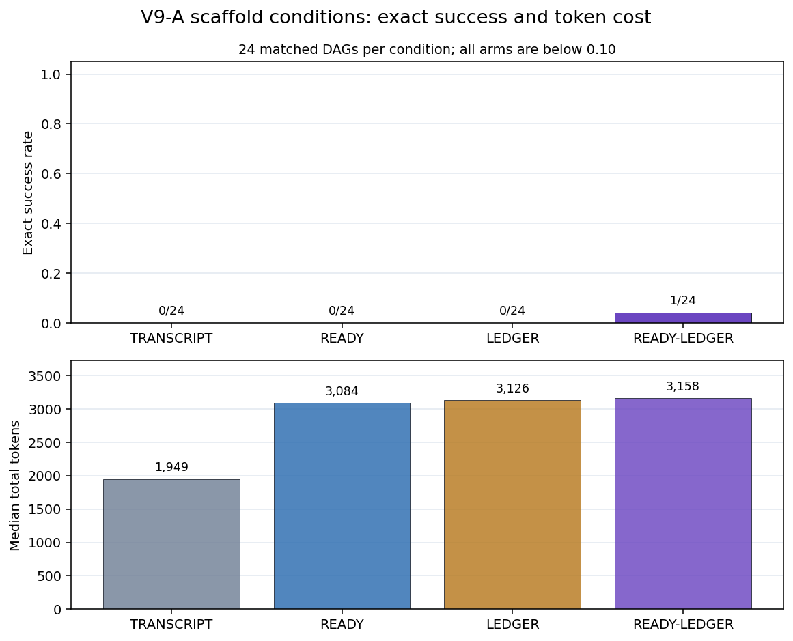
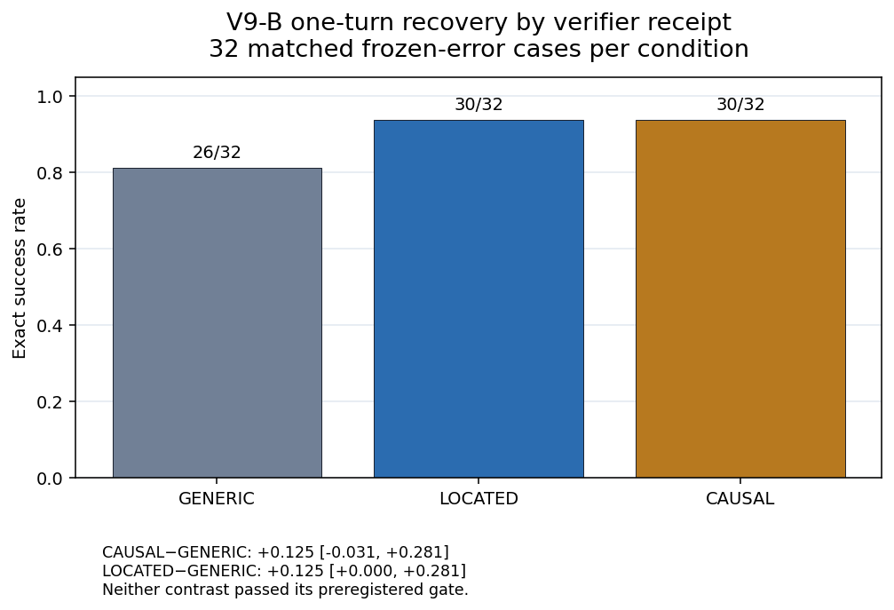
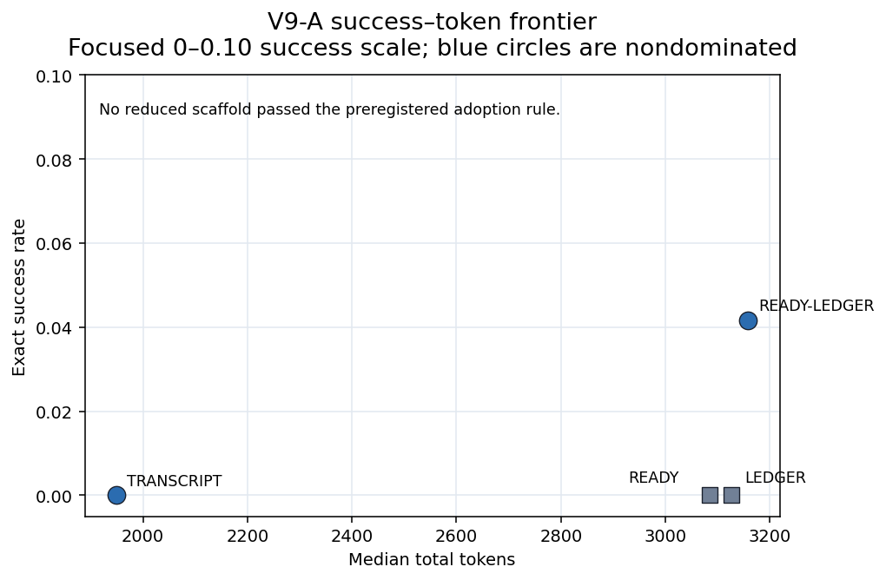

# 聚合失配 Artifact-v9：最小 Runtime Scaffold 与 Verifier Receipt

**文档类型：** 理论—实验—数据—工程验证报告<br>
**证据截点：** 2026 年 7 月 28 日<br>
**总体评估：** **数据可复核；scaffold 主效应因 floor 未裁决；两项 receipt claim
均未通过预注册确认门**<br>
**Study family：** `aggregation_mismatch_v9_minimal_scaffold_recovery`<br>
**Schema：** `artifact-v9`<br>
**English:** [Aggregation Mismatch Artifact-v9: Minimal Scaffold and Verifier Receipt](./aggregation-mismatch-v9-minimal-scaffold-recovery.md)<br>
**双语同步规则：** 两个版本的样本量、条件结果、估计值、裁决、局限和工程规则必须一致。

## 一句话结论

Artifact-v9 没有确认显式 ready set、规范化 completed ledger 或更具体 verifier
receipt 的独立增益：四个 scaffold 臂全部进入 strict-order floor；located 与 causal
相对 generic 都有 **+12.5 个百分点**的正点估计，但没有通过区间与多重校正确认门。
这不等于已经证明效应为零。

## 技术摘要

Artifact-v9 用 **192 个 DeepSeek-V4-Flash semantic episodes** 收窄 artifact-v8
留下的两个问题：

1. 在 staged interaction effort 匹配后，显式暴露当前 ready set 或规范化 completed
   ledger，能否分别提高 DAG 严格构造成功率？
2. 从同一冻结错误 proposal 开始，generic、located、causal 三种 verifier receipt
   是否改变一次完整 layer 修复？

| Claim | 配对估计 | 95% CI | Holm \(p\) | 预注册裁决 |
|---|---:|---|---:|---|
| **V9-A1** ready 主效应 | +0.0208 | [0, 0.0625] | 1.0 | **floor，未裁决** |
| **V9-A2** ledger 主效应 | +0.0208 | [0, 0.0625] | 1.0 | **floor，未裁决** |
| **V9-A3** interaction | +0.0417 | [0, 0.125] | — | Secondary |
| **V9-B1** CAUSAL−GENERIC | +0.125 | [−0.0313, 0.2813] | 0.875 | **未通过** |
| **V9-B2** LOCATED−GENERIC | +0.125 | [0, 0.2813] | 0.875 | **未通过** |
| **V9-B3** CAUSAL−LOCATED | 0 | [−0.0938, 0.0938] | — | Secondary |

这些状态必须区分：

- A1/A2 是**未裁决**，因为所有聚合臂成功率都低于 0.10；
- B1 低于 +0.15 最小效应，而且 CI 与 Holm 门也未通过；
- B2 超过 +0.10 点估计门，但 bootstrap 下界没有严格高于 0，Holm 检验未通过；
- failed gate 表示确认性 claim 没有建立，不代表真实效应严格等于零。

## 1. 理论

### 1.1 为什么要拆解 V8 的 scaffold package

Artifact-v8 发现 runtime readiness、外部 ledger 与 staged interaction 的组合包相对
one-shot static construction 提高 59.4 个百分点。但这个比较不能识别哪个组件产生
收益，也没有匹配 staged effort。

V9-A 用 2×2 设计暴露两个可见字段：

\[
Y_i(r,l),\qquad r\in\{0,1\},\ l\in\{0,1\},
\]

其中 \(r\) 表示是否显示 ready set，\(l\) 表示是否显示规范化 completed ledger。
四个条件都保留分层交互与工具历史。

ready 主效应：

\[
\Delta_{A1}
=
\operatorname{mean}_i
\frac{
[Y_i(1,0)-Y_i(0,0)]
+
[Y_i(1,1)-Y_i(0,1)]
}{2}.
\]

ledger 主效应：

\[
\Delta_{A2}
=
\operatorname{mean}_i
\frac{
[Y_i(0,1)-Y_i(0,0)]
+
[Y_i(1,1)-Y_i(1,0)]
}{2}.
\]

只有通过这两个 gate，才能支持字段级独立贡献。共同 floor 会阻止这种识别。

### 1.2 为什么先冻结错误，再比较 receipt

V8 的 local-verifier 对比处于 ceiling：没有 VERIFIED episode 真正走过
receipt→repair 路径。V9-B 让三臂从同一 rejected proposal 开始：

```text
相同 parents、constants、completed ledger、rejected assignment
→ 只改变 receipt 具体程度
→ 一个 provider turn、一次完整 layer 重提交
→ 同一 global verifier 与 commit gate
```

三个条件分别给出：

- **GENERIC：** 只说明 proposal 被拒绝；
- **LOCATED：** 失败 semantic node IDs；
- **CAUSAL：** failed IDs 加可复算的 parents、constants、observed values。

receipt 不包含 expected value。这个设计比 candidate audit 与从零生成的对比更接近
receipt specificity，但仍然只识别当前一次修复协议。

## 2. 实验

### 2.1 冻结配置

| 配置 | 值 |
|---|---|
| Client / model | `SimpleDeepSeekClientChat / deepseek-v4-flash` |
| Thinking | `False` |
| Temperature / top_p | `0 / 1` |
| Max tokens | 32,000 / provider turn |
| Episode budget | 300 秒 |
| Prompt language | 中文 |
| Primary units | A：24 个 DAG；B：32 个 repair case |
| Bootstrap | 10,000 次；seed `20260731` |
| Paired test | exact two-sided sign flip |
| Multiplicity | A1、A2、B1、B2 统一 Holm |

### 2.2 V9-A 矩阵

24 个新 DAG 覆盖 \(N\in\{24,48\}\) × frontier \(\in\{4,12\}\) 四个 cell，
每格 6 个实例。每个实例运行：

| 条件 | 显式 ready set | 显式规范化 ledger | Staged turns |
|---|---:|---:|---:|
| `A-TRANSCRIPT` | 否 | 否 | 是 |
| `A-READY` | 是 | 否 | 是 |
| `A-LEDGER` | 否 | 是 | 是 |
| `A-READY-LEDGER` | 是 | 是 | 是 |

严格成功要求下一 layer、顺序、值、覆盖、最终对象、global verifier、governed commit
全部正确，并在预算内完成。

### 2.3 V9-B 矩阵

32 个冻结 repair cases 覆盖 layer width \(\{8,32\}\) 与 single-error /
quarter-layer-error，四格各 8 个。每个 case 在相同输出合同下各运行 GENERIC、
LOCATED、CAUSAL 一次。

### 2.4 样本与调用

| 模块 | 实例 | 条件 | Semantic episodes | Provider turns |
|---|---:|---:|---:|---:|
| V9-A | 24 | 4 | 96 | 190 |
| V9-B | 32 | 3 | 96 | 96 |
| **合计** | — | — | **192** | **286** |

Provider turn 嵌套在 semantic episode 内，不是独立样本。

## 3. 数据完整性

独立重建得到：

| 审计 | 结果 |
|---|---:|
| Formal expected / observed | 192 / 192 |
| Missing / unexpected / duplicate run keys | 0 / 0 / 0 |
| Pilot | 28/28 |
| 冻结文件 SHA mismatch | 0 |
| Spec–endpoint identity mismatch | 0 |
| Events / event run keys | 2,293 / 192 |
| Event index 不连续 | 0 |
| Endpoint–event 重建 mismatch | 0 |
| Provider-turn / attempt mismatch | 0 / 0 |
| Timeout / transport error | 0 / 0 |
| Expected-value / ground-truth receipt 泄漏 | 0 |

14 项 v9 freeze/harness tests 全部通过。每个 episode 都有一个 prompt、evaluation、
verifier 与 commit-end 事件；A 的暴露标志与四条件完全匹配；每个 B episode 都只有
一个 provider turn 与一个 native tool call。

## 4. 结果：Ready × Ledger



| 条件 | Exact success | Mean turns | Median tokens | Median wall | 终态 |
|---|---:|---:|---:|---:|---|
| TRANSCRIPT | 0/24 | 1.29 | 1,949 | 8.11s | readiness 17；order 7 |
| READY | 0/24 | 2.13 | 3,084.5 | 8.87s | order 24 |
| LEDGER | 0/24 | 2.00 | 3,126 | 8.94s | order 23；readiness 1 |
| READY-LEDGER | 1/24 | 2.50 | 3,158.5 | 8.73s | order 23；success 1 |

95 个失败中，77 个终止于 `order`，18 个终止于 `readiness`；没有 timeout 或
transport 失败。唯一成功位于 \(N=48,\ frontier=4\)，所以没有任何 \(N\) 或
frontier cell 能识别字段差异。

77 个 order failure 的 `readiness_ok=true`：提交的 node-ID **集合就是正确的下一
ready layer**，只有排列不等于冻结顺序。Gate 在检查 GF(2) 值之前终止，所以不能称
这些值正确或错误。主导的可见失败因此是序列化验收合同，而不是普遍找不到 ready set。

当前证据只支持：

> 在 V9 的 \(N=24/48\) 矩阵与 strict full-layer ordered-submission 合同下，
> 无法识别 ready set 和 ledger 的独立效应。

它不支持“ready set 没用”“ledger 没用”或“V8 被推翻”。

## 5. 结果：Verifier Receipt



| Receipt | Exact success | Median tokens | Median wall | Value errors |
|---|---:|---:|---:|---:|
| GENERIC | 26/32 (81.25%) | 2,069.5 | 8.61s | 6 |
| LOCATED | 30/32 (93.75%) | 1,954 | 9.14s | 2 |
| CAUSAL | 30/32 (93.75%) | 2,865 | 10.06s | 2 |

配对不一致：

| 对比 | 正 / 负 / 零 | 估计 | 95% CI | Holm \(p\) |
|---|---:|---:|---|---:|
| CAUSAL−GENERIC | 6 / 2 / 24 | +0.125 | [−0.0313, 0.2813] | 0.875 |
| LOCATED−GENERIC | 5 / 1 / 26 | +0.125 | [0, 0.2813] | 0.875 |
| CAUSAL−LOCATED | 1 / 1 / 30 | 0 | [−0.0938, 0.0938] | — |

Width 8 接近 ceiling：15/16、16/16、16/16。Width 32 为 11/16、14/16、
14/16。这些是 secondary 分层，不是预注册路由规则。

LOCATED 与 CAUSAL 的观测成功率相同，而 LOCATED 中位 token 少 911。这使 located
receipt 成为下一轮非劣效性+成本实验的候选；V9 没有预注册或建立这项结论。

## 6. 成本与采用门



Reduced scaffold 必须同时满足：

1. 相对 READY-LEDGER 的成功差 95% CI 下界不低于 −0.10；
2. 中位 token 不超过 READY-LEDGER 的 75%；
3. 不增加 commit risk。

TRANSCRIPT 满足 token 条件，但成功差 CI 为 [−0.125, 0]；READY 与 LEDGER 也没有
满足组合规则。没有 reduced arm 通过。因为四臂都在 floor，这不构成默认开启 full
scaffold 的证据。

## 7. 结论

### 在冻结协议内支持

- Artifact 完整、事件可重建；
- V9-A 失败由 order/readiness 主导，不是预算或 transport；
- 77 个 order failure 的语义 ready-ID 集合全部正确，只因序列化排列不同被拒绝；
- Generic reject 已形成较高的一次修复基线；
- Located 与 causal 相对 generic 都有 +12.5 个百分点的正点估计；
- 当 parents、constants、ledger 已可见时，causal 相对 located 没有观测成功增益。

### 未裁决

- ready set 的独立收益；
- 规范化 ledger 的独立收益；
- 稳定的 ready×ledger interaction；
- 保持 full-scaffold 成功率的最小成本 scaffold。

### 未通过预注册门

- causal receipt 相对 generic 至少提高 0.15，且区间与修正检验通过；
- located receipt 相对 generic 至少提高 0.10，并满足同样统计条件。

### 未建立

- 显式 ready/ledger 字段无效；
- V8 package 效应为假；
- receipt 效应严格为零；
- 验证普遍比生成容易；
- 跨模型、跨语言或真实仓库外部效度。

## 8. 理论与实验差距

### 8.1 结构责任减少仍取决于合同

Ready set 减少一次拓扑搜索责任，外部 ledger 减少一次状态重建责任。但这种结构责任
减少不保证在每一种 acceptance rule 下都转化成部署增益。V9 的 strict ordered layer
submission 在值验证前就拒绝了多数 episode；其中 77 个 episode 的 ready-ID 集合
已经正确，只有排列不同。

这是 measurement floor，不是 runtime state ownership 的反证。

### 8.2 更多 receipt 细节可能冗余

当公共 prompt 已经暴露 parents、constants、completed ledger 与 rejected assignment，
failed IDs 可能足以复算修复。此时 causal witness 只是重组已有事实，而不是增加新的
任务信息。LOCATED 与 CAUSAL 持平与这一解释一致，但不能证明普遍冗余。

### 8.3 正点估计不等于产品默认

32 个匹配 case 中只有 6–8 个不一致配对。+0.125 可能是真实中等效应，也可能是抽样
波动。预注册最小效应、区间和多重校正门用于防止方向性估计静默变成默认策略。

## 9. Agent 工程意义

1. **不能靠断言拆 package 证据。** V8 支持完整 runtime package；V9 没有识别
   ready-only 或 ledger-only 增益。
2. **加上下文前先审 acceptance contract。** order/schema floor 会阻断额外状态或
   reasoning 的任何收益。
3. **让 runtime 拥有 canonical order。** 如果领域只要求 ready IDs 集合，先验证集合，
   再在模型外 canonicalize 序列化。
4. **分开语义和序列化指标。** 独立记录 `semantic_set_exact` 与
   `serialization_order_exact`。
5. **分级升级 verifier receipt。** 从 generic reject 开始，需要时增加 failed IDs，
   只在未解决或高风险案例中增加 causal witness。
6. **成功、成本和风险联合路由。** 本样本中 located 与 causal 成功率持平，但 token
   成本有明显差异。
7. **使用三态实验治理。** 区分 `passed`、`failed_gate` 与
   `not_adjudicated_floor_or_ceiling`。
8. **持久化 episode events。** V9 的 prompt→turn→tool→verifier→commit 链是生产
   恢复与审计的有用最低标准。

## 10. 可能应用

### 代码与配置 Agent

- runtime 从 AST/schema 依赖计算 ready edits；
- 接收 stable semantic IDs，并 canonicalize 物理顺序；
- 先返回 failed IDs，再按需生成完整 causal trace；
- 用全局测试与 schema 验证控制 commit。

### 数据库迁移与工作流编排

- 权威持有 dependency DAG、completed ledger 与 transaction state；
- 只分发当前 ready operations；
- receipt 使用 constraint/task IDs；
- 除非顺序本身是业务语义，否则将排序作为 runtime 编译。

### 表格、文档与多 Agent 系统

- 使用 stable row、claim、section、task IDs；
- 在对话外持久化公式、引用和任务依赖；
- receipt 从 generic 升级到 located，再到 causal；
- 用 strict success、token、latency、rollback risk 校准升级。

## 11. 局限与后续实验

1. 单 DeepSeek 配置、中文 prompt、thinking disabled；
2. 每个实例每条件只有一次正式运行；
3. 合成 GF(2) DAG，不是真实仓库或工作流；
4. V9 使用 \(N=24/48\)，V8 使用 \(N=8/16\)，不能形成 field-only 跨研究对照；
5. strict layer 内顺序可能拒绝语义等价集合；
6. GENERIC 已达到 26/32，headroom 有限；
7. 公共 B prompt 可能使 causal 内容冗余；
8. 未测试多轮 repair、verifier blind spot 与 false accept。

最高价值后续：

- 在 \(N=8/16/24\) 的重叠、非 floor 区间复跑 ready×ledger；
- 接受 ID set，由 runtime canonicalize 顺序；
- 用更难 width 或更大样本降低 generic 基线；
- 预注册 LOCATED 对 CAUSAL 的非劣效性与 token 成本门；
- 用第二个版本固定模型和真实代码/config task 复现。

## 12. 复现与来源

- [冻结设计](https://github.com/wxy2ab/llmdealer/blob/main/exp/aggregation_mismatch_experiment/docs/V9_MINIMAL_SCAFFOLD_RECOVERY_DESIGN.md)
- [正式报告](https://github.com/wxy2ab/llmdealer/blob/main/exp/aggregation_mismatch_experiment/docs/V9_MINIMAL_SCAFFOLD_RECOVERY_REPORT.md)
- [独立核验](https://github.com/wxy2ab/llmdealer/blob/main/exp/aggregation_mismatch_experiment/docs/V9_MINIMAL_SCAFFOLD_RECOVERY_VALIDATION.md)
- [机器汇总](https://github.com/wxy2ab/llmdealer/blob/main/exp/aggregation_mismatch_experiment/results/v9_minimal_scaffold_recovery/confirmatory/analysis/summary.json)
- [Endpoint ledger](https://github.com/wxy2ab/llmdealer/blob/main/exp/aggregation_mismatch_experiment/results/v9_minimal_scaffold_recovery/confirmatory/merged_runs.jsonl)
- [Event ledger](https://github.com/wxy2ab/llmdealer/blob/main/exp/aggregation_mismatch_experiment/results/v9_minimal_scaffold_recovery/confirmatory/events.jsonl)

## 相关文档

- [Artifact-v10 后续：语义合同与 Runtime Canonicalization](./aggregation-mismatch-v10-semantic-contract-canonicalization.zh-CN.md)
- [Aggregation Mismatch Artifact-v9: English](./aggregation-mismatch-v9-minimal-scaffold-recovery.md)
- [聚合失配 Artifact-v8](./aggregation-mismatch-v8-runtime-ownership-routing.zh-CN.md)
- [聚合失配与组合治理](./aggregation-mismatch-compositional-governance-llm-systems.zh-CN.md)
- [聚合失配：可推导命题与 Agent 工程](./aggregation-mismatch-theoretical-claims-agent-engineering.zh-CN.md)
- [Patch 与完整重写受控实验](./patch-vs-full-rewrite-controlled-experiment.zh-CN.md)
- [状态治理智能体范式](./state-governed-agent-regime-for-governed-llm-systems.zh-CN.md)
